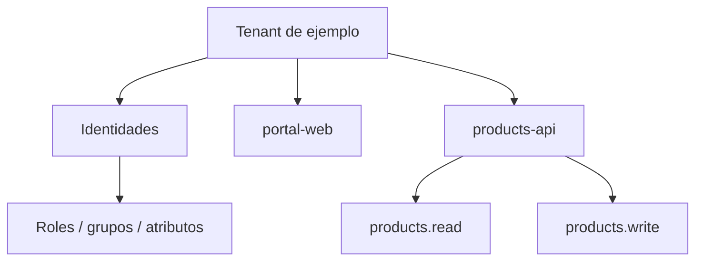

# Poblaciones, aplicaciones y recursos dentro del tenant

← [Volver a la profundización](./README.md)

Diseñar un tenant requiere identificar quiénes participan y qué elementos deben quedar representados.

Este ejemplo es independiente de RegistrApp.

## Poblaciones de identidad

En un sistema ficticio pueden existir, por ejemplo:

- clientes externos;
- operadores internos;
- administradores.

No todas las poblaciones tienen necesariamente las mismas políticas de acceso, recuperación de cuenta o MFA.

## Aplicaciones cliente

Una aplicación cliente inicia flujos de autenticación/autorización.

Ejemplo:

```text
portal-web
```

El tenant mantiene información como su `client_id`, redirect URIs permitidas y flujos habilitados.

## Recursos protegidos

Una API representa un recurso que debe protegerse.

Ejemplo:

```text
products-api
```

Puede exponer capacidades como:

```text
products.read
products.write
```

## Relación conceptual



El tenant organiza relaciones de identidad. Los datos propios del negocio siguen perteneciendo a la aplicación y no al proveedor de identidad.
