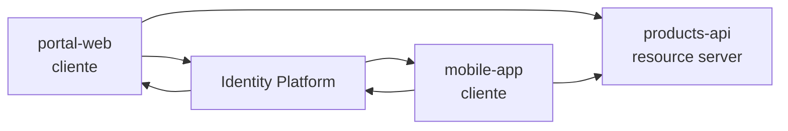
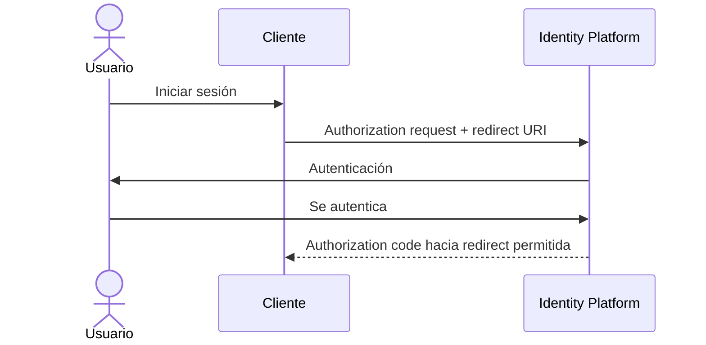
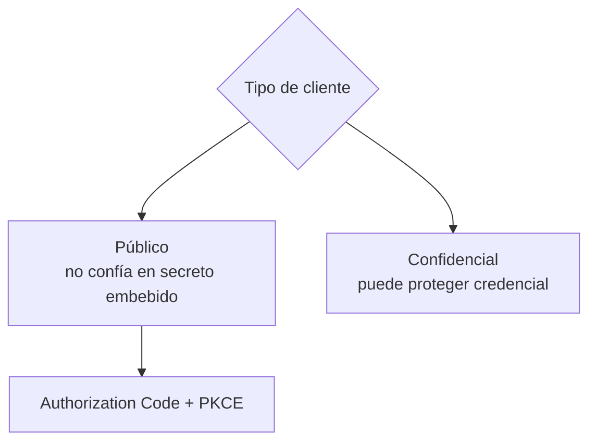
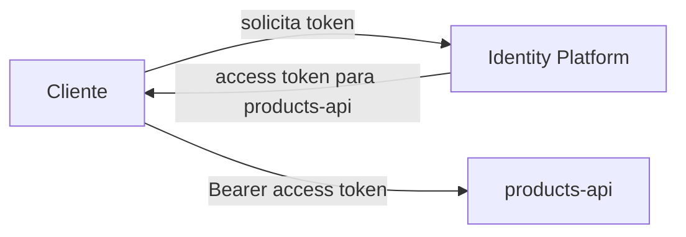
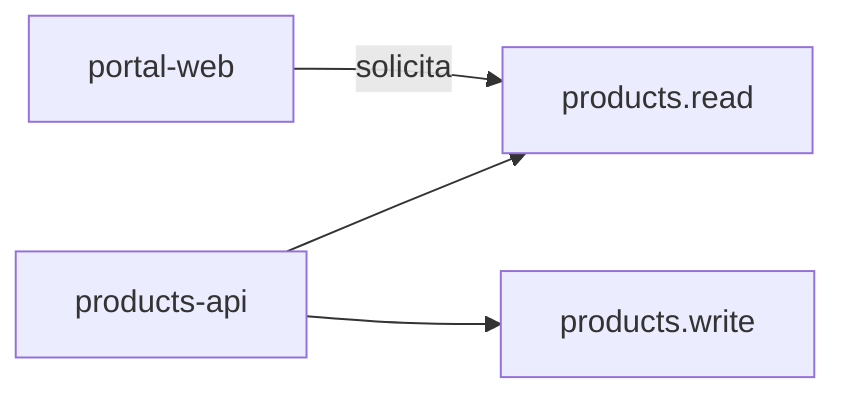
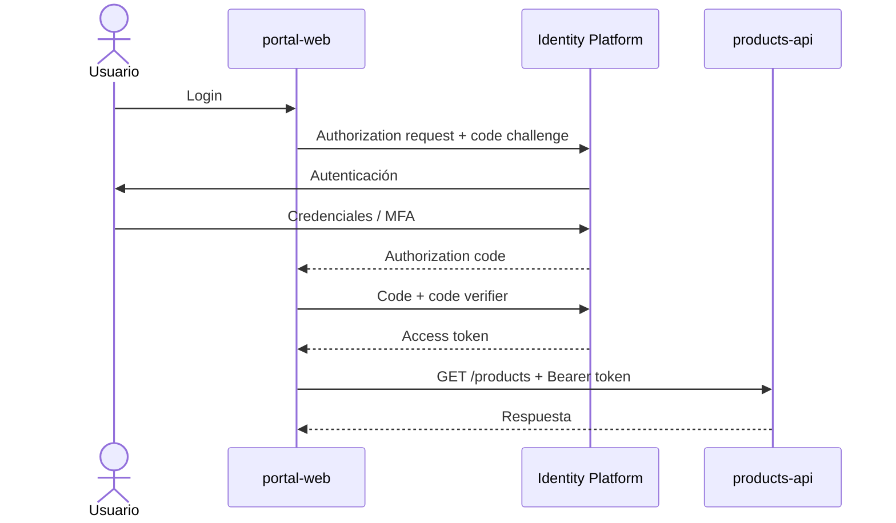

# 1.2.4 · Configurando aplicaciones en un IDaaS

## Objetivo

Comprender cómo se representan **clientes y APIs** dentro de una plataforma de identidad y qué significan Client ID, redirect URI, tipo de cliente, audience y scopes.

Este contenido se trabaja con ejemplos independientes de RegistrApp.

---

## 1. Registrar una aplicación no es “crear un usuario”

Una plataforma de identidad necesita conocer las aplicaciones que participarán en los flujos.

Ejemplo conceptual:

```text
portal-web
mobile-app
products-api
```

Cada una cumple un rol distinto.



---

## 2. Client ID

El **Client ID** identifica a una aplicación cliente ante el Authorization Server.

Ejemplo conceptual:

```text
client_id = portal-web
```

No es una contraseña.

Puede aparecer públicamente en aplicaciones donde su visibilidad sea esperable.

---

## 3. Redirect URI

La redirect URI indica a qué ubicación autorizada puede devolver el Authorization Server al usuario después de una etapa del flujo.

Ejemplo:

```text
https://app.example.com/callback
```

No debería aceptarse cualquier URL arbitraria.



---

## 4. Cliente público vs confidencial

### Cliente público

No puede proteger de forma confiable un secreto embebido.

Ejemplos típicos:

- SPA;
- aplicación móvil;
- aplicación instalada en dispositivo del usuario.

### Cliente confidencial

Puede mantener credenciales del cliente en un entorno controlado del servidor.

Ejemplos:

- backend server-side;
- servicio interno con almacenamiento seguro de secretos.



---

## 5. API / Resource Server

La API protegida debe estar representada conceptualmente como un recurso diferente del cliente.



La API debe comprobar que el token fue emitido para la audience que espera.

---

## 6. Audience

La audience responde conceptualmente:

> ¿Para qué recurso fue emitido este token?

Ejemplo:

```text
aud = products-api
```

Un token emitido para otra API no debería aceptarse automáticamente.

---

## 7. Scopes

Scopes de ejemplo:

```text
products.read
products.write
```



El Authorization Server puede conceder solo una parte de lo solicitado según políticas y consentimiento.

---

## 8. Authorization Code + PKCE aplicado al cliente público



No es necesario memorizar todos los parámetros todavía. Sí hay que comprender el rol de cada pieza.

---

## 9. Mini actividad independiente

Tienes este escenario:

```text
portal-web     → SPA
mobile-app     → aplicación móvil
products-api   → API protegida
```

Responde:

1. ¿qué elementos son clientes?;
2. ¿qué elemento es resource server?;
3. ¿qué Client ID necesita cada cliente?;
4. ¿qué redirect URI debería registrarse para cada uno?;
5. ¿qué clientes son públicos?;
6. ¿qué audience debería esperar la API?;
7. ¿qué scopes propondrías para leer y modificar productos?;
8. ¿por qué no guardarías un client secret dentro de la SPA?

## 10. Mapeo posterior a cloud

Solo después de defender el modelo conceptual se realiza el mapeo a la consola del proveedor real:

```text
cliente conceptual
→ app registration / client

resource server
→ API / resource registration

scope conceptual
→ scope configurado

redirect URI conceptual
→ redirect URI registrada
```

## Cierre

El estudiante debe ser capaz de explicar qué representa cada configuración antes de crearla en una consola cloud.

→ [Profundización opcional](./04-configurando-apps-idaas/README.md)
