# 1.2.4 · Configurando aplicaciones en un IDaaS

## Objetivo

Comprender qué significa **registrar una aplicación** en un sistema de identidad, diferenciar cliente y recurso protegido, entender Client ID, redirect URI, audience, scopes y tipo de cliente, y diseñar la configuración conceptual de **ReservApp** antes de utilizar una consola real.

---

## 1. Registrar una aplicación no es simplemente “crear un nombre”

El proveedor de identidad necesita conocer a los participantes del flujo.

Debe poder responder:

- ¿qué aplicación solicita autenticación/autorización?;
- ¿a qué URLs puede volver después del login?;
- ¿qué permisos puede solicitar?;
- ¿para qué API se emitirán tokens?;
- ¿qué tipo de cliente es?;
- ¿puede mantener un secreto?;

Por eso una aplicación se **registra**.

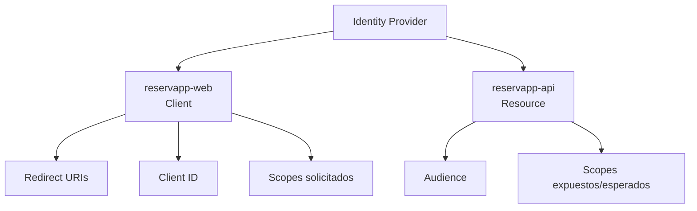

---

## 2. Cliente y API cumplen funciones distintas

### `reservapp-web`

Es el **client**.

Participa iniciando el flujo de autorización y utilizando el resultado para invocar la API.

### `reservapp-api`

Es el **resource server**.

Expone recursos protegidos y acepta access tokens válidos destinados a ella.

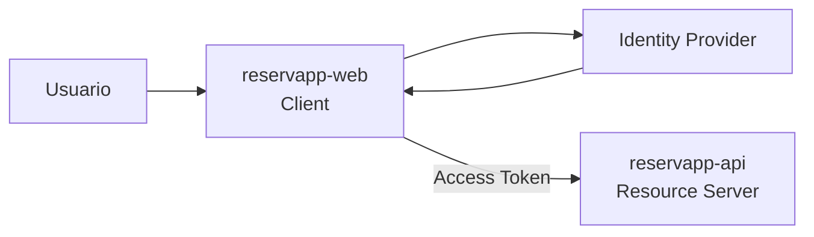

Esta distinción es fundamental: **el cliente pide acceso; la API protege el recurso**.

---

## 3. Client ID

El **Client ID** identifica a una aplicación cliente ante el proveedor de identidad.

Ejemplo conceptual:

```text
client_id = reservapp-web-123
```

### Importante

El Client ID:

- identifica software, no una persona;
- no es una contraseña;
- normalmente no se considera secreto;
- permite al proveedor recuperar la configuración asociada al cliente.

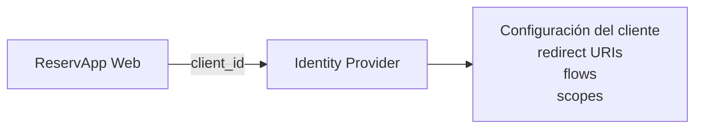

---

## 4. Redirect URI

Después de autenticar/autorizAR, el proveedor debe devolver el control al cliente.

Ese destino no puede ser arbitrario.

Debe existir una **redirect URI registrada previamente**.

Ejemplo local:

```text
http://localhost:3000/callback
```

### ¿Por qué se valida?

Si el proveedor aceptara cualquier URL enviada por el cliente, un atacante podría intentar desviar el resultado de autenticación hacia un sitio controlado por él.

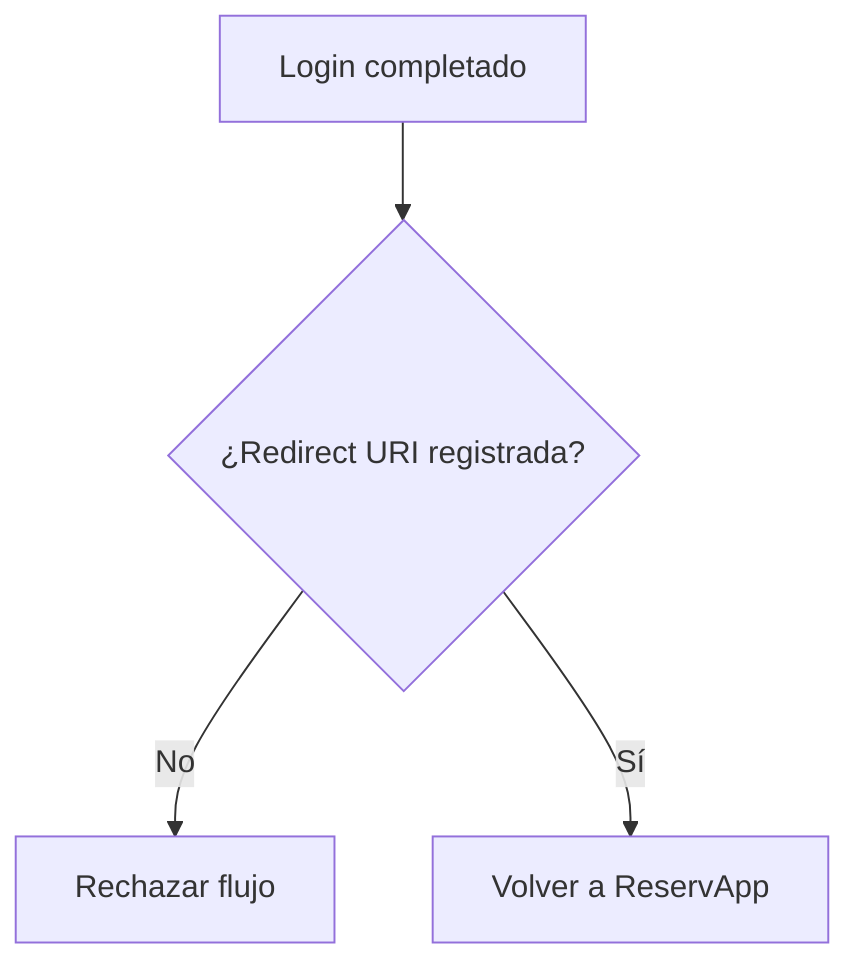

La comparación de redirect URI debe entenderse como una **medida de seguridad**, no como un trámite burocrático de configuración.

---

## 5. Cliente público vs cliente confidencial

Esta distinción responde a una pregunta:

> ¿La aplicación puede guardar una credencial secreta de manera confiable?

### Cliente público

No puede mantener un secreto con garantías suficientes.

Ejemplos:

- SPA ejecutándose en navegador;
- aplicación móvil;
- aplicación instalada en equipo del usuario.

Aunque el código contenga una cadena llamada `client_secret`, el usuario puede inspeccionarla o extraerla.

Por eso no tiene sentido tratar ese valor como secreto real.

### Cliente confidencial

Se ejecuta en un entorno controlado donde puede proteger credenciales.

Ejemplos:

- backend server-side;
- servicio ejecutado en infraestructura controlada.

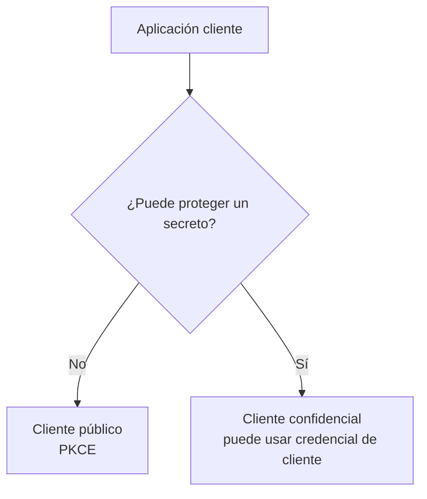

---

## 6. ¿Por qué PKCE importa para ReservApp Web?

En un cliente público no podemos basar la seguridad en un secreto embebido.

PKCE crea una prueba por cada intento de autorización.

El cliente genera conceptualmente:

```text
code_verifier → valor secreto temporal del intento
code_challenge → derivado del verifier
```

Al inicio envía el challenge.

Al intercambiar el código demuestra que conoce el verifier original.

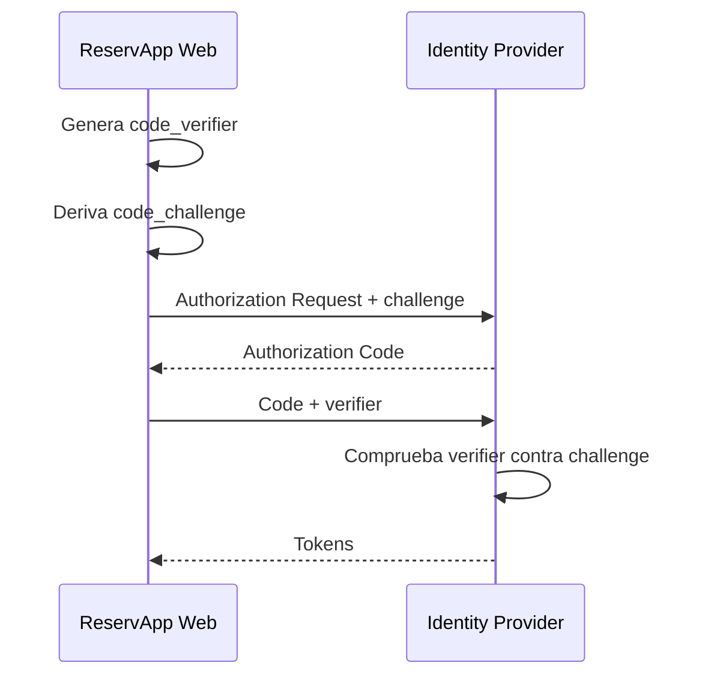

No necesitamos programarlo todavía; necesitamos entender **qué riesgo intenta reducir**.

---

## 7. API, audience y recurso protegido

`reservapp-api` necesita poder reconocer tokens que fueron emitidos **para ella**.

Ahí aparece la **audience (`aud`)**.

Ejemplo conceptual:

```text
aud = reservapp-api
```

Si un token fue emitido para:

```text
aud = another-api
```

ReservApp API no debería aceptarlo aunque:

- tenga firma válida;
- no esté expirado;
- provenga del mismo proveedor.

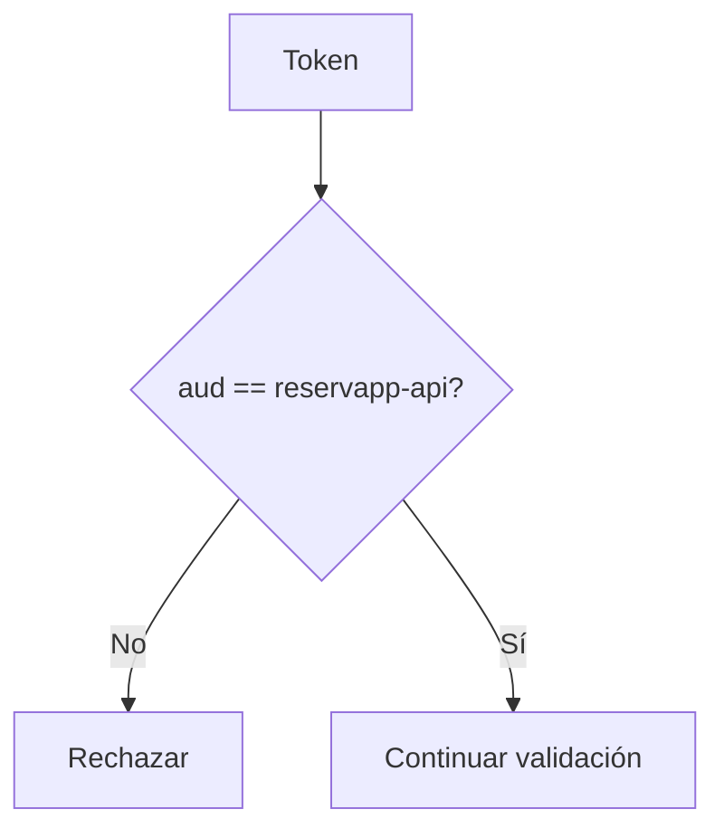

---

## 8. Scopes: lo que el cliente solicita y la API entiende

ReservApp utiliza inicialmente:

```text
reservations.read
reservations.write
```

Podemos pensar la relación así:

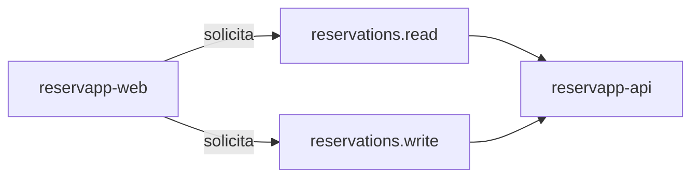

El cliente no debería pedir permisos innecesarios “por si acaso”.

Eso se relaciona con el principio de **mínimo privilegio**.

### Ejemplo

Si una pantalla solo consulta reservas:

```text
reservations.read
```

puede ser suficiente.

No existe razón automática para solicitar también escritura.

---

## 9. Issuer + audience + scopes trabajan juntos

Cuando la API recibe un access token debe comprobar más de una dimensión.

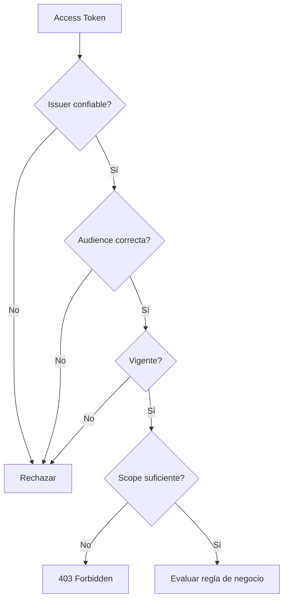

Que una comprobación sea correcta no reemplaza a las demás.

---

## 10. ¿Dónde entra el API Gateway?

Nuestra arquitectura incluye un gateway entre cliente y backend.

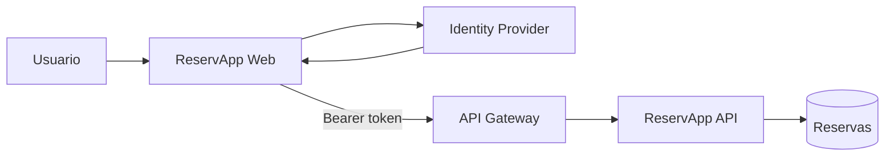

El gateway puede aplicar validaciones transversales, pero el backend sigue teniendo información que el gateway probablemente no posee.

Ejemplo:

```text
scope válido: reservations.write
```

pero la operación es:

```text
DELETE /reservas/982
```

Para saber si esa reserva pertenece al usuario, ReservApp API puede necesitar consultar los datos del dominio.

---

## 11. Client secret: cuándo existe y cuándo NO corresponde

Un **client secret** es una credencial utilizada por ciertos clientes confidenciales.

No debe confundirse con:

- Client ID;
- contraseña del usuario;
- access token.

### Regla práctica

Nunca debemos subir secretos a:

- repositorios;
- JavaScript frontend;
- documentación pública;
- capturas de pantalla compartidas.

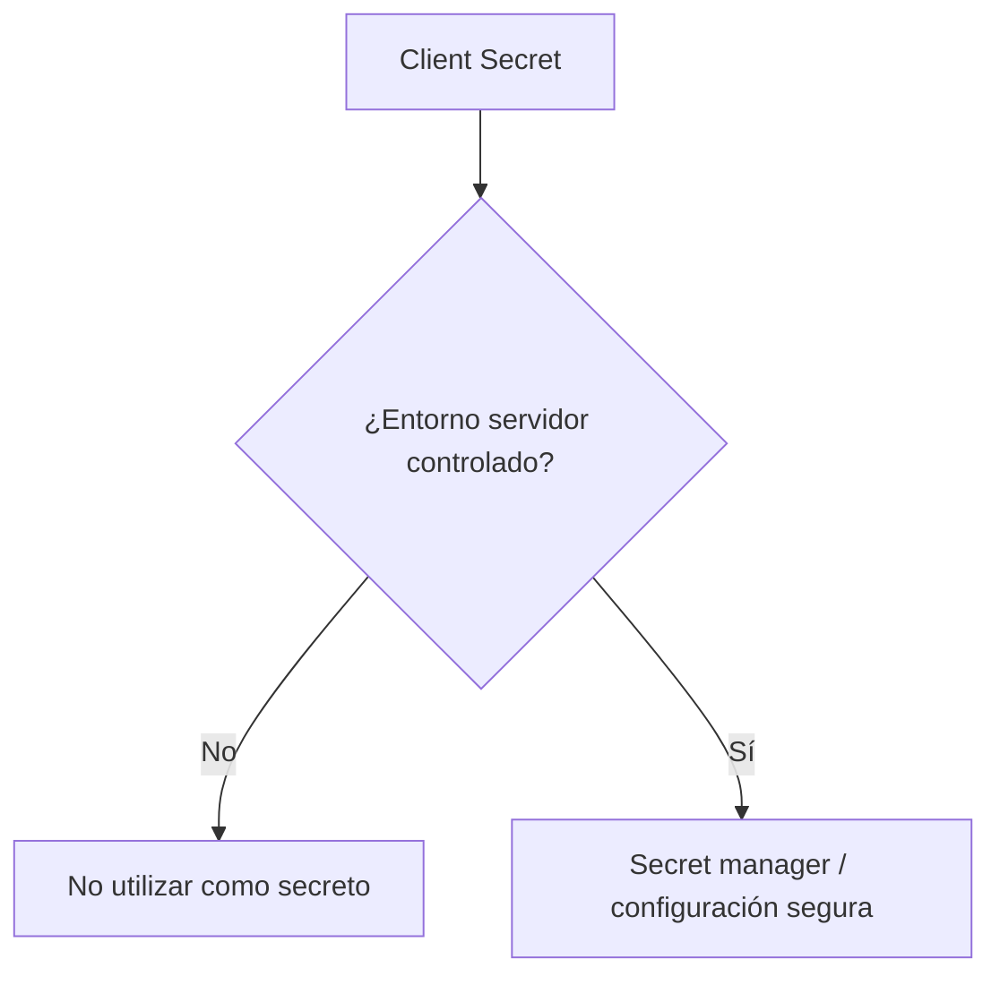

---

## 12. Configuración conceptual de ReservApp

### Cliente

```text
Nombre: reservapp-web
Tipo: cliente público
Client ID: asignado por proveedor
Redirect URI local: http://localhost:3000/callback
Scopes: reservations.read reservations.write
Client Secret: no
Flujo: Authorization Code + PKCE
```

### API

```text
Nombre: reservapp-api
Tipo: recurso protegido
Audience: reservapp-api
Issuer esperado: tenant de ReservApp
Scopes: reservations.read reservations.write
```

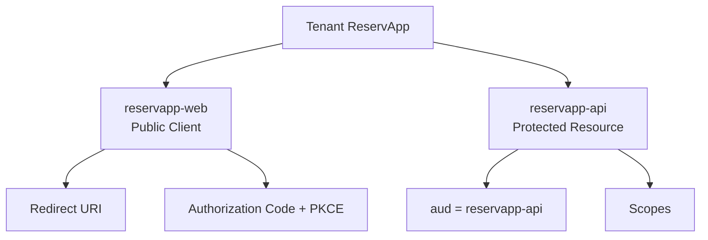

---

## 13. Flujo completo de la semana

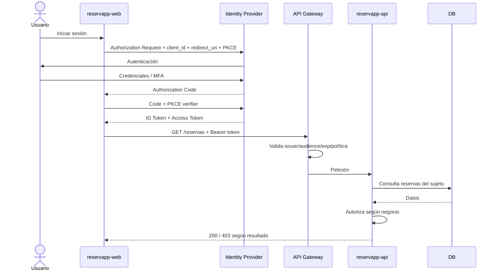

Este diagrama reúne los cuatro temas de Semana 02.

---

## 14. Actividad práctica · `app-registration-design.md`

En el repositorio grupal creen:

```text
app-registration-design.md
```

### A. Cliente

Completen:

```text
Nombre: reservapp-web
Tipo de cliente: __________________
Client ID: lo asignará el proveedor
Redirect URI local: __________________
Scopes solicitados: __________________
¿Utiliza client secret?: sí/no
Justificación: __________________
```

### B. API

```text
Nombre: reservapp-api
Audience esperada: __________________
Issuer esperado: __________________
Scopes aceptados: __________________
```

### C. Matriz de errores

Analicen:

1. redirect URI no registrada;
2. token emitido por issuer desconocido;
3. token con audience de otra API;
4. token expirado;
5. falta `reservations.write`;
6. scope correcto pero reserva perteneciente a otro usuario.

Para cada caso indiquen:

- componente que detecta;
- respuesta esperada;
- motivo.

### D. Diagrama Mermaid

Dibujen el flujo completo y etiqueten:

- `client_id`;
- redirect URI;
- Authorization Code;
- PKCE;
- access token;
- API Gateway;
- audience;
- scopes;
- autorización de negocio.

---

## 15. Errores frecuentes

- creer que Client ID es secreto;
- poner un client secret en una SPA;
- aceptar cualquier redirect URI;
- confundir audience con scope;
- creer que tener token implica acceso universal;
- aceptar tokens emitidos para otra API;
- utilizar ID token como access token;
- pedir todos los scopes disponibles aunque no sean necesarios;
- suponer que el gateway conoce automáticamente las reglas del dominio.

---

## Checkpoint de Semana 02

ReservApp debe terminar con un diseño donde pueda explicarse:

```text
Usuario
  → reservapp-web
  → Identity Provider
  → Authorization Code + PKCE
  → tokens
  → API Gateway
  → reservapp-api
  → reglas de negocio
```

Y además:

- Client ID;
- redirect URI;
- cliente público vs confidencial;
- issuer;
- audience;
- scopes;
- access token vs ID token;
- 401 vs 403;
- responsabilidades gateway/backend.

## Continuidad

Cuando se incorpore un proveedor real, esta etapa no debería rediseñarse desde cero: habrá que **mapear estas decisiones conceptuales a la terminología y configuración concreta del proveedor**, obtener tokens reales y validar efectivamente la integración.