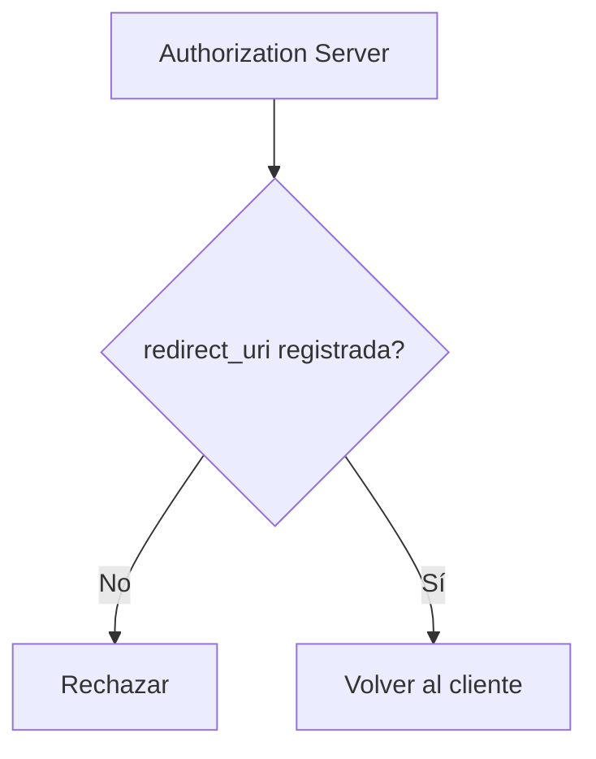

# Client ID y Redirect URI

← [Volver a la profundización](./README.md)

## Client ID

El `client_id` identifica a una aplicación cliente ante el Authorization Server.

No es una contraseña ni un secreto. Su función es permitir que el servidor recupere la configuración del cliente.

```text
client_id = reservapp-web-123
```

A partir de ese identificador, el proveedor puede conocer:

- redirect URIs permitidas;
- flujos habilitados;
- scopes que el cliente puede solicitar;
- tipo de cliente;
- políticas asociadas.

## Redirect URI

La `redirect_uri` indica dónde debe devolver el Authorization Server el navegador después de completar el paso interactivo del flujo.

Ejemplo:

```text
http://localhost:3000/callback
```

## ¿Por qué debe registrarse previamente?

Porque aceptar cualquier destino permitiría intentar redirigir códigos o respuestas de autenticación hacia un sitio controlado por un atacante.



## No confundir

```text
client_id
→ identifica al software cliente

redirect_uri
→ indica un destino permitido para regresar al cliente

client_secret
→ credencial que solo algunos tipos de clientes pueden proteger
```

Una SPA o una aplicación móvil no debe considerarse capaz de mantener de forma segura un secreto embebido en su código.