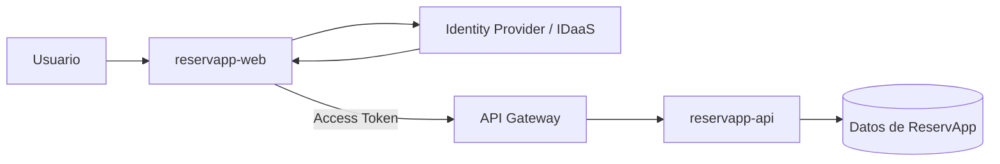
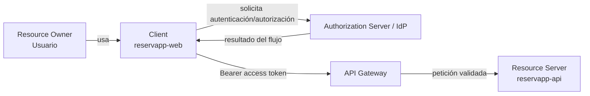
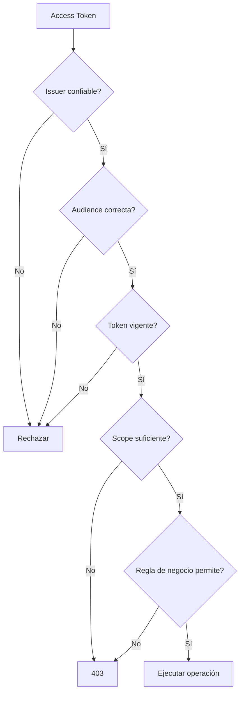
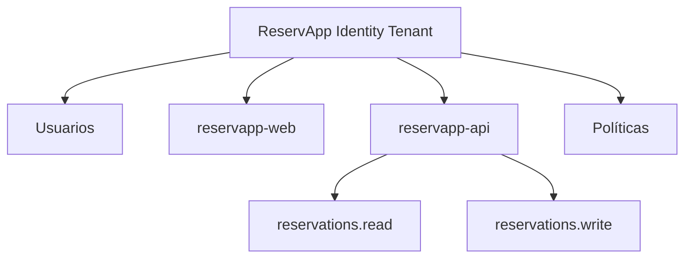
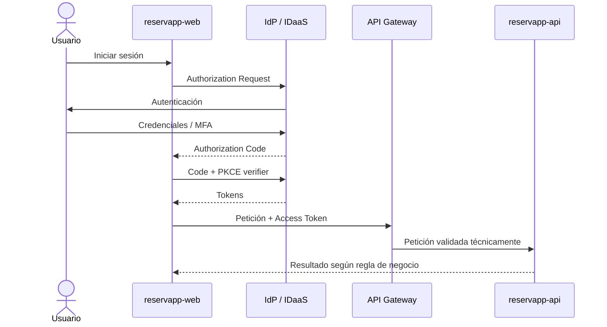

# Laboratorio · ReservApp · Identidad, autorización e IDaaS

**Duración sugerida:** 45–60 minutos, divisible entre bloques de la semana.  
**Modalidad:** grupos de máximo 3 integrantes.  
**Prerequisito:** haber cerrado o comprendido el laboratorio de API Gateway de Semana 01.

Este laboratorio integra los contenidos **1.2.1 a 1.2.4** de Semana 02. No utiliza todavía un proveedor real: el objetivo es que el grupo pueda **diseñar, justificar y defender** la solución antes de trasladarla a una consola cloud.

> **Dominio formativo transversal:** ReservApp es el sistema que reutilizaremos durante las actividades formativas de DSY1107. No corresponde al dominio de las evaluaciones sumativas.

---

## 0. Punto de partida

ReservApp permite a clientes gestionar reservas de servicios. Desde Semana 01 ya tenemos conceptualmente:

```text
cliente → API Gateway → reservapp-api
```

con:

- rutas a la API;
- versionado `/v1` y `/v2`;
- CORS;
- operaciones HTTP sobre reservas.

Ahora aparece un nuevo problema:

> ¿Cómo sabemos quién está usando ReservApp y qué operaciones puede realizar sin implementar todo el sistema de identidad desde cero?

El incremento de esta semana deberá llegar conceptualmente a:



---

# Parte 1 · Partir desde algo cotidiano

Antes de trabajar ReservApp, analicen estos dos casos.

### Caso A · “Continuar con Google”

Una aplicación permite crear/iniciar una sesión usando una cuenta Google.

Respondan:

1. ¿La aplicación necesita conocer la contraseña de Google del usuario?
2. ¿Qué problema principal se está resolviendo: identidad, acceso a Drive o ambos?
3. ¿Qué papel cumple Google en este caso?
4. ¿Qué información mínima podría necesitar la aplicación para reconocer al usuario?

### Caso B · “Conectar Google Drive”

El usuario ya inició sesión en una aplicación de diseño y ahora quiere abrir imágenes desde Google Drive o guardar allí un archivo.

Respondan:

1. ¿Haber iniciado sesión con Google significa que la aplicación puede leer automáticamente todo el Drive?
2. ¿Qué recurso adicional está intentando utilizar la aplicación?
3. ¿Qué tipo de permiso debería solicitar?
4. ¿Qué debería ocurrir si el usuario rechaza ese permiso?

### Conclusión esperada

Deben poder explicar con sus palabras:

```text
identificar al usuario ≠ autorizar acceso a otro recurso
```

Y relacionarlo con:

```text
OIDC   → identidad/autenticación
OAuth2 → autorización delegada
```

---

# Parte 2 · Identificar los actores de ReservApp

Dibujen en Mermaid el flujo de ReservApp e identifiquen explícitamente:

- **Resource Owner**;
- **Client**;
- **Authorization Server / Identity Provider**;
- **Resource Server**;
- **API Gateway**.

No basta con poner cajas. Sobre las flechas indiquen qué ocurre o qué artefacto viaja.

Su diagrama debe evolucionar aproximadamente hacia:



## Preguntas

1. ¿Por qué `reservapp-web` es el Client y no el usuario?
2. ¿Por qué `reservapp-api` es Resource Server?
3. ¿El API Gateway es un actor obligatorio de OAuth2? Justifiquen.

---

# Parte 3 · Autenticación, autorización y regla de negocio

Clasifiquen cada situación como:

- autenticación;
- validación técnica;
- autorización;
- autorización/regla de negocio.

Casos:

1. El usuario ingresa credenciales incorrectas.
2. La API recibe una petición sin token.
3. El token está expirado.
4. El token fue emitido para otra API.
5. El token no contiene `reservations.write`.
6. Un cliente con `reservations.write` intenta cancelar una reserva perteneciente a otro cliente.
7. Un operador intenta cancelar una reserva que ya está cancelada.

Para cada caso indiquen además **qué componente debería detectarlo principalmente**:

```text
IdP / reservapp-web / API Gateway / reservapp-api
```

---

# Parte 4 · Access Token, ID Token, scopes, roles y claims

## A. Tokens

Construyan una tabla con al menos estas columnas:

| Aspecto | Access Token | ID Token |
|---|---|---|
| Propósito | | |
| Destinatario principal | | |
| ¿Se usa para llamar una API? | | |
| ¿Qué error conceptual habría al intercambiarlos? | | |

## B. Scopes

ReservApp parte con:

```text
reservations.read
reservations.write
```

Respondan:

1. ¿Qué permite conceptualmente cada uno?
2. ¿Una pantalla solo lectura debería solicitar ambos? ¿Por qué?
3. ¿`reservations.write` permite cancelar cualquier reserva? ¿Por qué no necesariamente?

## C. Roles

Consideren:

```text
customer
operator
```

Expliquen por qué un **role** y un **scope** no representan exactamente la misma idea.

## D. Claims

Clasifiquen los siguientes claims:

```text
sub
iss
aud
exp
scope
role
```

Indiquen qué pregunta ayuda a responder cada uno.

---

# Parte 5 · Inspección razonada de un token

Usen este **payload didáctico**. No es un token real:

```json
{
  "iss": "https://identity.example.edu/reservapp",
  "sub": "user-1024",
  "aud": "reservapp-api",
  "exp": 1787000000,
  "scope": "reservations.read reservations.write",
  "role": "customer"
}
```

Respondan:

1. ¿Quién emitió el token?
2. ¿Cuál es el sujeto autenticado?
3. ¿Para qué recurso fue emitido?
4. ¿Qué capacidades declara?
5. ¿Qué función/contexto declara el usuario?
6. ¿Qué debería comprobarse respecto de `exp`?
7. ¿Qué información falta para decidir si `user-1024` puede cancelar la reserva `R-500`?
8. ¿Dónde debería obtenerse esa información faltante?

Luego dibujen la decisión:



---

# Parte 6 · Comprender IDaaS y CIAM

ReservApp no quiere implementar desde cero:

- almacenamiento de contraseñas;
- recuperación de cuenta;
- MFA;
- emisión de tokens;
- federación/login social;
- registro y administración de aplicaciones.

## A. Mapa de responsabilidades

Clasifiquen quién sería responsable principalmente de cada tarea:

| Responsabilidad | IdP / IDaaS | reservapp-web | Gateway | reservapp-api |
|---|---:|---:|---:|---:|
| Verificar credenciales | | | | |
| MFA | | | | |
| Emitir tokens | | | | |
| Enviar Bearer token | | | | |
| Validar issuer/audience/exp | | | | |
| Comprobar propiedad de una reserva | | | | |
| Validar que una reserva pueda cancelarse por su estado | | | | |

Justifiquen las decisiones que puedan depender de arquitectura.

## B. IAM vs CIAM

Respondan:

1. ¿Por qué ReservApp se parece a un escenario CIAM si permite autoregistro de clientes externos?
2. ¿Un operador interno representa exactamente la misma población de identidad que un cliente externo?
3. ¿Qué diferencias de política podrían existir?

## C. Identidad externa vs usuario de negocio

Supongan:

```text
Identity Provider
sub = user-1024
email = ana@example.com
```

Y en ReservApp:

```text
Cliente
id = 827
identitySubject = user-1024
nombre = Ana
```

Expliquen por qué puede ser útil mantener separados ambos conceptos.

---

# Parte 7 · Diseñar el tenant de identidad de ReservApp

Creen `tenant-design.md`.

Debe contener como mínimo:

## A. Poblaciones

Definan:

```text
customer
operator
```

Expliquen la diferencia de negocio entre ambas.

## B. Aplicaciones / recursos

Identifiquen:

```text
reservapp-web
reservapp-api
```

Para cada una indiquen:

- rol dentro del flujo;
- quién solicita tokens;
- quién consume access tokens.

## C. Scopes

Incluyan al menos:

```text
reservations.read
reservations.write
```

No agreguen más scopes sin justificar una necesidad real.

## D. Claims

Propongan los claims mínimos útiles y justifiquen por qué están presentes.

## E. Frontera de confianza

Expliquen por qué `reservapp-api` no debería aceptar tokens emitidos por cualquier issuer.

## F. Diagrama Mermaid

Dibujen una estructura semejante a:



No copien el diagrama sin analizarlo: adapten etiquetas y relaciones a sus decisiones.

---

# Parte 8 · Diseñar el registro de aplicaciones

Creen `app-registration-design.md`.

## `reservapp-web`

Completen:

```text
Nombre: reservapp-web
Rol: Client
Tipo de cliente: __________________
Client ID: asignado por proveedor
Redirect URI local: __________________
Scopes solicitados: __________________
¿Utiliza client secret?: __________________
Flujo recomendado: __________________
```

Justifiquen especialmente:

- por qué Client ID no es una contraseña;
- por qué la redirect URI debe estar registrada;
- si el cliente puede o no proteger un secret;
- por qué Authorization Code + PKCE resulta apropiado si lo modelan como cliente público.

## `reservapp-api`

Completen:

```text
Nombre: reservapp-api
Rol: Resource Server
Issuer esperado: __________________
Audience esperada: __________________
Scopes aceptados: __________________
```

---

# Parte 9 · Authorization Code + PKCE

Construyan un `sequenceDiagram` Mermaid del flujo de login de ReservApp.

Debe mostrar como mínimo:

1. usuario solicita iniciar sesión;
2. `reservapp-web` inicia autorización;
3. se utiliza `client_id` y redirect URI;
4. existe challenge PKCE;
5. el IdP autentica al usuario;
6. vuelve un Authorization Code;
7. el cliente intercambia code + verifier;
8. obtiene ID Token y Access Token;
9. utiliza **Access Token** ante el API Gateway;
10. gateway y backend realizan sus respectivas validaciones.

Pueden partir de esta estructura, pero deben completar correctamente las etiquetas:



---

# Parte 10 · Matriz 401 / 403 y otros rechazos

Completen una tabla para estos escenarios:

1. petición sin token;
2. token expirado;
3. issuer desconocido;
4. audience para otra API;
5. token válido sin `reservations.write`;
6. token con scope correcto intentando cancelar reserva ajena;
7. redirect URI no registrada;
8. usuario rechaza autorización solicitada;
9. Authorization Code interceptado pero sin PKCE verifier correcto.

Para cada uno indiquen:

```text
componente que detecta
momento del flujo
tipo de problema
resultado esperado
justificación
```

> No todos los casos ocurren dentro de `reservapp-api`; por tanto, no fuercen todos a convertirse en 401 o 403.

---

# Parte 11 · Arquitectura final de Semana 02

Construyan un diagrama Mermaid final que reúna:

- usuario;
- `reservapp-web`;
- tenant/IdP/IDaaS;
- API Gateway;
- `reservapp-api`;
- base de datos del dominio;
- Authorization Code + PKCE;
- ID Token;
- Access Token;
- scopes;
- issuer;
- audience;
- validación técnica;
- autorización de negocio.

El diagrama debe permitir explicar de extremo a extremo:

> “Carlos entra a ReservApp, se autentica y luego intenta cancelar una reserva propia”.

Y también:

> “Carlos está autenticado, tiene `reservations.write`, pero intenta cancelar la reserva de Ana”.

---

# Entrega mínima

El repositorio grupal debe contener como mínimo:

```text
README.md
tenant-design.md
app-registration-design.md
```

Dentro de esos documentos deben quedar:

- analogía “Continuar con Google” vs “Conectar Google Drive”;
- actores OAuth2/OIDC;
- autenticación vs autorización;
- Access Token vs ID Token;
- scopes;
- roles;
- claims;
- análisis del payload JWT didáctico;
- IAM / IDaaS / CIAM;
- usuario de identidad vs entidad de negocio;
- diseño del tenant;
- Client ID;
- redirect URI;
- cliente público/confidencial;
- Authorization Code + PKCE;
- issuer y audience;
- matriz de errores y 401/403;
- responsabilidad de gateway y backend;
- autorización de negocio;
- al menos **tres diagramas Mermaid**: arquitectura, tenant y secuencia.

---

# Defensa técnica

Cada integrante debe estar preparado para responder preguntas distintas. No basta con que una persona comprenda todo el trabajo.

Preguntas posibles:

1. ¿Por qué OAuth2 y OIDC no son sinónimos?
2. ¿Por qué “Continuar con Google” no entrega automáticamente acceso a Google Drive?
3. ¿Quién debería recibir un ID Token y quién un Access Token?
4. ¿Por qué un JWT firmado no basta si la audience es incorrecta?
5. ¿Qué diferencia existe entre scope y role?
6. ¿Para qué sirve un tenant?
7. ¿Qué identifica Client ID?
8. ¿Por qué una SPA no debería guardar un client secret?
9. ¿Qué problema ayuda a reducir PKCE?
10. ¿Qué puede validar el gateway y qué necesariamente debe resolver el backend?
11. ¿Por qué `reservations.write` no significa “puedo modificar cualquier reserva”? 
12. ¿Qué diferencia existe entre el usuario del IdP y la entidad Cliente de ReservApp?

No se requiere PPT.

---

# Restricciones

Esta semana **NO** deben:

- crear un tenant real en Azure u otro proveedor;
- crear secretos reales;
- publicar credenciales;
- pegar tokens reales en GitHub;
- copiar una configuración de Internet sin comprenderla;
- implementar todavía la integración cloud solo para “hacerla funcionar”.

El objetivo es obtener un **diseño técnicamente defendible y portable**.

---

# Checkpoint para la próxima experiencia

No eliminen ni reescriban desde cero este trabajo.

ReservApp debe quedar al terminar Semana 02 con:

```text
Gateway + versionado + CORS
        +
modelo OAuth2/OIDC
        +
IDaaS/CIAM
        +
diseño tenant
        +
app registrations conceptuales
        +
Authorization Code + PKCE
        +
issuer / audience / scopes / claims
        +
responsabilidades gateway/backend
```

Cuando llegue el proveedor real y el trabajo con JWT, **evolucionaremos este mismo checkpoint**.