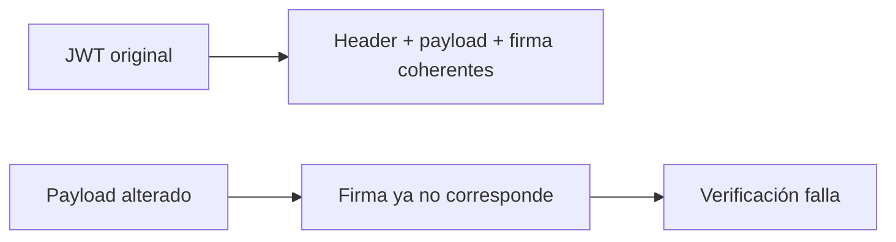

# Estructura, codificación y firma

← [Volver a la profundización](./README.md)

Un JWT suele verse así:

```text
xxxxx.yyyyy.zzzzz
```

Cada segmento tiene un propósito distinto:

```text
header.payload.signature
```

## 1. Header

El header describe metadatos necesarios para interpretar/verificar el token.

Ejemplo conceptual:

```json
{
  "alg": "RS256",
  "typ": "JWT",
  "kid": "key-2026-08"
}
```

- `alg`: algoritmo declarado para la firma;
- `typ`: tipo de objeto;
- `kid`: identificador de la clave utilizada, cuando corresponde.

## 2. Payload

El payload contiene claims.

```json
{
  "iss": "https://identity.example/",
  "sub": "user-123",
  "aud": "products-api",
  "exp": 1780000000,
  "scope": "products.read"
}
```

Estos datos **no están cifrados por ser JWT**.

El contenido se codifica de una forma que facilita su transporte. Por eso es posible inspeccionarlo sin poseer una clave privada.

## 3. Signature

La firma permite comprobar que los datos firmados no fueron modificados y que fueron emitidos por una autoridad cuya clave confiamos.

Conceptualmente:

```text
header + payload
      ↓
algoritmo de firma
      ↓
signature
```

La API no debería “recalcular la firma con la clave privada del proveedor”. En escenarios habituales de firma asimétrica, el emisor conserva la clave privada y los consumidores verifican usando la clave pública correspondiente.

## 4. ¿Qué pasa si modifico el payload?

Imagina que un atacante cambia:

```json
"scope": "products.read"
```

por:

```json
"scope": "products.write"
```

El payload modificado seguirá siendo legible, pero la firma dejará de corresponder con el contenido original.



## 5. Codificar no es cifrar

Error frecuente:

> “Como el payload no se ve a simple vista, está cifrado.”

Incorrecto.

Los claims de un JWT no deben contener secretos simplemente porque el token tenga apariencia ilegible.

Evita colocar información sensible innecesaria en un token.

## 6. JWT y JWS

Muchos access tokens con formato JWT utilizan una firma bajo el estándar JWS.

Para este curso basta comprender:

```text
JWT → estructura de claims/token
JWS → mecanismo para representar contenido firmado
```

No necesitas implementar manualmente criptografía ni construir validadores propios.

## Preguntas de comprobación

1. ¿Por qué puedes leer un payload sin conocer la clave privada?
2. ¿Qué propiedad aporta la firma?
3. ¿Qué ocurre si modificas un claim sin generar una firma válida?
4. ¿Por qué no deberías guardar secretos en el payload?
5. ¿Por qué una biblioteca de seguridad debe verificar el token y no limitarse a decodificarlo?