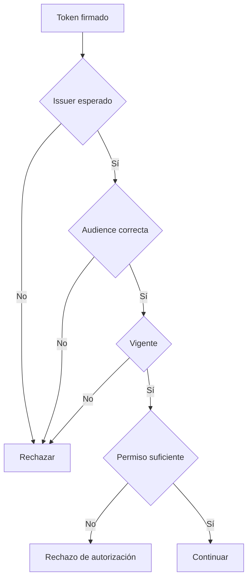

# Validación contextual de claims

← [Volver a la profundización](./README.md)

Una firma válida no basta para aceptar un token.

La API también debe comprobar si ese token **pertenece al contexto correcto**.

## Firma válida, token incorrecto

Imagina un token correctamente firmado por un proveedor confiable, pero emitido para otra API.

```json
{
  "iss": "https://identity.example/",
  "aud": "billing-api",
  "scope": "billing.read"
}
```

Si llega a `products-api`, la firma puede ser válida y aun así el token debe rechazarse.

## Claims principales

### `iss` — issuer

Responde:

> ¿Quién emitió este token?

La API debe conocer qué emisores acepta.

### `aud` — audience

Responde:

> ¿Para qué recurso fue emitido?

Un token para `billing-api` no debe aceptarse automáticamente en `products-api`.

### `exp` — expiration time

Responde:

> ¿Hasta cuándo es válido?

Un token expirado no debería seguir habilitando acceso.

### `nbf` — not before

Cuando existe, indica desde qué instante el token puede considerarse válido.

### `sub` — subject

Identifica al sujeto dentro del contexto del emisor.

No debe confundirse automáticamente con un ID interno de negocio.

## Claims de identidad vs permisos

Un token puede declarar quién es el sujeto y además capacidades como:

```text
products.read
products.write
```

Pero poseer identidad no implica poseer todos los permisos.



## Validar no es autorizar el negocio

Incluso después de superar estas comprobaciones, todavía puede existir una regla de dominio.

Ejemplo:

```text
scope = products.write
```

puede habilitar técnicamente la operación, pero el backend podría impedir modificar un producto marcado como bloqueado.

## Mini análisis

Para cada caso decide si el token debería aceptarse en `products-api`:

1. firma válida, `aud=products-api`, expirado;
2. firma válida, vigente, `aud=billing-api`;
3. firma válida, audience correcta, scope insuficiente;
4. firma válida, audience correcta, vigente y scope suficiente;
5. payload perfecto, pero firma inválida.

Justifica siempre **qué condición falla**, no solo el status esperado.