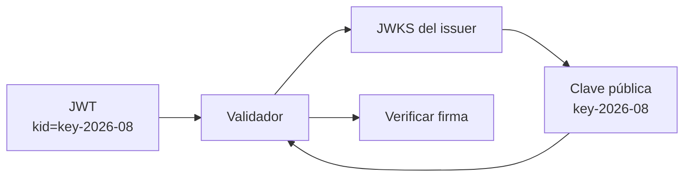

# Claves públicas, `kid` y JWKS

← [Volver a la profundización](./README.md)

Cuando un proveedor firma tokens con criptografía asimétrica, normalmente conserva la **clave privada** y publica una o más **claves públicas** para que APIs y gateways puedan verificar las firmas.

## Problema práctico

Un proveedor puede tener más de una clave activa o rotarlas con el tiempo.

Entonces la API necesita responder:

> ¿Qué clave pública corresponde a este token?

Ahí aparece `kid`.

## `kid`

En el header puede existir algo como:

```json
{
  "alg": "RS256",
  "kid": "key-2026-08"
}
```

`kid` significa **Key ID**.

No es la clave misma. Es un identificador que ayuda a seleccionar la clave adecuada dentro del conjunto publicado por el emisor.

## JWKS

JWKS significa **JSON Web Key Set**.

Conceptualmente es un documento que publica claves disponibles para verificación.

Ejemplo muy simplificado:

```json
{
  "keys": [
    {
      "kid": "key-2026-08",
      "kty": "RSA"
    },
    {
      "kid": "key-2026-07",
      "kty": "RSA"
    }
  ]
}
```

La biblioteca/framework de seguridad puede usar el `kid` del token para ubicar la clave pública correspondiente.



## Rotación de claves

Una plataforma de identidad puede cambiar sus claves por razones operativas o de seguridad.

Por eso una integración robusta no debería depender de copiar manualmente una única clave para siempre.

Conceptualmente:

```text
emisor
→ publica claves actuales
→ firma con una clave privada
→ identifica la clave mediante kid

API/gateway
→ obtiene claves públicas
→ selecciona según kid
→ verifica la firma
```

## ¿Qué NO debería hacer el estudiante?

Para esta asignatura no necesitas:

- generar infraestructura criptográfica propia;
- implementar RSA manualmente;
- escribir un parser de JWKS;
- programar rotación de claves desde cero.

Debes poder explicar **qué problema resuelven `kid` y JWKS** y reconocer que normalmente el framework realiza estas operaciones.

## Preguntas de comprobación

1. ¿Por qué el proveedor no entrega su clave privada a la API?
2. ¿Qué identifica `kid`?
3. ¿Para qué sirve un JWKS?
4. ¿Qué problema aparece cuando el proveedor rota claves?
5. ¿Por qué fijar manualmente una única clave pública para siempre puede ser frágil?