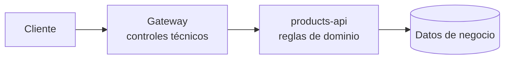

# Gateway vs backend: frontera de responsabilidad

← [Volver a la profundización](./README.md)

Un API Gateway puede aplicar seguridad transversal, pero no conoce necesariamente todo el contexto del dominio.

## Controles adecuados para el gateway

Ejemplos típicos:

- exigir `Authorization: Bearer ...`;
- validar estructura/firma del token;
- validar issuer y audience;
- comprobar expiración;
- exigir un scope general para una ruta;
- rate limiting;
- políticas comunes de entrada;
- observabilidad transversal.

Estas reglas suelen repetirse entre endpoints o servicios y no requieren conocer profundamente el negocio.

## Decisiones adecuadas para el backend

Ejemplos:

- el recurso pertenece realmente al usuario autenticado;
- el producto está en un estado que permite modificarlo;
- una reserva ya fue cancelada;
- el actor puede operar sobre **este recurso concreto**;
- una transición de estado es válida.

Estas decisiones dependen de datos e invariantes del dominio.

## Ejemplo con `products-api`

Supongamos:

```http
PUT /products/42
Authorization: Bearer <token>
```

El token contiene:

```text
scope = products.write
sub   = user-123
```

El gateway puede decidir:

```text
¿token válido?
¿audience correcta?
¿scope products.write presente?
```

El backend todavía puede necesitar responder:

```text
¿product 42 puede modificarse?
¿user-123 tiene relación con este producto?
¿su estado actual admite la operación?
```



## ¿Por qué no poner todo en el gateway?

Porque el gateway terminaría acoplado a:

- tablas internas;
- estados de entidades;
- reglas cambiantes del negocio;
- detalles que pertenecen al servicio.

Eso convierte una capa transversal en un segundo backend difícil de mantener.

## ¿Por qué no poner todo en el backend?

Porque repetir validaciones técnicas idénticas en muchos servicios puede:

- duplicar configuración;
- generar inconsistencias;
- dificultar cambios globales;
- permitir tráfico inválido más profundamente en la arquitectura.

## Principio útil

> Centraliza lo transversal; conserva lo contextual junto al dominio.

No es una ley absoluta, pero es un buen punto de partida arquitectónico.

## Preguntas de comprobación

Clasifica cada decisión como principalmente gateway o backend y justifica:

1. verificar `aud`;
2. exigir `products.write`;
3. impedir modificar un producto descontinuado;
4. comprobar que el recurso pertenece al usuario;
5. rechazar un JWT expirado;
6. limitar requests por minuto.