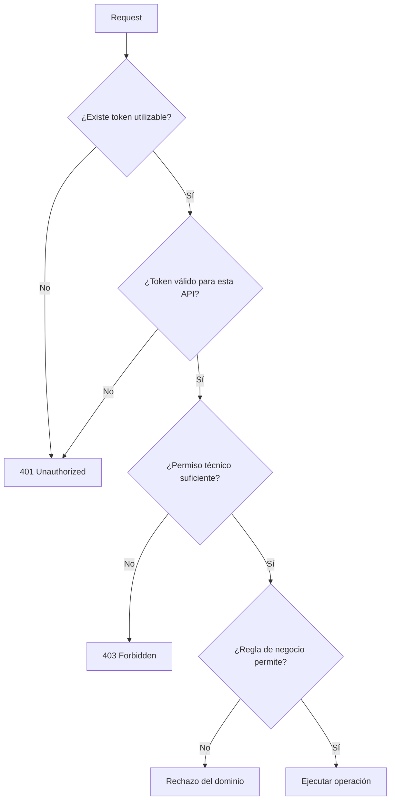

# Pipeline de acceso y 401 vs 403

← [Volver a la profundización](./README.md)

`401` y `403` suelen memorizarse como definiciones aisladas. Es más útil entender **en qué punto del pipeline falla una petición**.

## Pipeline conceptual



## 401

Como regla de aprendizaje, aparece cuando no existe una autenticación/token que el recurso pueda utilizar de forma válida.

Ejemplos:

- no hay `Authorization`;
- bearer mal formado;
- firma inválida;
- token expirado;
- issuer no confiable;
- audience incorrecta.

El detalle exacto depende del framework y de la política aplicada.

## 403

Aparece cuando el sistema reconoce una identidad/token utilizable, pero la operación no está permitida.

Ejemplo:

```text
token válido
scope = products.read
endpoint requiere products.write
```

## El backend también puede rechazar

Un token con `products.write` puede superar la política transversal y aun así fallar una regla del dominio.

Por ejemplo:

```text
producto 42 está bloqueado
```

La semántica HTTP concreta de esa regla debe definirse según la API; no todo rechazo de negocio debe memorizarse automáticamente como 403.

## ¿Quién respondió?

Una pregunta importante al depurar es:

> ¿Qué componente generó la respuesta?

Puede haber rechazado:

- el gateway;
- un filtro de seguridad del backend;
- el controlador/servicio de negocio;
- otra infraestructura intermedia.

## Matriz de análisis

| Caso | Token | Scope | Regla de negocio | Punto probable de rechazo |
|---|---|---|---|---|
| A | ausente | — | — | autenticación |
| B | expirado | — | — | validación token |
| C | válido | insuficiente | — | autorización técnica |
| D | válido | correcto | inválida | dominio |
| E | válido | correcto | válida | operación permitida |

## Preguntas de comprobación

1. ¿Por qué un token expirado no se trata igual que un token válido sin scope?
2. ¿Qué diferencia existe entre validar el token y autorizar la operación?
3. ¿Por qué conviene registrar qué componente emitió el rechazo?
4. ¿Por qué no todo error de negocio debe etiquetarse automáticamente como 403?