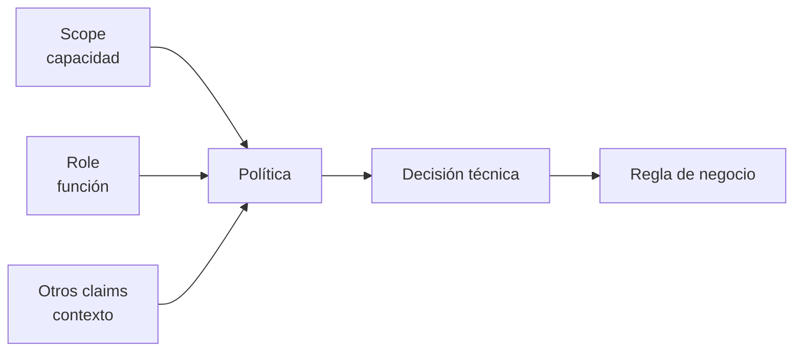

# Scopes, roles y claims en autorización

← [Volver a la profundización](./README.md)

Scopes, roles y claims pueden participar en una decisión de acceso, pero no significan lo mismo.

## Scope

Un scope suele expresar una **capacidad concedida sobre un recurso**.

Ejemplo:

```text
products.read
products.write
```

Su pregunta típica es:

> ¿Qué capacidad fue concedida a este cliente/sujeto sobre esta API?

## Role

Un rol suele expresar una **función o pertenencia** dentro de un sistema.

Ejemplos:

```text
customer
operator
admin
```

Su pregunta típica es:

> ¿Qué función cumple este sujeto dentro del sistema?

## Claim

Un claim es una afirmación incluida en el token.

Ejemplos:

```text
sub
iss
aud
exp
scope
role
department
```

Un role puede viajar como claim; un scope también puede representarse mediante claims. Eso no los convierte conceptualmente en la misma cosa.

## Ejemplo de política

Supongamos un token:

```json
{
  "sub": "user-123",
  "scope": "products.write",
  "role": "operator"
}
```

Una política podría requerir:

```text
scope products.write
AND
role operator
```

Pero el backend todavía podría consultar datos del dominio.



## ¿Cuándo usar cada uno?

No existe una receta universal.

Como guía:

- usa scopes para capacidades sobre APIs/recursos;
- usa roles para funciones relativamente estables dentro del sistema;
- usa claims para transportar datos necesarios para validación o contexto;
- evita convertir cada regla de negocio en un claim solo para no consultar el dominio.

## Antipatrón: token como base de datos

Un token no debería intentar transportar todo el estado del negocio.

Ejemplo poco saludable:

```text
product42CanEdit=true
product43CanEdit=false
product44CanEdit=true
...
```

Ese tipo de información cambia con frecuencia y pertenece mejor al dominio.

## Preguntas de comprobación

1. ¿Por qué `products.write` se parece más a un scope que a un rol?
2. ¿Por qué `admin` se parece más a un rol?
3. ¿Puede un rol viajar dentro de un claim?
4. ¿Por qué eso no convierte automáticamente roles y claims en sinónimos?
5. ¿Qué información evitarías meter en un JWT porque cambia demasiado rápido?