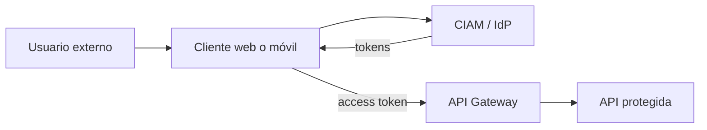

# Usuarios externos, CIAM y API protegida

← [Volver a la profundización](./README.md)

Cuando una aplicación está orientada a clientes o usuarios externos, proteger la API es solo una parte del problema. También hay que diseñar cómo esas identidades nacen, acceden, recuperan su cuenta y reciben permisos.

## Escenario

Una aplicación pública puede necesitar:

- registro/autoregistro;
- inicio de sesión;
- recuperación de contraseña;
- MFA;
- login social/federado;
- consentimiento;
- cierre de sesión;
- revocación;
- administración de sesiones;
- APIs protegidas.

Estas capacidades forman parte de un escenario cercano a **CIAM**.

## Flujo conceptual



## Qué resuelve identidad

La plataforma de identidad puede encargarse de:

- autenticar;
- recuperar cuentas;
- MFA;
- emitir tokens;
- mantener clientes registrados;
- aplicar políticas de identidad.

## Qué conserva la aplicación

La aplicación sigue siendo responsable de:

- decidir qué operaciones existen;
- definir scopes/capacidades;
- proteger datos;
- aplicar reglas de negocio;
- mantener entidades propias del dominio;
- decidir qué ocurre cuando una cuenta cambia de estado.

## Usuario de identidad vs usuario del negocio

Ejemplo:

```text
IdP
sub = external-user-783
```

La aplicación puede mapearlo a:

```text
Customer
id = 4821
identitySubject = external-user-783
plan = premium
```

No son necesariamente la misma entidad.

## Login no significa acceso ilimitado

Que una persona pueda autenticarse correctamente no significa que pueda ejecutar cualquier operación de la API.

```text
autenticado
→ sabemos quién es

autorizado
→ sabemos qué puede hacer
```

La autorización sigue dependiendo de scopes, roles, claims y reglas de negocio.

## ¿Dónde entra el gateway?

Puede funcionar como punto transversal para:

- validar access tokens;
- exigir audience/issuer esperados;
- aplicar scopes por ruta;
- bloquear peticiones inválidas tempranamente.

El backend conserva reglas contextuales.

## Preguntas de comprobación

1. ¿Por qué CIAM no es simplemente una pantalla de login?
2. ¿Qué responsabilidades sigue teniendo la aplicación aunque use un proveedor gestionado?
3. ¿Por qué `sub` y el ID de cliente del negocio pueden ser distintos?
4. ¿Por qué autenticarse correctamente no implica acceso total a la API?
5. ¿Qué controles pondrías en gateway y cuáles dejarías en backend?