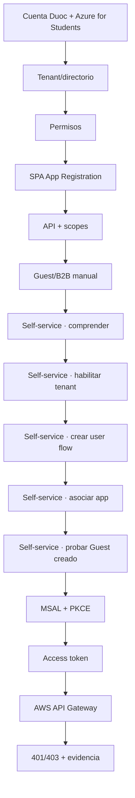
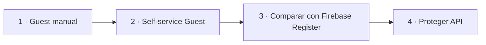

# Guía operativa · Microsoft Entra ID desde cero

**Uso en clase:** cierre de 1.2.5–1.2.8 y preparación de 1.3.x.

Esta guía se utiliza cuando el estudiante necesita configurar el entorno de identidad completo y no solo estudiar el concepto.

→ **[Abrir guía completa por etapas](../../docs/identity/entra-guia-completa/README.md)**

## Orden obligatorio en clase

## Regla docente

Si un alumno informa "no me aparece", "no tengo permiso" o "a mí me funciona pero a mi compañero no", no continuar inmediatamente con código. Identificar primero qué checkpoint falló.

| Síntoma | Primera capa a revisar |
|---|---|
| No aparece Azure for Students | cuenta/suscripción |
| No aparece tenant/directorio esperado | contexto de directorio |
| No puede registrar app | permisos/política del tenant |
| No puede invitar compañero | permisos de colaboración externa |
| Owner entra pero compañero no | Guest/B2B + aceptación + assignment |
| No aparece `User flows` | self-service tenant + permisos |
| User flow existe pero no aparece registro | asociación app + Identity Provider |
| Registro termina pero no aparece Guest | user flow / aprovisionamiento / tenant |
| Login funciona pero API no | access token / issuer / audience / scope |
| Token parece válido pero gateway rechaza | JWT Authorizer |

## Progresión pedagógica de externos

La invitación manual **no se elimina del material**: es el mecanismo que permite comprender primero el modelo `Member/Guest`. El auto-registro se enseña después como automatización del lifecycle mediante External ID.

La guía canónica contiene cada procedimiento, checkpoint, matriz de pruebas y troubleshooting. No duplicar una receta paralela dentro de la planificación semanal.
