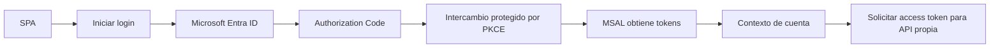
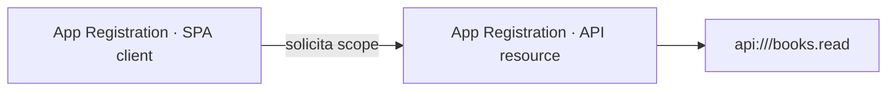
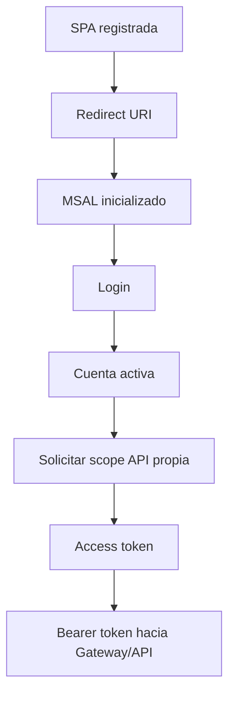

# 1 · MSAL y autenticación de frontend

## Objetivo

Comprender qué resuelve **MSAL (Microsoft Authentication Library)** y cómo participa en una SPA que autentica usuarios mediante Microsoft Entra ID y solicita un **access token para una API propia**.

## Autoridad técnica

Esta guía semanal explica el foco curricular. La configuración canónica y paso a paso de Entra vive en:

→ [Dominio Identity & Access](../../docs/identity/README.md)  
→ [Guía completa de Microsoft Entra ID](../../docs/identity/entra-guia-completa/README.md)

La práctica Full Stack que consume ese conocimiento vive en:

→ [Laboratorio Full Stack protegido](../../labs/fullstack-seguro/README.md)

No mantener aquí una segunda copia de tenant, Guest, App Registration o API Gateway.

---

## Qué problema resuelve MSAL

Una SPA no debe implementar OAuth2/OIDC manualmente. MSAL gestiona gran parte del flujo cliente:



## Authorization Code + PKCE

La SPA es un **public client**. No puede custodiar un `client_secret` de forma segura.

PKCE utiliza `code_verifier` y `code_challenge` para impedir que un authorization code interceptado sea útil sin el verifier original.

---

## ID token vs access token

| Token | Propósito principal | Destinatario |
|---|---|---|
| ID token | informar al cliente sobre la autenticación del usuario | SPA/client |
| Access token | autorizar acceso a un recurso | API / Resource Server |

**No enviar un ID token a la API como sustituto del access token.**

---

## Dos App Registrations

Para el flujo Full Stack usamos dos responsabilidades distintas:



- SPA: `clientId`, plataforma SPA, redirect URI, public client.
- API: recurso protegido, audience esperado, scopes.

Una confusión frecuente es pedir un token para Microsoft Graph y enviarlo al backend propio. Ese token corresponde a otro recurso/audience.

---

## Configuración mínima de MSAL

```javascript
const config = {
  auth: {
    clientId: "<spa-client-id>",
    authority: "https://login.microsoftonline.com/<tenant-id>",
    redirectUri: "http://localhost:5173/redirect.html"
  }
};
```

La instancia debe inicializarse antes de usar APIs interactivas:

```javascript
const msalInstance = new PublicClientApplication(config);
await msalInstance.initialize();
```

---

## Scope de la API propia

Ejemplo:

```javascript
const tokenRequest = {
  scopes: ["api://<api-client-id>/books.read"]
};
```

El access token resultante debe ser enviado como:

```text
Authorization: Bearer <access-token>
```

Nunca versionar ni publicar el token completo.

---

## Usuarios del tenant

En una App Registration single-tenant pueden autenticarse Members y Guests/B2B representados en el tenant.

Cuando al dueño le funciona y al compañero no, la ruta canónica de diagnóstico está en la guía Identity. No convertir la app a multitenant como workaround genérico.

---

## Ciclo mínimo



## Errores frecuentes

- secret en JavaScript;
- MSAL usado antes de `initialize()`;
- redirect URI distinto del registrado;
- pedir scope de Microsoft Graph en vez del de la API propia;
- confundir ID token con access token;
- ignorar `aud`;
- asumir que login exitoso implica autorización de API;
- almacenar tokens manualmente sin necesidad;
- confundir autenticación con autorización.

## Preguntas de comprobación

1. ¿Por qué una SPA es public client?
2. ¿Qué amenaza mitiga PKCE?
3. ¿Qué diferencia existe entre la App Registration de la SPA y la de la API?
4. ¿Por qué `clientId` puede ser público y `client_secret` no?
5. ¿Qué ocurre si el access token tiene audience de Microsoft Graph?
6. ¿Por qué login exitoso no prueba que `/api/books` esté autorizado?
7. ¿Qué scope solicita BookShelf UI?

## Ruta práctica

→ [Full Stack · Etapa 01: SPA, MSAL y token para API propia](../../labs/fullstack-seguro/01-spa-msal-token-api.md)
