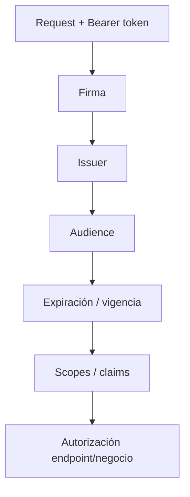
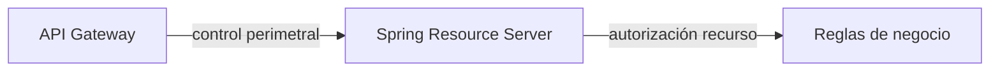

# 2 · Spring Security como Resource Server

## Objetivo

Proteger una API Spring Boot para que acepte únicamente **access tokens válidos destinados a esa API** y autorice operaciones según scopes/claims.

## Autoridad y práctica

El modelo de tenant, API registration, issuer, audience y scopes se define en:

→ [Dominio Identity & Access](../../docs/identity/README.md)

La aplicación práctica vive en:

→ [Full Stack · Spring Security Resource Server](../../labs/fullstack-seguro/03-spring-security-resource-server.md)

---

## Rol del backend

El backend no confía en un request porque venga desde una SPA autenticada ni porque haya pasado por un Gateway.



## Configuración base

```yaml
spring:
  security:
    oauth2:
      resourceserver:
        jwt:
          issuer-uri: https://login.microsoftonline.com/<tenant-id>/v2.0
```

`issuer-uri` configura la confianza en el issuer y permite obtener metadata/JWKs. **No se debe enseñar como si por sí solo expresara el audience que BookShelf API acepta.**

## Audience explícita

El token debe estar destinado a la API propia. El laboratorio exige una validación explícita de `aud` en el `JwtDecoder`/validator.

Conceptualmente:

```text
firma válida
+ issuer esperado
+ token vigente
+ audience BookShelf API
= autenticación aceptable
```

Después se evalúan los permisos.

## SecurityFilterChain

```java
@Bean
SecurityFilterChain security(HttpSecurity http) throws Exception {
    return http
        .authorizeHttpRequests(auth -> auth
            .requestMatchers("/public/**").permitAll()
            .requestMatchers("/api/books").hasAuthority("SCOPE_books.read")
            .anyRequest().authenticated())
        .oauth2ResourceServer(oauth -> oauth.jwt())
        .build();
}
```

## 401 vs 403

| Situación | Resultado esperado |
|---|---:|
| sin token | 401 |
| token expirado/firma inválida | 401 |
| issuer incorrecto | 401 |
| audience incorrecta | 401 |
| token válido sin `books.read` | 403 |
| token válido con `books.read` | 2xx |

## Claims y authorities

Scopes delegados pueden mapearse a authorities con prefijo `SCOPE_`, por ejemplo:

```text
scp = books.read
→
SCOPE_books.read
```

Para claims/roles personalizados puede requerirse un converter específico.

## Gateway y backend



Gateway puede rechazar temprano, pero Spring conserva defensa en profundidad y autorización del recurso/negocio.

## Errores frecuentes

- desactivar seguridad para hacer funcionar la demo;
- aceptar cualquier JWT del proveedor sin validar audience;
- creer que `issuer-uri` sustituye toda validación contextual;
- autorizar por valores enviados por el cliente;
- registrar tokens completos;
- mezclar CORS con autenticación;
- devolver 403 cuando no existe autenticación válida.

## Evidencia sugerida

Demostrar al menos:

1. sin token → 401;
2. audience incorrecta → 401;
3. token válido sin scope → 403;
4. token válido con `books.read` → 2xx.

→ [Ejecutar laboratorio Full Stack](../../labs/fullstack-seguro/README.md)
