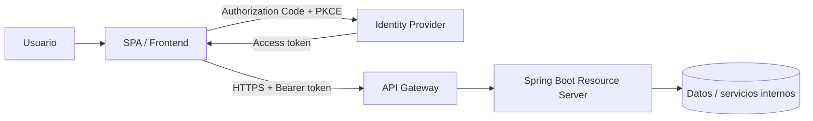
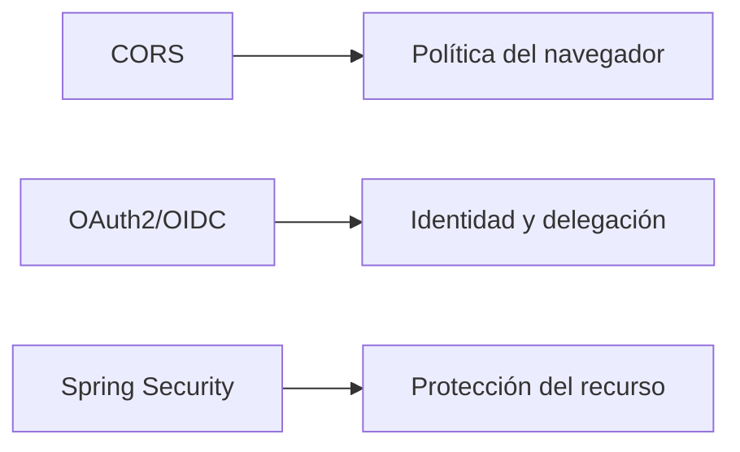
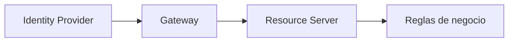

# 3 · Arquitectura Full Stack segura en la nube

## Objetivo

Relacionar frontend, proveedor de identidad, API Gateway y backend en una arquitectura segura, explicable y alineada con el laboratorio Full Stack canónico.

## Fuentes relacionadas

→ [Dominio Identity & Access](../../docs/identity/README.md)  
→ [Laboratorio Full Stack protegido](../../labs/fullstack-seguro/README.md)  
→ [Threat sketch del laboratorio](../../labs/fullstack-seguro/05-arquitectura-threat-sketch.md)

## Arquitectura de referencia

## Responsabilidades

### Frontend

- iniciar autenticación;
- solicitar scopes apropiados;
- no contener secretos;
- minimizar exposición de tokens;
- gestionar errores de sesión sin saltarse controles.

### Identity Provider

- autenticar al usuario;
- emitir tokens;
- publicar metadata y claves públicas;
- representar tenant, aplicaciones y permisos.

### API Gateway

- exponer una entrada controlada;
- validar JWT tempranamente cuando corresponde;
- aplicar políticas técnicas comunes;
- rate limiting, routing y observabilidad;
- no reemplazar autorización de negocio.

### Backend / Resource Server

- validar token y contexto;
- validar audience del recurso;
- mapear scopes/authorities;
- aplicar autorización de endpoint y negocio;
- no confiar en parámetros del cliente para identidad/permisos.

## Controles fundamentales

1. HTTPS en tránsito.
2. Authorization Code + PKCE para SPA.
3. No usar client secret en frontend.
4. Dos App Registrations separadas: SPA client y API resource.
5. Validación de firma, `iss`, `aud`, vigencia y permisos.
6. Mínimo privilegio para scopes y roles.
7. CORS limitado a orígenes requeridos.
8. Secretos fuera de Git.
9. Logs sin tokens ni credenciales completas.
10. Separación clara entre autenticación y autorización.
11. Defensa en profundidad entre Gateway y backend.

## CORS no es autenticación

CORS no protege la API contra clientes no navegador y no reemplaza OAuth2/OIDC.

## Threat sketch

| Riesgo | Control principal |
|---|---|
| robo/intercepción de authorization code | PKCE + HTTPS |
| token emitido para otra API | validación de audience |
| token de otro tenant/emisor | validación de issuer |
| permisos excesivos | scopes/roles mínimos |
| secret expuesto en JavaScript | public client sin secret |
| XSS roba token accesible | reducir exposición + CSP/buenas prácticas frontend |
| credenciales en repositorio | secret management + `.gitignore` + rotación |
| bypass del gateway | backend validando autenticación/autorización |

## Principio de defensa en profundidad

Cada capa tiene una frontera distinta. Que una request supere el Gateway no elimina las responsabilidades del backend.

## Ejercicio

Dibuja un flujo completo de `GET /api/books` e indica:

- dónde ocurre autenticación;
- cuál App Registration representa la SPA;
- cuál representa la API;
- qué audience se espera;
- qué scope se exige;
- qué puede rechazar el Gateway;
- qué puede rechazar Spring;
- qué componente puede producir 401 o 403;
- qué datos nunca deben aparecer en logs.

## Cierre

La arquitectura se considera comprendida cuando puedes explicar **qué valida cada componente y por qué**, no solo enumerar tecnologías.
