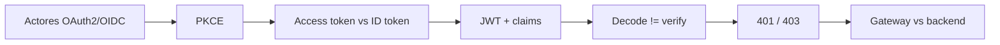
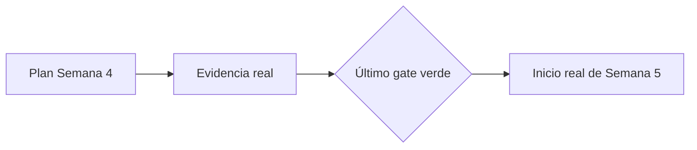

# DSY1107-002D · Semana 4

**Periodo:** 31 de agosto al 5 de septiembre de 2026  
**Clase de la sección:** viernes 4 de septiembre · módulos 6–7 · 12:11–13:40  
**Sala:** SJ-L4

## Estado documental

La sección dispuso de **2 módulos docentes**. Este documento conserva dos planos separados:

1. **plan ejecutable de la sesión**;
2. **cierre verificable**, que solo puede completarse con evidencia posterior a clase.

> A la fecha de esta revisión no existe evidencia suficiente en el repositorio para afirmar qué contenidos quedaron efectivamente cubiertos hoy. Por eso no se promueve ningún tópico a `covered` por planificación.

## Horizonte curricular de Semana 4

### Cerrar 1.2

1. **1.2.5** Creando una aplicación para usuarios externos.
2. **1.2.6** Integrando Seguridad en nuestro API Manager.
3. **1.2.7** Introducción a JWT y Claims.
4. **1.2.8** Decodificando tokens JWT.

### Continuar 1.3

5. **1.3.1** Conociendo MSAL.
6. **1.3.2** Configurar MSAL en frontend.
7. **1.3.3** Configurar Spring Security en backend.
8. **1.3.4** Arquitecturas seguras en la nube.
9. Entrega y revisión de indicaciones de **Evaluación Parcial 1**.

→ [Mapeo curricular de Semana 4](./00-mapeo-curricular.md)  
→ [Orientaciones Evaluación Parcial 1](./05-evaluacion-parcial-1.md)

# Plan de sesión · viernes 4 de septiembre · 2 módulos

## Meta planificada

Cerrar o consolidar las fronteras esenciales de OAuth2/OIDC + JWT y **comenzar una práctica real de Identity as a Service con Firebase Authentication**, dejando un checkpoint técnico verificable que permita continuar sin reconstruir el entorno.

No era objetivo obligatorio alcanzar MSAL, Spring Security ni el laboratorio Full Stack completo.

## Módulo 6 · recuperación y cierre focalizado de 1.2

Validar rápidamente si el grupo puede explicar:

- usuario, cliente, Authorization Server/IdP y Resource Server;
- propósito de Authorization Code + PKCE;
- access token vs ID token;
- estructura `header.payload.signature` de JWT;
- `iss`, `aud`, `exp` y scopes/claims;
- **decodificar != verificar**;
- diferencia entre 401 y 403;
- responsabilidad del API Gateway frente a la del backend.

**Regla:** lo demostrado no se reexpone extensamente. La deuda real recibe explicación o mini práctica y luego se avanza.

## Módulo 7 · iniciar Firebase Authentication

→ [Mini App con Firebase Authentication](../../labs/firebase-auth-miniapp/README.md)

Prioridad planificada:

1. comprender la arquitectura de la mini app;
2. crear/levantar el proyecto Vite;
3. crear o configurar el proyecto Firebase;
4. registrar la Web App;
5. instalar/configurar Firebase SDK;
6. habilitar **Email/Password**;
7. dejar `auth` inicializado desde `src/firebase.js`;
8. si el ritmo lo permite, comenzar Register/Login.

### Gate pedagógico

**No habilitar Google como atajo.** Google Sign-In se agrega solo después de que Email/Password esté completamente funcional: Register, Login, recuperación de contraseña, estado de sesión, zona privada y Logout.

Por el tamaño de esta sesión, Google puede quedar legítimamente pendiente.

## Capacidades que no deben asumirse cubiertas

Mientras no exista evidencia posterior a clase, no marcar como logrados por mera planificación:

- Google Sign-In;
- MSAL;
- access token para API propia;
- JWT Authorizer en API Gateway;
- Spring Security Resource Server;
- integración Full Stack segura;
- transferencia de seguridad a RegistrApp.

## Cierre verificable de 002D

Completar este bloque cuando exista evidencia real.

| Campo | Estado actual |
|---|---|
| OAuth2/OIDC + JWT checkpoint | `PENDING_EVIDENCE` |
| Vite + Firebase operativo | `PENDING_EVIDENCE` |
| Email/Password habilitado | `PENDING_EVIDENCE` |
| Register/Login funcional | `PENDING_EVIDENCE` |
| Password Reset + sesión + Logout | `PENDING_EVIDENCE` |
| Google Sign-In | `NOT_CLAIMED` |
| Entra/MSAL | `NOT_CLAIMED` |
| Full Stack seguro | `NOT_CLAIMED` |
| Incremento RegistrApp | `NOT_CLAIMED` |

### Evidencia válida para cerrar

- resultado del checkpoint OAuth2/OIDC + JWT;
- estado concreto alcanzado en Firebase;
- configuración sanitizada;
- prueba funcional reproducible;
- deuda exacta;
- bloqueo, si existe;
- punto de continuidad.

## RegistrApp

Solo transferir competencias efectivamente comprendidas y probadas.

→ [Checkpoint RegistrApp · Semana 4](../../proyecto-formativo/semana-04/README.md)

La transferencia base exige primero cerrar Identity Parte I + el patrón Full Stack; self-service B2B es una extensión posterior y no bloquea el gate base de RegistrApp.

## Entrada a Semana 5

La próxima semana **no debe comenzar desde una suposición**. Debe leer el cierre real de esta sección y continuar desde el último gate verde.

→ [Checkpoint neutral de entrada a Semana 5](../semana-05/00-entrada-desde-semana-04.md)

## Estado de ejecución

`execution_claimed: false`

Este valor debe cambiar únicamente cuando exista evidencia posterior a clase suficiente para completar el cierre verificable.