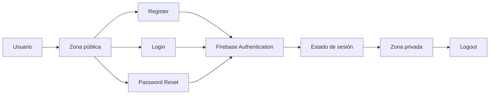
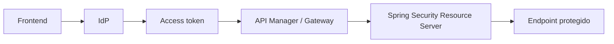

# DSY1107-003D · Semana 4

**Periodo:** 31 de agosto al 5 de septiembre de 2026  
**Clase de la sección:** viernes 4 de septiembre · módulos 9–12 · 14:31–17:20  
**Sala:** SJ-L9

## Estado

Planificación ajustada al horario oficial de la sección. 003D dispone de **4 módulos docentes** durante la tarde, por lo que puede avanzar más que 002D, manteniendo los mismos gates pedagógicos y sin presumir contenidos ejecutados.

La última evidencia inequívoca dejó el laboratorio de API Gateway en progreso y OAuth2/OIDC trabajado conceptualmente. La sesión comienza validando ese prerrequisito antes de avanzar.

## Horizonte curricular de Semana 4

### Cerrar 1.2

1. **1.2.5** Creando una aplicación para usuarios externos.
2. **1.2.6** Integrando Seguridad en nuestro API Manager.
3. **1.2.7** Introducción a JWT y Claims.
4. **1.2.8** Decodificando tokens JWT.

### Continuar 1.3

5. **1.3.1** Conociendo MSAL.
6. **1.3.2** Configurar MSAL en frontend.
7. **1.3.3** Configurar Spring Security en backend.
8. **1.3.4** Arquitecturas seguras en la nube.
9. Entrega y revisión de indicaciones de **Evaluación Parcial 1**.

→ [Mapeo curricular de Semana 4](./00-mapeo-curricular.md)  
→ [Orientaciones Evaluación Parcial 1](./05-evaluacion-parcial-1.md)

# Viernes 4 de septiembre · 4 módulos

## Meta de salida

Que el estudiante pueda **explicar y demostrar autenticación delegada mediante un IDaaS real**, conectando el flujo práctico con OAuth2/OIDC y JWT, y comprender el siguiente salto hacia protección de APIs con gateway y Resource Server.

## Módulo 9 · 14:31–15:10 · checkpoint + cierre focalizado de 1.2

Validar y completar, solo donde exista deuda:

- actores OAuth2/OIDC;
- Authorization Code + PKCE;
- access token vs ID token;
- usuarios externos / CIAM;
- JWT y claims;
- `iss`, `aud`, `exp` y scopes;
- **decode != verify**;
- 401 vs 403;
- responsabilidad de gateway vs backend.

Secuencia:

```text
checkpoint real Semana 3
→ cerrar deuda OAuth2/OIDC
→ JWT / claims
→ decode != verify
→ gateway / backend
```

No repetir una presentación completa si el grupo demuestra el concepto.

## Módulo 10 · 15:11–15:50 · Firebase: preparación + Email/Password

→ [Mini App con Firebase Authentication](../../labs/firebase-auth-miniapp/README.md)

Objetivo del módulo:

- levantar proyecto Vite;
- configurar Firebase;
- registrar Web App;
- habilitar Email/Password;
- inicializar `Auth`;
- implementar o avanzar en Register y Login.

Debe quedar explícito que Firebase actúa como **Identity as a Service** y que el frontend delega autenticación al proveedor.

## Módulo 11 · 16:01–16:40 · completar ciclo Email/Password

Completar el gate obligatorio:

- Register;
- Login;
- Password Reset usando el flujo estándar de Firebase;
- `onAuthStateChanged`;
- zona pública y zona privada;
- Logout;
- Firebase Auth como fuente de verdad de sesión, no `localStorage`.



**No avanzar a Google hasta que este módulo quede verde.**

## Módulo 12 · 16:41–17:20 · Google + puente Full Stack + cierre

### Parte A · Google como segundo proveedor

Solo si Email/Password está completo:

→ [Parte 5 · Google Sign-In](../../labs/firebase-auth-miniapp/05-google-sign-in.md)

Comparar:

```text
Email/Password ─┐
                ├─→ Firebase Authentication → user → misma zona privada
Google ─────────┘
```

La aplicación consume un usuario autenticado sin necesitar una zona privada distinta por proveedor.

### Parte B · puente conceptual a Full Stack seguro

Si queda tiempo y los gates están cumplidos:



Preguntas de salida:

- ¿Por qué estar autenticado en frontend no basta para confiar en una request al backend?
- ¿Quién valida el access token?
- ¿Qué diferencia hay entre autenticación y autorización?
- ¿Dónde aparecen 401 y 403?

MSAL y Spring Security pueden introducirse conceptualmente; **no es obligatorio implementar ambos hoy** si el laboratorio Firebase necesitó el tiempo.

### Parte C · Evaluación Parcial 1 y checkpoint

Antes de terminar:

- revisar criterios, evidencia y ventana semanas **6–7**;
- aclarar que **Pedidos360** es la referencia nominal institucional y que los requisitos se aplican al proyecto real de cada grupo;
- registrar contenido alcanzado, deuda y punto exacto de continuidad.

## Priorización si falta tiempo

1. checkpoint OAuth2/OIDC + JWT;
2. Firebase Email/Password completo;
3. Google Sign-In;
4. puente Full Stack;
5. MSAL/Spring Security solo según evidencia y tiempo.

No sacrificar el cierre de evidencia para marcar temas como cubiertos.

## Evidencia esperada

- resultado del checkpoint inicial;
- Firebase Auth Email/Password completo;
- Google Sign-In solo si se superó el gate;
- explicación de ID token vs access token;
- explicación de decode vs verify;
- configuración sanitizada;
- diagrama del flujo comprendido;
- revisión de orientaciones de Parcial 1;
- checkpoint real de cierre de 003D.

## Laboratorios disponibles

1. → [Mini App con Firebase Authentication](../../labs/firebase-auth-miniapp/README.md) — laboratorio principal de esta sesión.
2. → [Flujo Full Stack protegido](../../labs/fullstack-seguro/README.md) — continuidad posterior cuando los prerrequisitos estén cumplidos.

## RegistrApp

Solo transferir competencias efectivamente comprendidas. El checkpoint vive en [`proyecto-formativo/semana-04/`](../../proyecto-formativo/semana-04/).

RegistrApp **no se utiliza para explicar por primera vez** OAuth/OIDC, JWT, Firebase, MSAL ni Resource Server.

## Cierre de clase

Registrar al terminar:

- contenido realmente demostrado;
- práctica/lab ejecutado;
- evidencia;
- bloqueos;
- deuda curricular;
- avance de RegistrApp, si ocurrió;
- punto exacto de arranque siguiente.
