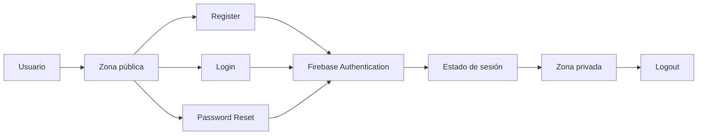
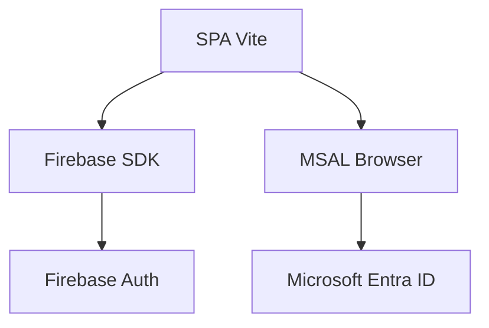
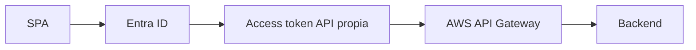

# DSY1107-003D · Semana 4

**Periodo:** 31 de agosto al 5 de septiembre de 2026  
**Clase de la sección:** viernes 4 de septiembre · módulos 9–12 · 14:31–17:20  
**Sala:** SJ-L9

## Estado

Planificación ajustada al horario oficial de la sección. 003D dispone de **4 módulos docentes** durante la tarde, por lo que puede avanzar más que 002D, manteniendo gates pedagógicos y sin presumir contenidos ejecutados.

La última evidencia inequívoca dejó el laboratorio de API Gateway en progreso y OAuth2/OIDC trabajado conceptualmente. La sesión comienza validando ese prerrequisito antes de avanzar.

## Horizonte curricular de Semana 4

### Cerrar 1.2

1. **1.2.5** Creando una aplicación para usuarios externos.
2. **1.2.6** Integrando Seguridad en nuestro API Manager.
3. **1.2.7** Introducción a JWT y Claims.
4. **1.2.8** Decodificando tokens JWT.

### Continuar 1.3

5. **1.3.1** Conociendo MSAL.
6. **1.3.2** Configurar MSAL en frontend.
7. **1.3.3** Configurar Spring Security en backend.
8. **1.3.4** Arquitecturas seguras en la nube.
9. Entrega y revisión de indicaciones de **Evaluación Parcial 1**.

→ [Mapeo curricular de Semana 4](./00-mapeo-curricular.md)  
→ [Orientaciones Evaluación Parcial 1](./05-evaluacion-parcial-1.md)

# Viernes 4 de septiembre · 4 módulos

## Meta de salida

Que el estudiante pueda **comparar y demostrar dos implementaciones reales de Identity as a Service**:

```text
Firebase Authentication
→ Email/Password
→ Google

Microsoft Entra ID
→ tenant / Guest
→ MSAL
→ Authorization Code + PKCE
```

La conexión a API Gateway mediante access token se introduce/continúa solo después de comprender ambos contextos de identidad.

---

## Módulo 9 · 14:31–15:10 · checkpoint + cierre focalizado de 1.2

Validar y completar, solo donde exista deuda:

- actores OAuth2/OIDC;
- Authorization Code + PKCE;
- access token vs ID token;
- usuarios externos / CIAM;
- JWT y claims;
- `iss`, `aud`, `exp` y scopes;
- **decode != verify**;
- 401 vs 403;
- responsabilidad de gateway vs backend.

Secuencia:

```text
checkpoint real Semana 3
→ cerrar deuda OAuth2/OIDC
→ JWT / claims
→ decode != verify
→ usuarios externos
→ gateway / backend
```

No repetir una presentación completa si el grupo demuestra el concepto.

---

## Módulo 10 · 15:11–15:50 · Firebase: preparación + Email/Password

→ [Mini App con Firebase Authentication](../../labs/firebase-auth-miniapp/README.md)

Objetivo del módulo:

- levantar proyecto Vite;
- configurar Firebase;
- registrar Web App;
- habilitar Email/Password;
- inicializar `Auth`;
- implementar/avanzar Register y Login.

Debe quedar explícito que Firebase actúa como **Identity as a Service** y que el frontend delega autenticación al proveedor.

---

## Módulo 11 · 16:01–16:40 · completar Firebase + Google

### Gate A · Email/Password

Completar:

- Register;
- Login;
- Password Reset usando flujo estándar Firebase;
- `onAuthStateChanged`;
- zona pública y zona privada;
- Logout;
- Firebase SDK como fuente de verdad de su contexto de sesión.



### Gate B · Google

Solo si Gate A está verde:

→ [Parte 5 · Google Sign-In](../../labs/firebase-auth-miniapp/05-google-sign-in.md)

Comparar:

```text
Email/Password ─┐
                ├─→ Firebase Authentication → misma sesión Firebase
Google ─────────┘
```

Si Firebase consume todo el módulo, **no forzar MSAL**. Registrar el checkpoint y continuar posteriormente.

---

## Módulo 12 · 16:41–17:20 · Microsoft Entra ID + MSAL

Solo si el core Firebase está suficientemente estable para comparar.

→ [Parte 9 · Microsoft Entra ID + MSAL](../../labs/firebase-auth-miniapp/09-microsoft-entra-msal.md)

### Parte A · diferenciar los dos IDaaS

Dejar claro antes de programar:



**MSAL no es un provider Firebase en esta práctica.** Es otra integración de identidad dentro de la misma SPA.

### Parte B · configuración mínima Entra

Realizar/validar:

1. App Registration single-tenant;
2. plataforma `Single-page application`;
3. redirect URI:

```text
http://localhost:5173/redirect.html
```

4. `Application (client) ID`;
5. `Directory (tenant) ID`;
6. instalar:

```bash
npm install @azure/msal-browser
```

7. crear `redirect.html` con MSAL redirect bridge;
8. crear `src/msal.js`;
9. ejecutar `await msalInstance.initialize()`;
10. Login Microsoft y active account si el tiempo lo permite.

### Parte C · caso real del trabajo grupal

Si el dueño del tenant puede autenticarse pero un compañero no:

→ [Guía de usuarios externos / Guest B2B](../../docs/identity/entra-usuarios-externos-spa-api-gateway.md)

Secuencia de diagnóstico:

```text
single-tenant
→ compañero existe como Guest
→ invitación aceptada
→ authority usa TENANT_ID correcto
→ redirect URI exacto
→ Assignment required?
```

**No cambiar a multitenant solo para hacer desaparecer el error.**

### Parte D · puente hacia API protegida

Si login MSAL queda verde, explicar el próximo incremento:



La SPA debe solicitar un scope de **su API propia**, no usar un token de Microsoft Graph como sustituto.

Spring Security queda para la continuidad cuando el flujo `SPA → Entra → token → API Gateway` esté defendible.

---

## Cierre · últimos minutos del módulo 12

Antes de terminar:

- revisar criterios/evidencia de Evaluación Parcial 1 y ventana semanas **6–7**;
- aclarar que **Pedidos360** es referencia nominal institucional y los requisitos se aplican al proyecto real de cada grupo;
- registrar qué gate quedó realmente verde;
- registrar deuda y punto exacto de continuidad.

---

## Priorización si falta tiempo

1. checkpoint OAuth2/OIDC + JWT;
2. Firebase Email/Password completo;
3. Google Sign-In;
4. Entra App Registration + Guest/B2B + MSAL setup;
5. Login MSAL;
6. access token para API propia;
7. Spring Security después, no por nominalidad curricular.

No sacrificar evidencia ni comprensión para marcar temas como cubiertos.

---

## Evidencia esperada

### Firebase

- Email/Password completo;
- Password Reset;
- sesión/zona privada/Logout;
- Google Sign-In si se supera el gate.

### Entra/MSAL

Según el punto alcanzado:

- App Registration single-tenant;
- redirect URI SPA;
- `clientId` / `tenantId` sin secretos;
- compañero Guest si corresponde;
- `@azure/msal-browser` instalado;
- MSAL inicializado;
- login dueño/Guest si alcanza el tiempo;
- explicación de por qué MSAL no es un provider Firebase;
- DevLog con bloqueo real y diagnóstico.

### Conceptual

- ID token vs access token;
- decode vs verify;
- 401 vs 403;
- tenant Member/Guest;
- gateway vs backend.

---

## Laboratorios y apoyos

1. → [Mini App Firebase + extensión Entra/MSAL](../../labs/firebase-auth-miniapp/README.md)
2. → [Parte 9 · implementación MSAL](../../labs/firebase-auth-miniapp/09-microsoft-entra-msal.md)
3. → [Usuarios externos / Guest B2B](../../docs/identity/entra-usuarios-externos-spa-api-gateway.md)
4. → [Flujo Full Stack protegido](../../labs/fullstack-seguro/README.md) — continuidad posterior.

---

## RegistrApp

Solo transferir competencias efectivamente comprendidas. El checkpoint vive en [`proyecto-formativo/semana-04/`](../../proyecto-formativo/semana-04/).

RegistrApp **no se utiliza para explicar por primera vez** OAuth/OIDC, JWT, Firebase, MSAL ni Resource Server.

## Cierre de clase

Registrar al terminar:

- contenido realmente demostrado;
- práctica/lab ejecutado;
- evidencia;
- bloqueos;
- deuda curricular;
- avance de RegistrApp, si ocurrió;
- punto exacto de arranque siguiente.
