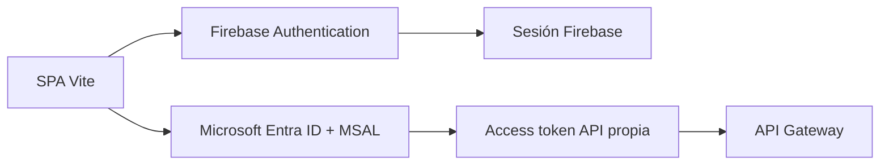
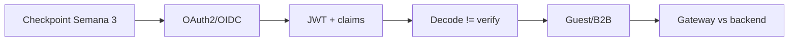
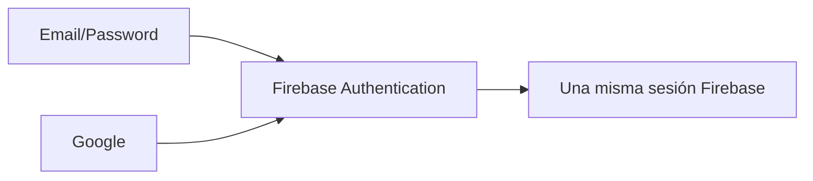
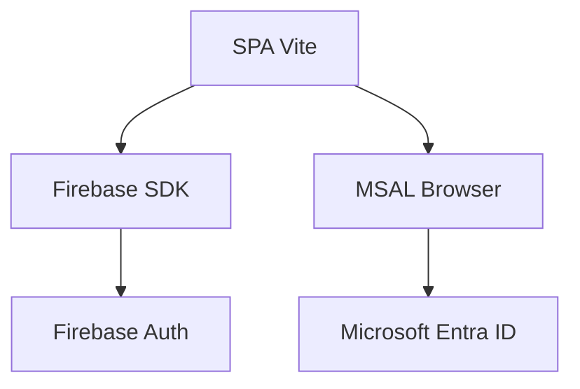
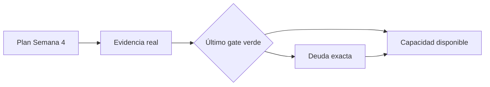

# DSY1107-003D · Semana 4

**Periodo:** 31 de agosto al 5 de septiembre de 2026  
**Clase de la sección:** viernes 4 de septiembre · módulos 9–12 · 14:31–17:20  
**Sala:** SJ-L9

## Estado documental

003D dispuso de **4 módulos docentes** y, por planificación, podía avanzar más que 002D. Eso no autoriza a inferir ejecución.

Este documento separa:

1. **plan ejecutable de la sesión**;
2. **cierre verificable**, que solo se completa con evidencia posterior a clase.

> A la fecha de esta revisión no existe evidencia suficiente en el repositorio para afirmar qué gates quedaron realmente verdes hoy. Se conserva `execution_claimed: false`.

## Horizonte curricular de Semana 4

### Cerrar 1.2

1. **1.2.5** Creando una aplicación para usuarios externos.
2. **1.2.6** Integrando Seguridad en nuestro API Manager.
3. **1.2.7** Introducción a JWT y Claims.
4. **1.2.8** Decodificando tokens JWT.

### Continuar 1.3

5. **1.3.1** Conociendo MSAL.
6. **1.3.2** Configurar MSAL en frontend.
7. **1.3.3** Configurar Spring Security en backend.
8. **1.3.4** Arquitecturas seguras en la nube.
9. Entrega y revisión de indicaciones de **Evaluación Parcial 1**.

→ [Mapeo curricular de Semana 4](./00-mapeo-curricular.md)  
→ [Orientaciones Evaluación Parcial 1](./05-evaluacion-parcial-1.md)

# Plan de sesión · viernes 4 de septiembre · 4 módulos

## Meta planificada

Comparar y, si los gates lo permiten, demostrar dos contextos IDaaS:

La conexión a API Gateway y backend debía ocurrir solo después de que las fronteras de identidad fueran defendibles.

## Módulo 9 · checkpoint + cierre focalizado de 1.2

Validar y completar solo donde exista deuda:

- actores OAuth2/OIDC;
- Authorization Code + PKCE;
- access token vs ID token;
- usuarios externos / Guest B2B;
- JWT y claims;
- `iss`, `aud`, `exp` y scopes;
- **decode != verify**;
- 401 vs 403;
- gateway vs backend.

## Módulo 10 · Firebase Email/Password

→ [Mini App con Firebase Authentication](../../labs/firebase-auth-miniapp/README.md)

Objetivo planificado:

- levantar Vite;
- configurar Firebase;
- registrar Web App;
- habilitar Email/Password;
- inicializar `Auth`;
- implementar/avanzar Register y Login.

## Módulo 11 · completar Firebase + Google condicionado

### Gate A · Email/Password

Completar antes de agregar Google:

- Register;
- Login;
- Password Reset estándar Firebase;
- `onAuthStateChanged`;
- zona pública/privada;
- Logout.

### Gate B · Google

Solo si Gate A está verde:

→ [Google Sign-In](../../labs/firebase-auth-miniapp/05-google-sign-in.md)

Si Firebase consume el módulo, no se fuerza MSAL.

## Módulo 12 · Microsoft Entra ID + MSAL condicionado

Solo si Firebase está suficientemente estable para comparar.

### Fuente canónica

No duplicar el procedimiento administrativo de Entra en este archivo.

→ [Identity & Access · guía completa](../../docs/identity/entra-guia-completa/README.md)

La Parte I `0–7` es el flujo base. La Parte II `8–14` de self-service B2B es una extensión posterior.

### Objetivo de comparación

**MSAL no es un provider Firebase.**

### Si se alcanza integración Entra

Orden correcto:

1. SPA App Registration single-tenant;
2. API App Registration separada;
3. scope propio de la API;
4. Guest/B2B manual cuando corresponda;
5. MSAL + Authorization Code + PKCE;
6. access token para la API propia;
7. JWT Authorizer / Gateway;
8. Spring Security Resource Server;
9. 401/403/2xx reproducibles.

→ [Laboratorio Full Stack seguro](../../labs/fullstack-seguro/README.md)

## Capacidades que no deben asumirse cubiertas

Mientras no exista evidencia posterior a clase, no marcar automáticamente como logrados:

- Firebase Email/Password end-to-end;
- Google Sign-In;
- App Registrations Entra completas;
- Guest/B2B funcional;
- Login MSAL;
- access token para API propia;
- API Gateway JWT Authorizer;
- Spring Security Resource Server;
- transferencia a RegistrApp;
- self-service B2B.

## Cierre verificable de 003D

| Campo | Estado actual |
|---|---|
| OAuth2/OIDC + JWT checkpoint | `PENDING_EVIDENCE` |
| Firebase Email/Password | `PENDING_EVIDENCE` |
| Password Reset + sesión + Logout | `PENDING_EVIDENCE` |
| Google Sign-In | `PENDING_EVIDENCE` |
| Entra tenant/App Registration | `PENDING_EVIDENCE` |
| Guest/B2B manual | `PENDING_EVIDENCE` |
| MSAL login | `PENDING_EVIDENCE` |
| Access token API propia | `NOT_CLAIMED` |
| Full Stack seguro | `NOT_CLAIMED` |
| Incremento RegistrApp | `NOT_CLAIMED` |
| Self-service B2B | `NOT_CLAIMED` |

### Evidencia válida para cerrar

- checkpoint conceptual demostrado;
- etapa exacta del laboratorio alcanzada;
- configuración sanitizada;
- pruebas funcionales reproducibles;
- errores/bloqueos concretos;
- DevLog;
- punto exacto de continuidad.

## RegistrApp

Solo transferir competencias efectivamente comprendidas y probadas.

→ [Checkpoint RegistrApp · Semana 4](../../proyecto-formativo/semana-04/README.md)

El **Gate A base** no exige self-service. Si más adelante se implementa Identity Parte II, se ejecuta el Gate B y una segunda batería de no regresión.

## Entrada a Semana 5

Semana 5 debe partir desde el último gate realmente verde, no desde el máximo alcance que permitían cuatro módulos.

→ [Checkpoint neutral de entrada a Semana 5](../semana-05/00-entrada-desde-semana-04.md)

## Estado de ejecución

`execution_claimed: false`

Cambiar este valor solo con evidencia posterior a clase suficiente para completar el cierre verificable.