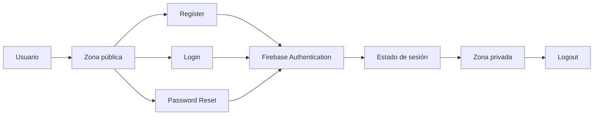
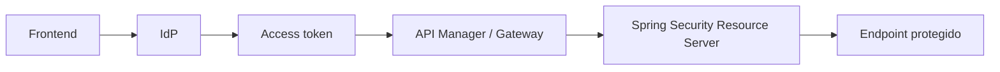

# DSY1107-003D · Semana 4

**Periodo:** 31 de agosto al 5 de septiembre de 2026  
**Clase de la sección:** viernes 4 de septiembre · 14:31–17:20

## Estado

Planificación de la clase del viernes explicitada. El punto de arranque real se toma del cierre verificable de Semana 3; este documento no presume contenidos ya ejecutados.

La última evidencia inequívoca de 003D dejó el laboratorio de API Gateway en progreso y OAuth2/OIDC trabajado conceptualmente. Por ello la sesión comienza con un checkpoint corto antes de avanzar.

## Horizonte curricular oficial

### Cerrar 1.2

1. **1.2.5** Creando una aplicación para usuarios externos.
2. **1.2.6** Integrando Seguridad en nuestro API Manager.
3. **1.2.7** Introducción a JWT y Claims.
4. **1.2.8** Decodificando tokens JWT.

### Continuar 1.3

5. **1.3.1** Conociendo MSAL.
6. **1.3.2** Configurar MSAL en frontend.
7. **1.3.3** Configurar Spring Security en backend.
8. **1.3.4** Arquitecturas seguras en la nube.
9. Entrega y revisión de indicaciones de **Evaluación Parcial 1**.

→ [Mapeo curricular de Semana 4](./00-mapeo-curricular.md)  
→ [Orientaciones Evaluación Parcial 1](./05-evaluacion-parcial-1.md)

## Viernes 4 de septiembre · 14:31–17:20

### Meta de salida

Que el estudiante pueda **explicar y demostrar autenticación delegada mediante un IDaaS real**, conectando el flujo práctico con OAuth2/OIDC, JWT y la protección posterior de APIs, sin confundir autenticación de frontend con autorización de backend.

### Bloque 0 · 14:31–14:46 · checkpoint de recuperación

Validar rápidamente, sin repetir una clase completa, si el grupo puede:

- identificar usuario, cliente, Authorization Server/IdP y Resource Server;
- explicar para qué sirve Authorization Code + PKCE;
- distinguir access token de ID token;
- explicar un caso 401 y uno 403;
- describir qué hacía el API Gateway trabajado previamente.

**Regla:** lo demostrado se considera recuperado; lo que no se demuestra recibe explicación y ejemplo corto antes de continuar.

### Bloque 1 · 14:46–15:16 · cierre focalizado de 1.2

Completar la deuda necesaria para poder interpretar el laboratorio:

```text
usuarios externos / CIAM
→ seguridad en API Manager
→ JWT y claims
→ decode != verify
→ issuer / audience / expiración
```

No convertir este bloque en una exposición extensa. La prioridad es dejar claras las fronteras entre identidad, token, gateway y backend.

### Bloque 2 · 15:16–16:26 · laboratorio principal: Firebase Auth con Email/Password

→ [Mini App con Firebase Authentication](../../labs/firebase-auth-miniapp/README.md)

Ejecutar primero el flujo completo Email/Password:



Checkpoint obligatorio antes de Google:

- Register funcionando;
- Login funcionando;
- recuperación de contraseña usando el flujo estándar de Firebase;
- `onAuthStateChanged` reflejando sesión;
- zona pública/privada diferenciadas;
- Logout funcionando;
- Firebase Auth, no `localStorage`, como fuente de verdad de autenticación.

### Bloque 3 · 16:26–16:51 · agregar Google como segundo proveedor

Solo si el checkpoint Email/Password está verde:

→ [Parte 5 · Google Sign-In](../../labs/firebase-auth-miniapp/05-google-sign-in.md)

Comparar explícitamente:

```text
Email/Password ─┐
                ├─→ Firebase Authentication → user → misma zona privada
Google ─────────┘
```

El objetivo no es solo que el popup funcione: deben reconocer que cambia el mecanismo de autenticación, pero no el concepto de sesión consumido por la aplicación.

### Bloque 4 · 16:51–17:10 · puente hacia Full Stack seguro

Si los gates anteriores están cumplidos, introducir el siguiente salto conceptual:



Preguntas de salida:

- ¿Por qué estar autenticado en el frontend no basta para confiar en una request al backend?
- ¿Quién valida el token?
- ¿Qué diferencia hay entre obtener un token y autorizar una operación?
- ¿Dónde aparecerían 401 y 403?

MSAL y Spring Security quedan habilitados para continuar solo si esta frontera se comprende. No forzar implementación completa si el laboratorio Firebase consumió el tiempo necesario.

### Bloque 5 · 17:10–17:20 · cierre y Evaluación Parcial 1

- revisar brevemente rúbrica, condiciones, evidencia esperada y ventana semanas 6–7;
- aclarar que **Pedidos360** es el nombre del documento institucional y que los requisitos se aplican al proyecto real de cada grupo;
- registrar último contenido efectivamente demostrado;
- registrar deuda exacta y punto de arranque siguiente.

## Priorización si el tiempo real se acorta

1. **Obligatorio:** checkpoint OAuth/OIDC + Firebase Email/Password completo.
2. **Segundo:** Google Sign-In como evolución del mismo estado de sesión.
3. **Tercero:** cierre JWT/API Manager que siga pendiente.
4. **Condicional:** puente MSAL/Spring Security.
5. **No sacrificar:** cierre con evidencia y punto de arranque real.

## Evidencia esperada de la sesión

- resultado del checkpoint inicial;
- Firebase Auth: Register, Login, Password Reset, sesión, zona privada y Logout con Email/Password;
- evidencia de Google Sign-In solo si se superó el checkpoint Email/Password;
- explicación oral o escrita de ID token vs access token y decode vs verify;
- diagrama del flujo comprendido;
- configuración sanitizada;
- revisión de orientaciones de Parcial 1;
- checkpoint de cierre real de 003D.

## Laboratorios disponibles

1. → [Mini App con Firebase Authentication](../../labs/firebase-auth-miniapp/README.md) — laboratorio principal de esta sesión.
2. → [Flujo Full Stack protegido](../../labs/fullstack-seguro/README.md) — siguiente integración SPA, gateway y Resource Server cuando los prerrequisitos estén cumplidos.

## RegistrApp

Solo transferir competencias efectivamente comprendidas. El checkpoint vive en [`proyecto-formativo/semana-04/`](../../proyecto-formativo/semana-04/).

RegistrApp **no se utiliza para explicar por primera vez** Firebase, OAuth/OIDC, JWT, MSAL ni Resource Server.

## Cierre de clase

Actualizar al terminar:

- contenido alcanzado;
- evidencia obtenida;
- bloqueos;
- deuda curricular;
- avance de RegistrApp, si ocurrió;
- punto exacto de arranque de la siguiente sesión.
