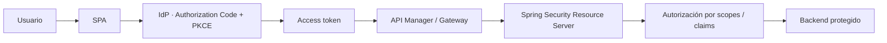
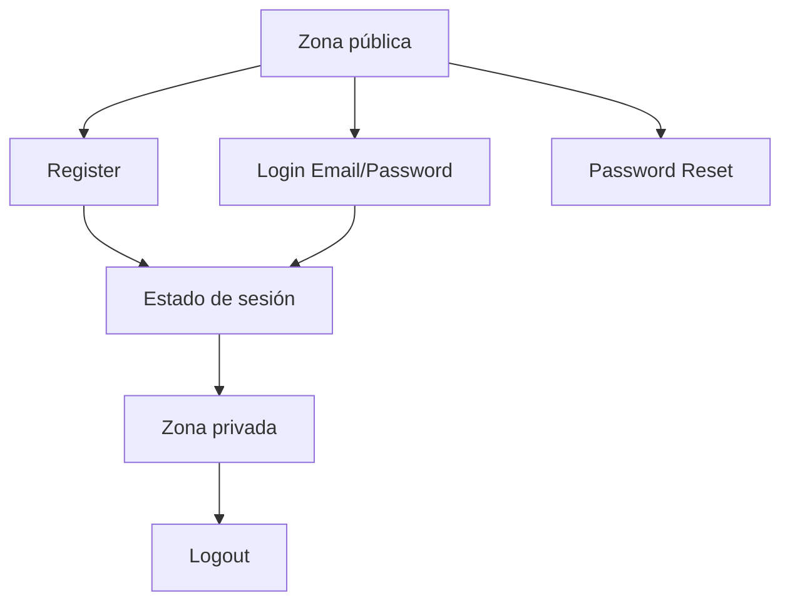

# Semana 4 · Cierre de Identity as a Service + Full Stack seguro

**Periodo:** 31 de agosto al 5 de septiembre de 2026  
**Asignatura:** DSY1107 Desarrollo Cloud Native I

← [Volver al índice](../README.md)

## Regla de trabajo

`semanas/semana-04/` organiza el horizonte curricular y el contenido de estudio. Los ejemplos reutilizables viven en `examples/`, los laboratorios canónicos en `labs/` y RegistrApp en `proyecto-formativo/`.

> Primero se comprende el patrón con un caso independiente. Después se transfiere la competencia a RegistrApp si existe evidencia suficiente.

## Cobertura curricular oficial

→ [Mapeo curricular oficial de Semana 4](./00-mapeo-curricular.md)

Semana 4 tiene **dos responsabilidades**: cerrar formalmente contenidos pendientes del bloque 1.2 y continuar con el bloque 1.3.

### A. Finalizar · Implementando autenticación con Identity as a Service

- **1.2.5** Creando una aplicación para usuarios externos.
- **1.2.6** Integrando Seguridad en nuestro API Manager.
- **1.2.7** Introducción a JWT y Claims.
- **1.2.8** Decodificando tokens JWT.

Estos contenidos conservan como fuente canónica el material de [Semana 3](../semana-03/). Semana 4 los declara explícitamente como **cierre curricular** para evitar asumir que ya fueron ejecutados sólo porque el material existe.

### B. Continuar · API Manager + Identity as a Service en una solución Full Stack

- **1.3.1** Conociendo MSAL.
- **1.3.2** Configurar MSAL en el frontend.
- **1.3.3** Configurar Spring Security en el Backend.
- **1.3.4** Arquitecturas seguras en la nube.

## Propósito

Evolucionar desde OAuth2/OIDC, usuarios externos y JWT hacia una protección Full Stack verificable:

La idea central es que **el backend no confía en el frontend por estar autenticado**: valida el access token y aplica su propia autorización.

## Ruta de estudio

### 1. Cierre del bloque 1.2

Repasar y completar, según el último checkpoint real de cada sección:

- [JWT y Claims](../semana-03/01-jwt-claims.md)
- [Seguridad de API, API Manager y usuarios externos](../semana-03/02-seguridad-api.md)
- [Laboratorio JWT forense](../../labs/jwt-forense/README.md)

### 2. Práctica guiada · Identity as a Service real

→ [Mini App con Firebase Authentication](../../labs/firebase-auth-miniapp/README.md)

Este laboratorio provider-backed usa Firebase Authentication como servicio administrado real y construye una mini aplicación con:

**Gate pedagógico obligatorio:** todo el flujo Email/Password debe funcionar antes de habilitar Google. Después se agrega Google Sign-In como segundo proveedor y se verifica que ambos mecanismos conduzcan a la misma zona privada.

El objetivo es experimentar directamente la delegación de autenticación a un IDaaS sin mezclar todavía la complejidad de un backend propio.

### 3. MSAL y frontend

→ [MSAL y autenticación de frontend](./01-msal-frontend.md)

Competencias clave: public client, Authorization Code + PKCE, `clientId`, `redirectUri`, scopes, ID token vs access token y ausencia de secretos en JavaScript.

### 4. Spring Security en backend

→ [Spring Security como Resource Server](./02-spring-security-backend.md)

Competencias clave: validación criptográfica/contextual, issuer, audience, expiración, scopes/authorities y diferencia 401/403.

### 5. Arquitectura segura en la nube

→ [Arquitectura Full Stack segura](./03-arquitectura-segura-cloud.md)

Competencias clave: responsabilidades de frontend, IdP, gateway y backend; mínimo privilegio; CORS; observabilidad segura; defensa en profundidad.

### 6. Ejemplo independiente

→ [BookShelf · Ejemplo Semana 4](../../examples/semana-04/README.md)

### 7. Laboratorio Full Stack canónico

→ [Flujo Full Stack protegido](../../labs/fullstack-seguro/README.md)

El archivo [`04-laboratorio-fullstack-seguro.md`](./04-laboratorio-fullstack-seguro.md) se conserva únicamente como punto de entrada curricular.

## Evaluación Parcial 1

Durante esta semana se deben proporcionar los detalles de la **Evaluación Parcial 1** y revisar con los estudiantes:

- rúbrica y criterios;
- condiciones de entrega;
- evidencia esperada;
- ventana planificada para semanas **6–7**;
- aclaración de que **“Pedidos360” es el nombre utilizado por el documento institucional**, pero los requisitos se aplican al proyecto real que desarrolla cada grupo.

→ [Orientaciones de Evaluación Parcial 1](./05-evaluacion-parcial-1.md)

## Resultado técnico esperado

Al finalizar el contenido, el estudiante debe poder:

- explicar qué significa delegar autenticación a un servicio IDaaS;
- implementar un flujo básico de Register, Login, Password Reset y Logout con un proveedor administrado;
- observar el estado de sesión y distinguir zona pública de zona privada en frontend;
- agregar un proveedor federado como Google sin romper el mecanismo Email/Password ya validado;
- explicar el rol de usuarios externos/CIAM y la protección del API Manager;
- interpretar estructura y claims de un JWT;
- distinguir decodificar de verificar;
- explicar Authorization Code + PKCE y por qué es apropiado para SPA;
- distinguir ID token y access token;
- configurar conceptualmente MSAL sin secretos embebidos en frontend;
- proteger endpoints con Spring Security Resource Server;
- interpretar 401 y 403 en el flujo completo;
- justificar `issuer`, `audience`, expiración, scopes y mínimo privilegio;
- ubicar responsabilidades entre frontend, IdP, gateway/API Manager y backend;
- reconocer riesgos de CORS, almacenamiento de tokens, exposición de secretos y logging inseguro.

## Evidencia mínima

- evidencia del flujo Firebase Email/Password antes de habilitar Google;
- evidencia posterior de Google Sign-In funcionando;
- diagrama del flujo completo conforme a `STD-ENG-DIAG-001`;
- configuración sanitizada o pseudoconfiguración equivalente;
- request autorizado y casos 401/403 para el laboratorio Full Stack;
- explicación de qué componente valida cada condición;
- breve threat sketch;
- DevLog;
- constancia de revisión de orientaciones de Evaluación Parcial 1.

## Transferencia a RegistrApp

Solo después de comprender el contenido:

→ [Checkpoint transversal Semana 4](../../proyecto-formativo/semana-04/README.md)

## Planificación por sección

- [DSY1107-002D](./DSY1107-002D.md)
- [DSY1107-003D](./DSY1107-003D.md)

Los documentos de sección declaran planificación y punto de arranque. El avance real se actualiza únicamente con evidencia de clase.

## Seguridad

Nunca versionar client secrets, contraseñas, access/refresh tokens reutilizables, certificados privados ni credenciales cloud. Para demos, usar datos sintéticos, cuentas de laboratorio y secretos fuera del repositorio.
