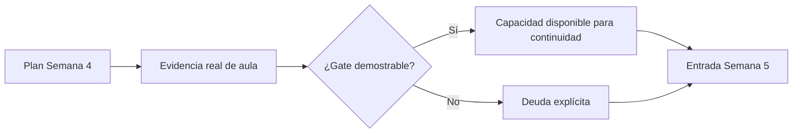

# Semana 5 · checkpoint de entrada desde Semana 4

> Este archivo **no define todavía el contenido curricular de Semana 5**. Su única función es conservar una entrada verificable y distinta por sección a partir del cierre real de Semana 4.

← [Volver a Semana 4](../semana-04/README.md)

## Regla de continuidad

No se promueve una capacidad a `cubierta` porque haya sido planificada, explicada parcialmente o porque exista material en el repositorio.

La entrada de cada sección se determina con esta secuencia:

## DSY1107-002D

La sección tuvo **2 módulos** el viernes 4 de septiembre. El plan priorizó:

1. recuperar/cerrar fronteras OAuth2/OIDC + JWT según evidencia;
2. iniciar Firebase Authentication con Email/Password;
3. conservar un checkpoint reproducible.

No se debe asumir por planificación que alcanzó Google Sign-In, MSAL, API Gateway JWT Authorizer, Spring Security o transferencia Full Stack a RegistrApp.

### Entrada provisional

Hasta incorporar evidencia posterior a clase, Semana 5 debe iniciar preguntando y verificando:

- ¿qué conceptos OAuth2/OIDC + JWT quedaron realmente verdes?;
- ¿Vite + Firebase quedaron operativos?;
- ¿Email/Password quedó solo configurado o también funcional end-to-end?;
- ¿qué punto exacto del lab quedó pendiente?;
- ¿hubo incremento transferible a RegistrApp?

→ [Cierre/plan de 002D](../semana-04/DSY1107-002D.md)

## DSY1107-003D

La sección tuvo **4 módulos** el viernes 4 de septiembre. El plan permitió, condicionado a gates:

1. cierre OAuth2/OIDC + JWT;
2. Firebase Email/Password;
3. Google Sign-In;
4. introducción/implementación Entra + MSAL;
5. puente posterior a access token de API propia.

La mayor disponibilidad horaria **no constituye evidencia** de que esos gates hayan sido superados.

### Entrada provisional

Hasta incorporar evidencia posterior a clase, Semana 5 debe verificar:

- estado real del gate Firebase Email/Password;
- si Google Sign-In se ejecutó o quedó pendiente;
- si Entra/MSAL fue solo conceptual, configurado o probado;
- si existió Guest/B2B funcional;
- si se obtuvo access token para API propia;
- si se inició o no Full Stack seguro;
- si hubo incremento transferible a RegistrApp.

→ [Cierre/plan de 003D](../semana-04/DSY1107-003D.md)

## Fuente para las capacidades técnicas

La continuidad no vuelve a explicar desde cero lo ya validado. Las fuentes siguen siendo:

- [Identity & Access canónico](../../docs/identity/README.md)
- [Laboratorio Full Stack seguro](../../labs/fullstack-seguro/README.md)
- [Transferencia RegistrApp · Semana 4](../../proyecto-formativo/semana-04/README.md)

## Gate para reemplazar el estado provisional

El estado provisional se reemplaza solo cuando exista evidencia de aula suficiente para completar, por sección:

| Campo | Ejemplo de evidencia válida |
|---|---|
| `covered_topics` | concepto demostrado + práctica/evidencia coherente |
| `pending_topics` | deuda identificada con punto de continuidad |
| `lab_checkpoint` | etapa concreta alcanzada |
| `blockers` | error/configuración/dependencia identificable |
| `registrapp_increment` | commit/prueba/DevLog que demuestre transferencia |

Mientras esa evidencia no exista, mantener explícitamente `execution_claimed: false`.