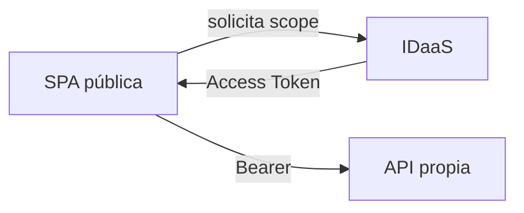

# 01 · Access Token para la API propia

## Objetivo

Cerrar una confusión frecuente: **login correcto no implica tener una credencial válida para cualquier API**.

## Modelo

La SPA es un cliente público. La API es el recurso protegido y expone permisos/scopes. El frontend debe solicitar un Access Token destinado a esa API.

## Claims mínimos

- `iss`: issuer esperado;
- `aud`: recurso al que está destinado;
- `exp`: vigencia;
- `scp` o equivalente: permisos delegados.

## Checkpoint

El estudiante puede demostrar un Access Token real de sandbox sin exponerlo en repositorios/capturas públicas y explicar por qué un ID Token no reemplaza esa credencial.
