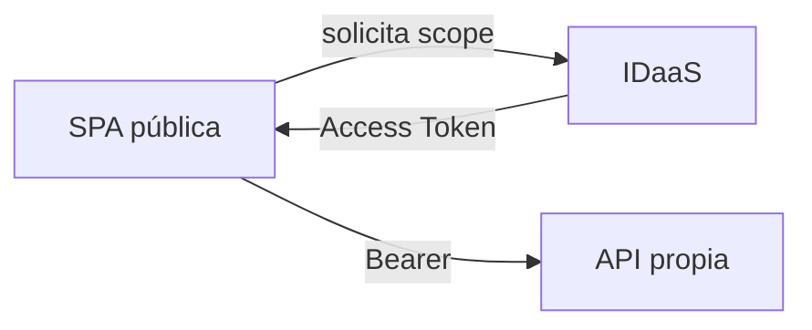

# 01 · Access Token para la API propia

## Objetivo

Cerrar una confusión frecuente: **login correcto no implica tener una credencial válida para cualquier API**.

## Modelo

La SPA es un cliente público. La API es el recurso protegido y expone permisos/scopes. El frontend debe solicitar un Access Token destinado a esa API.

## Claims mínimos

- `iss`: issuer esperado;
- `aud`: recurso al que está destinado;
- `exp`: vigencia;
- `scp` o equivalente: permisos delegados.

## Checkpoint

El estudiante puede demostrar un Access Token real de sandbox sin exponerlo en repositorios/capturas públicas y explicar por qué un ID Token no reemplaza esa credencial.

## ID Token vs Access Token

El ID Token permite al cliente conocer información de la autenticación del usuario. El Access Token, en cambio, es la credencial destinada a acceder a un recurso protegido.

Por eso, un login exitoso no demuestra todavía que el frontend posea el token correcto para la API.

## Audience: el recurso importa

El claim aud identifica el recurso para el cual fue emitido el token. Un token válido para Microsoft Graph no debe ser aceptado automáticamente por una API propia, aunque ambos tokens hayan sido emitidos por el mismo proveedor de identidad.

La pregunta correcta no es solo “¿el token es válido?”, sino también “¿es válido para ESTE recurso?”.

## Issuer y vigencia

El claim iss identifica al emisor esperado. Claims como exp permiten comprobar vigencia temporal.

Una validación razonable combina:

- firma confiable;
- issuer esperado;
- audience correcta;
- token vigente;
- permisos suficientes.

## Permisos delegados

En escenarios OAuth2 delegados, scp puede representar los scopes concedidos. Por ejemplo, books.read expresa una capacidad más concreta que “usuario autenticado”.

## Dos responsabilidades: cliente y recurso

En el modelo del curso, la SPA representa al cliente público y la API representa al recurso protegido.

La SPA solicita permisos que la API expone. Esto ayuda a comprender por qué cliente y API no deberían modelarse como si fueran la misma aplicación.

## Recorrido completo

1. El usuario inicia sesión.
2. La SPA obtiene contexto de cuenta.
3. La SPA solicita el scope de la API propia.
4. El Identity Provider emite un Access Token.
5. La SPA envía Authorization: Bearer.
6. Gateway y backend validan el contexto.
7. La autorización decide si la operación continúa.

## Inspección segura

Durante laboratorio se puede inspeccionar un token de sandbox para identificar issuer, audience, vigencia y permisos, pero nunca debe versionarse, publicarse completo en capturas ni quedar en logs reutilizables.

## Errores frecuentes

- usar un ID Token como Bearer;
- pedir un token para Microsoft Graph y enviarlo a la API propia;
- revisar solo la firma e ignorar audience;
- asumir que autenticación implica autorización;
- exponer el token completo como evidencia.

## Preguntas de salida

1. ¿Por qué un token legítimo puede ser inválido para nuestra API?
2. ¿Qué diferencia práctica existe entre iss y aud?
3. ¿Por qué login correcto no implica acceso autorizado?
4. ¿Qué información mínima inspeccionarías antes de culpar al backend?

## Profundización

→ [Contenido extendido · Access Token para API propia](./01-access-token-api-propia/)
