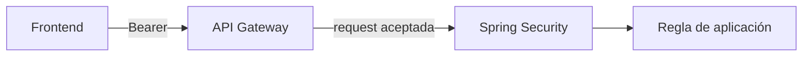

# 02 · Gateway + backend protegido

## Objetivo

Integrar la frontera perimetral y la seguridad de aplicación sin asignarles responsabilidades idénticas.

## Gateway

Puede validar propiedades de entrada como issuer, audience y scopes según la capacidad configurada.

## Backend

Conserva la validación de Resource Server y la autorización de aplicación. Las reglas de negocio no se trasladan al Gateway por comodidad.

## Checkpoint

Probar al menos una ruta pública y una protegida, y poder indicar en qué frontera ocurre un rechazo observado.
