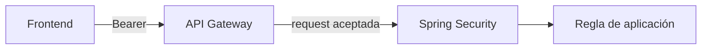

# 02 · Gateway + backend protegido

## Objetivo

Integrar la frontera perimetral y la seguridad de aplicación sin asignarles responsabilidades idénticas.

## Gateway

Puede validar propiedades de entrada como issuer, audience y scopes según la capacidad configurada.

## Backend

Conserva la validación de Resource Server y la autorización de aplicación. Las reglas de negocio no se trasladan al Gateway por comodidad.

## Checkpoint

Probar al menos una ruta pública y una protegida, y poder indicar en qué frontera ocurre un rechazo observado.

## Dos fronteras distintas

El Gateway protege la entrada y puede aplicar controles comunes como validación del token, routing, rate limiting y observabilidad perimetral.

El backend sigue siendo Resource Server y conserva responsabilidades como validar el contexto del token, mapear scopes/roles y aplicar autorización de recurso y de aplicación.

Que una request haya pasado por el Gateway no significa que el backend deba confiar ciegamente.

## Defensa en profundidad

Una arquitectura razonable puede validar propiedades críticas en más de una frontera.

El Gateway permite rechazo temprano. El backend conserva la autoridad sobre el recurso y las reglas de aplicación.

No se busca duplicar toda la lógica, sino evitar que la seguridad dependa de una sola capa accidental.

## Qué NO debe mudarse al Gateway

Reglas como estas pertenecen a aplicación o dominio:

- el usuario solo puede modificar sus propias reservas;
- una reserva cerrada no puede cambiar;
- un monto supera un límite de negocio.

El Gateway no debería convertirse en un backend de reglas.

## Ruta pública y ruta protegida

Disponer de una ruta pública y otra protegida ayuda a distinguir problemas generales de conectividad de problemas reales de autenticación/autorización.

Una prueba útil compara:

- ruta pública sin token;
- ruta protegida sin token;
- ruta protegida con token inválido;
- ruta protegida con token válido.

## Diagnóstico por frontera

Seguir este orden reduce ruido:

1. ¿El frontend envía Bearer?
2. ¿El Gateway acepta issuer/audience?
3. ¿El backend acepta el token?
4. ¿El scope/rol es suficiente?
5. ¿La regla de negocio permite la operación?

## Anti-patrones

- desactivar seguridad para “hacer avanzar” la demo;
- usar permitAll en todo el backend;
- confiar únicamente en el Gateway;
- mezclar errores de routing con errores de autorización;
- mover decisiones de negocio a políticas del Gateway.

## Checkpoint

El estudiante debería poder demostrar una ruta pública, una protegida, un rechazo 401, un rechazo 403 cuando corresponda y un caso 2xx, explicando en qué frontera ocurrió cada decisión.

## Profundización

→ [Contenido extendido · Gateway + backend protegido](./02-gateway-backend-seguro/)
