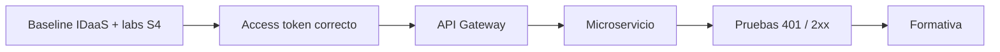

# DSY1107-002D · Semana 5

← [Semana 5](./README.md)

## Baseline esperado

La sección **ya debió avanzar en Semana 4 hasta la configuración del IDaaS y la realización de los laboratorios y guías indicados**. Por tanto, la clase no debe comenzar reenseñando Firebase/IDaaS desde cero.

El inicio se usa como checkpoint breve para confirmar que el grupo puede reproducir:

- configuración del proyecto/proveedor IDaaS;
- autenticación alcanzada en el laboratorio;
- obtención/inspección de tokens;
- diferencia básica entre ID token y access token;
- último punto reproducible de las guías de Semana 4.

Si falta evidencia en un grupo, se registra como deuda y se recupera de forma acotada.

## Prioridad

La ruta crítica es:

La prioridad ya no es configurar el IDaaS, sino **integrarlo con el API Manager/Gateway y el microservicio**.

## Mínimo pedagógico

1. verificar rápidamente el baseline de Semana 4;
2. obtener/identificar access token para el recurso correcto;
3. inspeccionar `iss`, `aud`, `exp` y permisos/scopes;
4. enviar Bearer token al Gateway;
5. integrar Gateway con el microservicio;
6. demostrar rechazo sin credencial y aceptación con credencial válida;
7. ejecutar Evaluación Formativa 1 y revisar respuestas.

No forzar alcance funcional adicional. Si un grupo tiene deuda de Semana 4, recuperarla sin sacrificar el objetivo central de integración de Semana 5.

## Evidencia de cierre

Registrar después de clase:

- baseline de Semana 4 efectivamente reproducido o deuda detectada;
- `covered_topics` reales;
- `pending_topics`;
- `lab_checkpoint`;
- `blockers`;
- incremento de RegistrApp, sólo si realmente ocurrió.

No marcar ejecución por planificación ni por expectativa previa.
