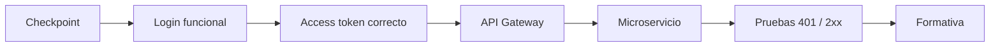

# DSY1107-002D · Semana 5

← [Semana 5](./README.md)

## Regla de inicio

La sección parte desde evidencia real, no desde el máximo alcance planificado en Semana 4.

Antes de avanzar, verificar en vivo:

- OAuth2/OIDC + JWT suficientemente comprendidos para interpretar el flujo;
- estado de Firebase Email/Password;
- si existe login funcional;
- si el estudiante distingue ID token de access token;
- último punto reproducible del laboratorio.

## Prioridad

En una sección con menor disponibilidad horaria, la ruta crítica es:

No forzar Google Sign-In, MSAL, Spring Security avanzado o transferencia completa a RegistrApp si los gates anteriores siguen rojos.

## Mínimo pedagógico

1. recuperar qué componente autentica y cuál autoriza;
2. obtener/identificar access token;
3. inspeccionar `iss`, `aud`, `exp` y permisos/scopes;
4. enviar Bearer token al Gateway;
5. demostrar rechazo sin credencial y aceptación con credencial válida;
6. ejecutar Evaluación Formativa 1 y revisar respuestas.

## Evidencia de cierre

Registrar después de clase:

- `covered_topics` reales;
- `pending_topics`;
- `lab_checkpoint`;
- `blockers`;
- incremento de RegistrApp, sólo si realmente ocurrió.

No marcar ejecución por planificación.
