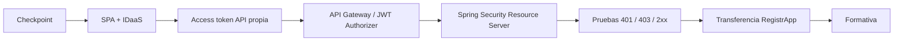

# DSY1107-003D · Semana 5

← [Semana 5](./README.md)

## Regla de inicio

La sección parte desde el último gate realmente verde de Semana 4. La mayor disponibilidad horaria no permite asumir que Firebase, Google Sign-In, Entra/MSAL, Guest/B2B o el access token para API propia quedaron completados.

Verificar en vivo:

- Firebase Email/Password end-to-end;
- Google Sign-In si fue alcanzado;
- estado real de Entra + MSAL;
- Guest/B2B cuando corresponda;
- existencia de access token destinado a la API propia;
- inicio o no del flujo Full Stack seguro.

## Ruta crítica

## Secuencia sugerida

### Bloque conceptual

- OAuth2/OIDC y Authorization Code + PKCE;
- SPA pública sin `client_secret`;
- App Registration SPA vs API Resource;
- ID token vs access token;
- `iss`, `aud`, `exp`, `scp`.

### Bloque de integración

- solicitar token para API propia;
- configurar Gateway y authorizer/política equivalente;
- integrar Gateway con microservicio;
- enviar Bearer token desde frontend.

### Bloque backend

- validar contexto de seguridad en Spring Security;
- explicar frontera perimetral vs autorización de aplicación;
- probar requests deliberadamente inválidas y válidas.

### Cierre

- si el patrón está verde, transferirlo de forma incremental a RegistrApp;
- realizar Evaluación Formativa 1;
- revisar colectivamente alternativas y errores conceptuales.

## Troubleshooting obligatorio

Diagnosticar una frontera a la vez:

1. ¿login funciona?;
2. ¿hay access token?;
3. ¿`aud`/`iss` corresponden?;
4. ¿Gateway acepta el JWT?;
5. ¿backend autoriza?;
6. ¿la respuesta esperada es 401, 403 o 2xx?

## Evidencia de cierre

Registrar después de clase:

- `covered_topics` reales;
- `pending_topics`;
- `lab_checkpoint`;
- `blockers`;
- `registrapp_increment` con commit/archivo/DevLog cuando exista.

No marcar ejecución por planificación.
