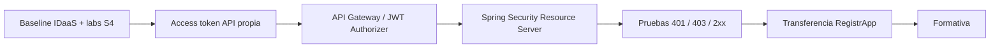

# DSY1107-003D · Semana 5

← [Semana 5](./README.md)

## Baseline esperado

La sección **ya debió avanzar en Semana 4 hasta la configuración del IDaaS y la realización de los laboratorios y guías indicados**. La clase de Semana 5 no debe partir repitiendo la configuración del proveedor de identidad.

El inicio se usa como checkpoint breve para confirmar en vivo:

- IDaaS configurado y autenticación reproducible;
- labs/guías de Semana 4 realizados al menos hasta su checkpoint esperado;
- obtención e inspección de tokens;
- estado de Entra/MSAL cuando corresponda al camino seguido por el grupo;
- existencia o preparación del access token destinado a la API propia.

Una deuda puntual se recupera de forma acotada; no se reinicia la secuencia completa de Semana 4.

## Ruta crítica

## Secuencia sugerida

### Checkpoint corto

- reproducir autenticación ya configurada;
- confirmar ID token vs access token;
- inspeccionar `iss`, `aud`, `exp`, `scp`;
- recuperar sólo deudas bloqueantes.

### Bloque de integración

- solicitar/obtener token para API propia;
- configurar Gateway y authorizer/política equivalente;
- integrar Gateway con microservicio;
- enviar Bearer token desde frontend.

### Bloque backend

- validar contexto de seguridad en Spring Security;
- explicar frontera perimetral vs autorización de aplicación;
- probar requests deliberadamente inválidas y válidas.

### Cierre

- si el patrón está verde, transferirlo de forma incremental a RegistrApp;
- realizar Evaluación Formativa 1;
- revisar colectivamente alternativas y errores conceptuales.

## Troubleshooting obligatorio

Diagnosticar una frontera a la vez:

1. ¿el baseline IDaaS de Semana 4 es reproducible?;
2. ¿hay access token?;
3. ¿`aud`/`iss` corresponden?;
4. ¿Gateway acepta el JWT?;
5. ¿backend autoriza?;
6. ¿la respuesta esperada es 401, 403 o 2xx?

## Evidencia de cierre

Registrar después de clase:

- baseline de Semana 4 reproducido o deuda detectada;
- `covered_topics` reales;
- `pending_topics`;
- `lab_checkpoint`;
- `blockers`;
- `registrapp_increment` con commit/archivo/DevLog cuando exista.

No marcar ejecución por planificación ni por expectativa previa.
