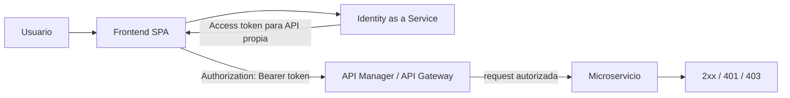
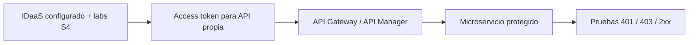
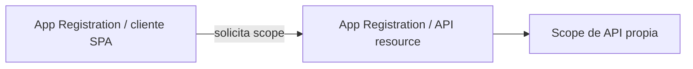
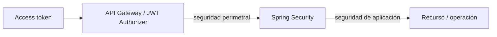
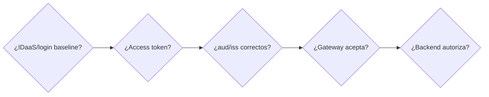

# Semana 5 · Integración Full Stack segura con API Manager e IDaaS

**Periodo:** 7 al 12 de septiembre de 2026  
**Propósito:** cerrar técnicamente la primera experiencia de aprendizaje logrando un flujo de autenticación y autorización funcional de extremo a extremo.

## Resultado de aprendizaje de la semana

Al finalizar, el estudiante debe poder demostrar y explicar el recorrido:

> Prioridad de Semana 5: **cerrar el flujo seguro**, no aumentar el alcance funcional de los microservicios ni las reglas de negocio.

## Contenidos oficiales

- **1.3.5** Integrando Frontend y Backend utilizando un API Manager.
- **1.3.6** Configurando e Integrando un API Gateway con un microservicio.
- **1.3.7** Integrando el IDaaS con el API Manager en la solución Full Stack.
- **Evaluación Formativa 1:** Integrando el Aplicativo al API Manager.

## Baseline esperado de entrada

Al comenzar Semana 5, los estudiantes **ya debieron haber avanzado hasta la configuración del IDaaS y realizado los laboratorios y guías indicados en Semana 4**. Por tanto, esta semana no debe reiniciar la configuración del proveedor de identidad ni repetir los laboratorios completos como contenido principal.

La apertura de clase se usa sólo como **checkpoint breve de evidencia** para confirmar que el baseline esperado es reproducible:

- proyecto/tenant del IDaaS configurado;
- cliente/frontend registrado o configurado según el proveedor;
- autenticación funcional alcanzada en los labs/guías previos;
- capacidad de obtener e inspeccionar tokens;
- comprensión mínima de ID token vs access token;
- último checkpoint reproducible de los laboratorios de Semana 4.

Si un estudiante o grupo no puede demostrar ese baseline, se registra como deuda y se recupera de manera acotada sin convertir toda la clase en repetición de Semana 4.

→ [Checkpoint de entrada desde Semana 4](./00-entrada-desde-semana-04.md)

## Foco nuevo de Semana 5

Desde ese baseline, el avance principal debe comenzar en la **integración**:

La implementación de referencia usa Microsoft Entra ID + MSAL + AWS API Gateway JWT Authorizer + Spring Security Resource Server:

→ [Laboratorio Full Stack protegido](../../labs/fullstack-seguro/README.md)  
→ [Identity & Access](../../docs/identity/README.md)  
→ [Guía completa Microsoft Entra ID](../../docs/identity/entra-guia-completa/README.md)

Firebase Authentication se mantiene como práctica IDaaS válida para consolidar autenticación y comparar proveedores, pero **MSAL no se modela como un provider de Firebase**.

## Conceptos que deben quedar verdes

### Cliente SPA vs API Resource

- La SPA representa al cliente público y no contiene `client_secret`.
- La API representa el recurso protegido y expone scopes/permisos.
- El frontend debe solicitar un **access token para la API propia**, no usar un ID token como credencial de API ni un token destinado a Microsoft Graph.

### Claims mínimos para diagnóstico

- `iss`: quién emitió el token.
- `aud`: para qué recurso fue emitido.
- `exp`: vigencia.
- `scp` / permisos equivalentes: qué puede hacer el cliente/usuario.

### Fronteras de seguridad

El Gateway y el backend no tienen responsabilidades idénticas: el primero protege la frontera de entrada; el segundo conserva validación/autorización de aplicación.

## Secuencia recomendada de clase

1. **Checkpoint breve del baseline:** verificar IDaaS configurado, autenticación reproducible y labs/guías de Semana 4; no repetirlos completos.
2. **Access token correcto:** obtener/inspeccionar un token destinado a la API propia.
3. **API Gateway:** configurar integración con el microservicio y JWT Authorizer/seguridad equivalente.
4. **Frontend → Gateway:** enviar `Authorization: Bearer <token>`.
5. **Backend protegido:** validar request y contexto de seguridad.
6. **Pruebas controladas:** sin token, token incorrecto, token correcto.
7. **Evaluación Formativa 1:** realizar en clase y revisar colectivamente las alternativas.

## Diagnóstico por fronteras

No cambiar cinco capas simultáneamente. Diagnosticar en orden:

Interpretación mínima:

- **401:** credencial ausente/no aceptable: token ausente, expirado, firma/issuer/audience incorrectos, etc.
- **403:** identidad/credencial aceptada, pero autorización insuficiente para la operación.
- **2xx:** credencial válida y autorización suficiente.

## Definition of Done de Semana 5

El cierre técnico mínimo es demostrable cuando:

- [ ] el baseline IDaaS de Semana 4 es reproducible;
- [ ] el frontend obtiene un access token;
- [ ] el token está destinado a la API propia;
- [ ] el frontend envía el Bearer token;
- [ ] el API Gateway/API Manager valida o aplica la política de seguridad;
- [ ] el Gateway enruta al microservicio;
- [ ] el microservicio responde correctamente;
- [ ] una llamada sin token es rechazada;
- [ ] una credencial incorrecta es rechazada;
- [ ] una credencial válida produce respuesta 2xx cuando corresponde;
- [ ] el estudiante puede explicar las fronteras del flujo y diagnosticar 401/403;
- [ ] se realizó y revisó la Evaluación Formativa 1.

No es requisito de cierre agregar CRUD, persistencia sofisticada, nuevos microservicios ni reglas de negocio adicionales.

## Evaluación Formativa 1

- Es un cuestionario automático **sin nota**.
- Debe habilitarse manualmente en AVA.
- Debe realizarse durante la clase.
- Preferentemente se aplica después de dejar operativo el flujo de autenticación/autorización, según avance de la sección.
- Al finalizar, revisar en conjunto las respuestas: explicar por qué la correcta es correcta y por qué las demás alternativas no lo son.

## Preparación para la defensa técnica de la evaluación parcial

El trabajo de esta semana también debe preparar al estudiante para explicar lo que implementó. Como entrenamiento, usar preguntas de tres niveles:

1. **base:** qué componente hace qué;
2. **profundización:** por qué se configuró de esa forma;
3. **hipotética:** qué cambiaría ante otro issuer, audience, scope, token expirado, endpoint protegido o proveedor.

La defensa posterior es grupal en presentación, pero el dominio se evidencia individualmente.

## Transferencia a RegistrApp

Primero demostrar el patrón en el laboratorio; después transferirlo al proyecto formativo.

→ [RegistrApp · Semana 5](../../proyecto-formativo/semana-05/README.md)

La transferencia no debe reiniciar el proyecto ni forzar alcance funcional nuevo: sólo integrar el patrón seguro sobre el incremento existente.
