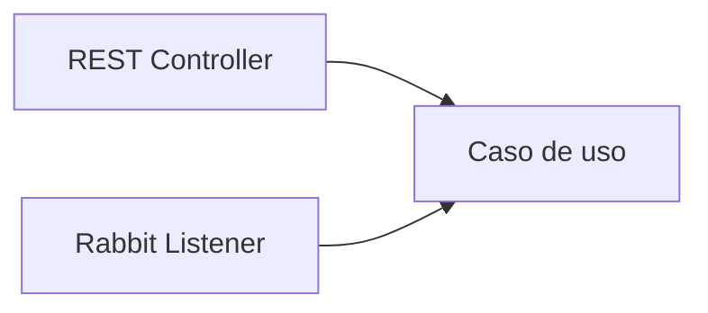

# 2.1.1 · Mensajería asíncrona y RabbitMQ

## Problema antes que herramienta

Una llamada síncrona acopla temporalmente a quien solicita con quien responde.

```text
Cliente → API A → Servicio B → respuesta
```

Si la operación secundaria tarda, falla o puede ejecutarse después, el solicitante queda innecesariamente bloqueado.

Con mensajería:

```text
Cliente → API A → Broker → Consumer
```

API A entrega una intención de trabajo y puede continuar.

## Conceptos

- **Producer:** publica mensajes.
- **Broker:** recibe y enruta mensajes.
- **Queue:** conserva mensajes pendientes.
- **Consumer:** procesa mensajes.
- **Message:** datos necesarios para ejecutar una intención.

## Beneficios

- desacoplamiento temporal;
- amortiguación de carga;
- procesamiento en segundo plano;
- escalado independiente;
- aislamiento parcial ante fallas.

## Cuándo NO usar una cola

No se agrega RabbitMQ solo por “ser cloud native”. Si el usuario necesita la respuesta inmediata y el proceso es simple y confiable, una llamada síncrona puede ser mejor.

## Autonomía de capacidades

La mensajería aparece naturalmente en microservicios, pero también en un monolito modular cuando una capacidad puede activarse desde distintos adaptadores:



La lógica no se duplica entre REST y RabbitMQ.
