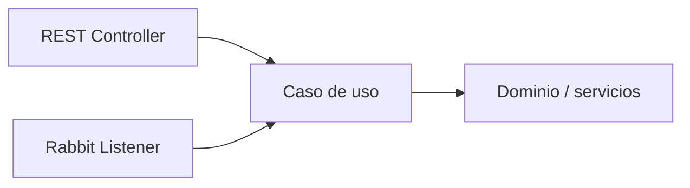

# 2.1.1 · Mensajería asíncrona y RabbitMQ

## Objetivo

Comprender qué problema resuelve la mensajería asíncrona antes de introducir RabbitMQ como herramienta.

> La decisión importante no es “usar RabbitMQ”. La decisión importante es determinar si una operación necesita o no mantener acoplados temporalmente a sus participantes.

## Problema antes que herramienta

En una comunicación síncrona, quien inicia la operación espera que el receptor procese la solicitud y entregue una respuesta.

```text
Cliente → API A → Servicio B → respuesta
```

Este modelo es correcto cuando la respuesta de B es necesaria para continuar. Sin embargo, también crea **acoplamiento temporal**: A depende de que B esté disponible y responda dentro de un tiempo razonable.

Imaginemos una reserva:

```text
crear reserva
→ guardar reserva
→ enviar correo
→ generar auditoría
→ actualizar estadísticas
→ responder
```

¿Necesita el usuario esperar el correo, la auditoría y las estadísticas para saber que su reserva fue creada?

Probablemente no.

## Comunicación asíncrona

Con mensajería, el productor entrega un mensaje a un broker y puede continuar sin ejecutar directamente el procesamiento final.

```text
Cliente → API A → Broker → Queue → Consumer
```

Ejemplo:

```text
ReservaService
→ publica "reserva.creada"
→ RabbitMQ
→ NotificacionConsumer
→ envía notificación
```

El servicio que crea la reserva ya no necesita invocar directamente al componente de notificaciones.

## Conceptos fundamentales

### Producer

Componente que **publica** un mensaje.

No necesita conocer qué instancia concreta terminará procesándolo.

### Broker

Software intermediario que recibe mensajes y administra su entrega.

En esta asignatura utilizaremos **RabbitMQ**.

### Queue

Cola donde pueden permanecer mensajes pendientes de procesamiento.

Una queue permite desacoplar la velocidad de producción de la velocidad de consumo.

### Consumer

Componente que recibe y procesa mensajes desde una queue.

### Message

Unidad de información intercambiada.

Debería contener los datos necesarios para representar una intención o evento sin transportar objetos internos innecesarios de la aplicación.

## Síncrono y asíncrono no son rivales

No se reemplaza toda comunicación REST por mensajería.

| Necesidad | Enfoque habitual |
|---|---|
| El cliente necesita una respuesta inmediata | Síncrono |
| La operación puede completarse posteriormente | Asíncrono |
| Se quiere absorber peaks de carga | Asíncrono |
| Se necesita una consulta simple e inmediata | Síncrono |
| Varias capacidades reaccionan al mismo evento | Asíncrono |
| El resultado determina el siguiente paso del usuario | Síncrono |

Una arquitectura real suele combinar ambos estilos.

## Beneficios principales

### Desacoplamiento temporal

Producer y consumer no necesitan estar ejecutándose exactamente al mismo tiempo.

### Amortiguación de carga

Si llegan mensajes más rápido de lo que el consumer procesa, la queue puede retener trabajo pendiente.

### Procesamiento en segundo plano

Tareas que no forman parte de la respuesta inmediata pueden ejecutarse posteriormente.

### Escalado independiente

Es posible aumentar consumers sin modificar necesariamente al producer.

### Aislamiento parcial ante fallas

La caída temporal de un consumer no implica automáticamente que el producer deba fallar.

> “Parcial” es importante: utilizar mensajería no elimina los fallos; cambia dónde y cómo deben administrarse.

## Costos que también aparecen

Agregar un broker introduce nuevas responsabilidades:

- infraestructura adicional;
- mensajes que pueden quedar pendientes;
- necesidad de monitorear queues;
- duplicados o reintentos en escenarios posteriores;
- mayor dificultad para seguir un flujo distribuido;
- consistencia que puede dejar de ser inmediata.

Por eso la mensajería debe responder a una necesidad concreta.

## ¿Cuándo NO usar una cola?

No se agrega RabbitMQ solo por “ser cloud native”.

Una llamada síncrona puede ser más simple cuando:

- el usuario necesita el resultado inmediatamente;
- la operación es breve y confiable;
- existe un único flujo simple;
- no se necesita desacoplar temporalmente;
- el costo operacional del broker supera el beneficio.

## Autonomía de capacidades

La mensajería aparece naturalmente en microservicios, pero también puede utilizarse dentro de arquitecturas modulares.

Una capacidad debería poder ser activada desde diferentes adaptadores sin duplicar sus reglas.



REST y RabbitMQ son mecanismos de entrada. La lógica de negocio no debería vivir exclusivamente en ninguno de ellos.

## Ejemplo de decisión

Supongamos que una API registra una inscripción.

La creación de la inscripción debe responder inmediatamente si los datos son válidos. En cambio, estas tareas podrían procesarse después:

- enviar correo de confirmación;
- generar auditoría;
- actualizar una estadística;
- notificar a otro sistema.

Eso permite separar:

```text
operación principal
≠
efectos secundarios que pueden ocurrir después
```

## Checkpoint conceptual

Antes de continuar, deberías poder explicar:

1. ¿qué significa acoplamiento temporal?;
2. ¿por qué una queue puede absorber diferencias de velocidad?;
3. ¿qué parte del flujo sigue siendo responsabilidad del producer?;
4. ¿qué costo nuevo introduce un broker?;
5. ¿qué ejemplo NO justificaría mensajería?

## Profundización

Para revisar consistencia eventual, escenarios de carga, fallos parciales y criterios de decisión con mayor detalle:

→ [Contenido extendido · Asincronía y colas](./01-asincronia-y-colas/)
