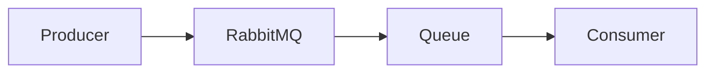

# 2.1.2 · Queue, Producer y Consumer · Hello World

## Objetivo

Construir el recorrido mínimo de un mensaje con RabbitMQ y Spring AMQP antes de incorporar exchanges y routing más elaborados.

```text
Producer → Queue → Consumer
```

La prioridad es que el estudiante pueda **observar y explicar cada paso**.

## Arquitectura mínima



En este primer ejercicio no buscamos resolver todavía una arquitectura completa. Queremos comprobar cuatro cosas:

1. RabbitMQ está disponible.
2. Existe una queue.
3. un producer puede publicar.
4. un consumer puede recibir.

## RabbitMQ local con Docker

RabbitMQ puede ejecutarse localmente usando la imagen con Management UI.

Ejemplo:

```bash
docker run -d \
  --name rabbitmq \
  -p 5672:5672 \
  -p 15672:15672 \
  rabbitmq:3-management
```

Puertos importantes:

- **5672:** protocolo AMQP utilizado por la aplicación;
- **15672:** interfaz web RabbitMQ Management.

La interfaz de administración permite observar exchanges, queues, bindings, consumers y cantidad de mensajes.

## Dependencia Spring AMQP

En Spring Boot utilizamos:

```xml
<dependency>
  <groupId>org.springframework.boot</groupId>
  <artifactId>spring-boot-starter-amqp</artifactId>
</dependency>
```

Spring Boot puede conectarse por defecto a RabbitMQ local en `localhost:5672`, aunque es recomendable declarar la configuración explícitamente cuando el ejemplo evoluciona.

```properties
spring.rabbitmq.host=localhost
spring.rabbitmq.port=5672
spring.rabbitmq.username=guest
spring.rabbitmq.password=guest
```

## Declarar una queue

Una configuración mínima puede declarar la cola como bean.

```java
@Configuration
public class RabbitMQConfig {

    public static final String QUEUE_NAME = "hello.queue";

    @Bean
    Queue helloQueue() {
        return new Queue(QUEUE_NAME);
    }
}
```

Esto permite que Spring declare la queue al iniciar la aplicación.

## Producer

El producer publica mensajes utilizando `RabbitTemplate`.

```java
@Component
public class HelloProducer {

    private final RabbitTemplate rabbitTemplate;

    public HelloProducer(RabbitTemplate rabbitTemplate) {
        this.rabbitTemplate = rabbitTemplate;
    }

    public void send(String message) {
        rabbitTemplate.convertAndSend(
            RabbitMQConfig.QUEUE_NAME,
            message
        );
    }
}
```

Para este primer recorrido se prioriza simplicidad. En el tema siguiente se trabajará explícitamente con exchange y routing key.

## Consumer

Un consumer puede escuchar la queue con `@RabbitListener`.

```java
@Component
public class HelloConsumer {

    @RabbitListener(queues = RabbitMQConfig.QUEUE_NAME)
    public void receive(String message) {
        System.out.println("Mensaje recibido: " + message);
    }
}
```

Cuando existe un mensaje disponible y el consumer está conectado, RabbitMQ lo entrega para procesamiento.

## Flujo completo

```text
1. aplicación inicia
2. Spring se conecta a RabbitMQ
3. queue queda declarada
4. producer publica un mensaje
5. RabbitMQ lo recibe
6. mensaje queda disponible en la queue
7. consumer recibe el mensaje
8. aplicación procesa el contenido
```

## ¿Qué observar en Management UI?

No usar Management únicamente como “captura para evidencia”.

Hay que relacionar lo que se observa con el código:

- nombre de la queue;
- cantidad de mensajes;
- consumers conectados;
- actividad de publicación y entrega;
- estado de la conexión.

Una prueba útil consiste en detener temporalmente el consumer, publicar mensajes y observar cómo quedan pendientes.

## Error frecuente: confundir queue con consumer

La queue no es el consumer.

```text
Queue = almacena mensajes pendientes
Consumer = ejecuta procesamiento
```

Pueden existir uno o varios consumers asociados a una misma queue.

## Error frecuente: creer que RabbitMQ ejecuta la lógica

RabbitMQ transporta y administra mensajes.

No sabe enviar correos, crear reservas ni aplicar reglas de negocio. Ese trabajo pertenece al consumer y, preferentemente, al caso de uso que el consumer invoca.

## Checkpoint

Antes de continuar al routing:

- RabbitMQ está ejecutándose;
- Management UI es accesible;
- la queue aparece declarada;
- el producer publica;
- el consumer recibe;
- se puede observar un mensaje pendiente al detener temporalmente el consumer;
- el estudiante puede explicar qué responsabilidad tiene cada componente.

## Profundización

Para revisar ciclo de vida de mensajes, serialización, múltiples consumers, troubleshooting y observación con Management UI:

→ [Contenido extendido · Hello World RabbitMQ](./02-hello-world-rabbitmq/)
