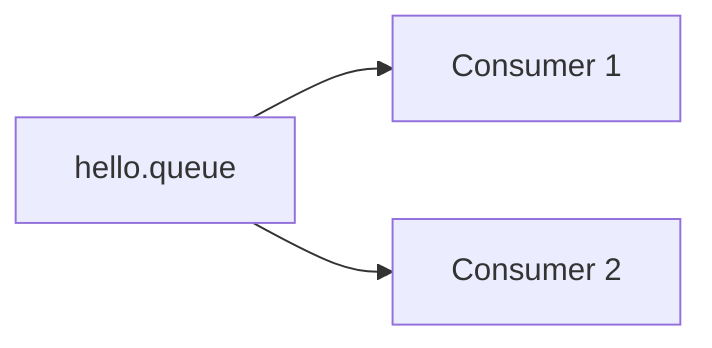

# Contenido extendido · Hello World RabbitMQ

Este material profundiza [2.1.2 · Queue, Producer y Consumer](../02-hello-world-rabbitmq.md).

## 1. Objetivo técnico

La primera implementación debe reducir variables.

No buscamos todavía:

- múltiples exchanges;
- retry;
- DLQ;
- seguridad avanzada;
- arquitectura distribuida completa.

Buscamos comprobar:

```text
aplicación
→ conexión AMQP
→ publicación
→ queue
→ consumo
```

## 2. Levantar RabbitMQ

```bash
docker run -d \
  --name rabbitmq \
  -p 5672:5672 \
  -p 15672:15672 \
  rabbitmq:3-management
```

Comprobar:

```bash
docker ps
```

Si el contenedor existe pero está detenido:

```bash
docker start rabbitmq
```

## 3. Management UI

Abrir:

```text
http://localhost:15672
```

Credenciales locales por defecto:

```text
guest / guest
```

En ambiente real no se deben reutilizar estas credenciales ni exponer Management públicamente.

## 4. Qué observar

### Connections

Representa conexiones activas entre clientes y RabbitMQ.

### Channels

Una conexión AMQP puede contener canales lógicos.

Para Semana 08 basta reconocer que Spring administra estos detalles y que la aplicación no abre una conexión nueva por cada mensaje.

### Queues

Permite observar:

- mensajes listos;
- mensajes entregados;
- consumers;
- tasa de ingreso;
- tasa de salida.

## 5. Declaración de queue

```java
@Bean
Queue helloQueue() {
    return new Queue("hello.queue");
}
```

En ejemplos docentes, declarar infraestructura desde Spring facilita reproducibilidad.

La aplicación describe la topología que necesita y RabbitMQ la crea si no existe.

## 6. Producer con RabbitTemplate

`RabbitTemplate` es una abstracción de Spring AMQP para publicar mensajes.

Ejemplo:

```java
@Component
public class MessageProducer {

    private final RabbitTemplate rabbitTemplate;

    public MessageProducer(RabbitTemplate rabbitTemplate) {
        this.rabbitTemplate = rabbitTemplate;
    }

    public void send(String payload) {
        rabbitTemplate.convertAndSend("hello.queue", payload);
    }
}
```

Para una primera práctica, `String` es suficiente.

Después pueden utilizarse objetos serializados.

## 7. Consumer con @RabbitListener

```java
@Component
public class MessageConsumer {

    @RabbitListener(queues = "hello.queue")
    public void consume(String payload) {
        System.out.println("Recibido: " + payload);
    }
}
```

Spring registra el listener y mantiene el consumer conectado.

## 8. Experimento A · consumer activo

1. iniciar RabbitMQ;
2. iniciar aplicación;
3. publicar un mensaje;
4. observar el log;
5. revisar queue.

Resultado esperado:

```text
mensaje entra
→ consumer disponible
→ mensaje sale rápidamente
```

Por eso a veces es difícil “ver” el mensaje pendiente en Management: el consumer lo procesa casi inmediatamente.

## 9. Experimento B · consumer detenido

1. detener aplicación consumer;
2. dejar RabbitMQ activo;
3. publicar uno o más mensajes;
4. observar `Ready` en Management;
5. volver a iniciar consumer.

Resultado:

```text
mensajes pendientes
→ consumer se conecta
→ mensajes son entregados
```

Este experimento muestra el desacoplamiento temporal mejor que una definición teórica.

## 10. ¿Qué pasa con dos consumers?

Si dos consumers escuchan **la misma queue**, RabbitMQ distribuye trabajo entre ellos.



Esto no significa que ambos reciban una copia del mismo mensaje.

Para fan-out hacia responsabilidades diferentes normalmente se utilizan queues separadas.

## 11. Serialización

Cuando enviamos un `String`, la conversión es simple.

Con objetos:

```java
public record NotificationMessage(
    Long userId,
    String email
) {}
```

aparece una preocupación adicional: producer y consumer deben compartir un contrato comprensible.

No conviene asumir que cualquier objeto Java interno es automáticamente un buen mensaje.

## 12. Troubleshooting

### Connection refused

Revisar:

```text
¿RabbitMQ está ejecutándose?
¿puerto 5672 está publicado?
¿host configurado correctamente?
```

### Queue no aparece

Revisar:

- clase `@Configuration`;
- bean de `Queue`;
- package scanning;
- aplicación realmente iniciada.

### Consumer no recibe

Revisar:

- nombre exacto de queue;
- listener registrado;
- errores de conversión;
- logs de Spring;
- messages `Ready` en Management.

### Puerto ocupado

Comprobar si otro proceso usa `5672` o `15672`.

## 13. Qué debería quedar claro

Al terminar el Hello World, el estudiante debe poder separar mentalmente:

```text
RabbitTemplate
= mecanismo de publicación

Queue
= buffer / destino intermedio

@RabbitListener
= mecanismo de consumo

Caso de uso
= comportamiento de aplicación
```

## 14. Desafío breve

Modifica el ejemplo para enviar:

```json
{
  "id": 101,
  "tipo": "RESERVA_CREADA",
  "descripcion": "Reserva registrada correctamente"
}
```

Luego explica qué parte corresponde a:

- transporte;
- contrato;
- negocio;
- observabilidad.
