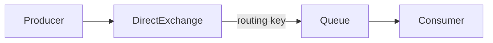

# 2.1.3 · Exchange, Binding y Routing Key

## Modelo completo



El producer publica al exchange. El exchange decide el destino según bindings.

## DirectExchange

Para Semana 08 se utiliza `DirectExchange` porque su regla es explícita:

> la routing key del mensaje debe coincidir exactamente con la binding key.

Ejemplo:

```text
exchange: reservas.exchange
routing key: reserva.creada
queue: reservas.notificaciones.queue
```

## Un mensaje puede llegar a varias queues

Si dos queues tienen un binding con `reserva.creada`, ambas reciben una copia del mensaje.

## Una queue puede aceptar varios eventos

Puede tener múltiples bindings:

```text
auditoria.queue
← reserva.creada
← reserva.cancelada
```

## Regla de diseño

El consumer escucha una queue. No debería contener conocimiento innecesario sobre quién produjo el mensaje ni cómo se decidió el routing.
