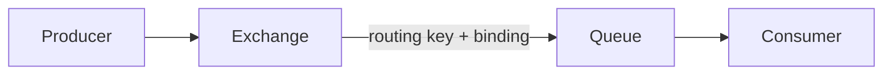
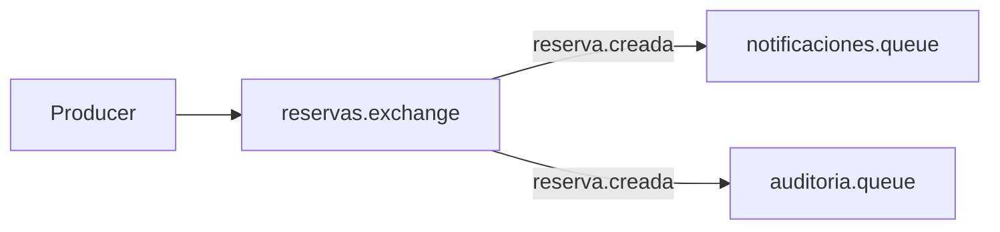

# 2.1.3 · Exchange, Binding y Routing Key

## Objetivo

Comprender cómo RabbitMQ decide a qué queue debe llegar un mensaje.

El modelo conceptual completo es:



Una diferencia importante respecto del ejemplo inicial es esta:

> El producer publica hacia un exchange. El exchange utiliza sus reglas y bindings para determinar el destino.

## Exchange

Un **exchange** recibe mensajes publicados por producers.

No es normalmente el lugar donde el mensaje espera ser procesado. Su función principal es **routing**.

El exchange evalúa información del mensaje —por ejemplo su routing key— y la compara con los bindings disponibles.

## Queue

La queue conserva mensajes destinados a ser procesados por consumers.

El producer no debería necesitar conocer qué consumer concreto procesará finalmente el mensaje.

## Binding

Un binding representa una relación entre exchange y queue.

Podemos leerlo como una regla:

```text
cuando este exchange reciba un mensaje que cumpla esta condición
→ enrútalo hacia esta queue
```

## Routing key

La routing key es un valor enviado junto con la publicación y utilizado por ciertos tipos de exchange para tomar decisiones de routing.

Ejemplo:

```text
reserva.creada
reserva.cancelada
usuario.registrado
pago.confirmado
```

No es el nombre de la queue.

Eso permite separar:

```text
qué ocurrió
≠
dónde se procesa
```

## DirectExchange

Durante Semana 08 utilizamos principalmente `DirectExchange` porque su regla es fácil de observar:

> La routing key del mensaje debe coincidir exactamente con la binding key.

Ejemplo:

```text
exchange: reservas.exchange
routing key: reserva.creada
queue: reservas.notificaciones.queue
binding key: reserva.creada
```

Flujo:

```text
Producer
→ reservas.exchange
→ routing key "reserva.creada"
→ binding coincide
→ reservas.notificaciones.queue
→ Consumer
```

## Configuración con Spring AMQP

```java
@Configuration
public class RabbitMQConfig {

    public static final String EXCHANGE = "reservas.exchange";
    public static final String QUEUE = "reservas.notificaciones.queue";
    public static final String ROUTING_KEY = "reserva.creada";

    @Bean
    DirectExchange reservasExchange() {
        return new DirectExchange(EXCHANGE);
    }

    @Bean
    Queue notificacionesQueue() {
        return new Queue(QUEUE);
    }

    @Bean
    Binding notificacionesBinding(
            Queue notificacionesQueue,
            DirectExchange reservasExchange) {

        return BindingBuilder
                .bind(notificacionesQueue)
                .to(reservasExchange)
                .with(ROUTING_KEY);
    }
}
```

## Publicación

```java
rabbitTemplate.convertAndSend(
    RabbitMQConfig.EXCHANGE,
    RabbitMQConfig.ROUTING_KEY,
    payload
);
```

El producer conoce:

- el exchange;
- la routing key;
- el mensaje.

No necesita conocer al consumer.

## Un mensaje puede llegar a varias queues

Si dos queues tienen bindings compatibles con la misma routing key, ambas reciben una copia.



Este diseño permite que distintas capacidades reaccionen de manera independiente al mismo evento.

## Una queue puede aceptar varios tipos de mensaje

Una misma queue también puede tener múltiples bindings.

```text
auditoria.queue
← reserva.creada
← reserva.cancelada
```

Eso puede ser correcto si ambos mensajes corresponden a la responsabilidad de esa queue.

## Routing semántico

Una routing key debería comunicar significado.

Preferir:

```text
reserva.creada
pago.confirmado
usuario.registrado
```

sobre nombres que describen implementación accidental:

```text
queue1
procesar
mensajeA
```

El nombre ayuda a leer la topología como parte de la arquitectura.

## Error frecuente: producer → queue como modelo mental permanente

RabbitMQ permite simplificaciones, pero para comprender routing conviene pensar explícitamente en:

```text
Producer → Exchange → Binding → Queue → Consumer
```

Esa secuencia evita confundir responsabilidades.

## Regla de diseño

El consumer escucha una queue.

No debería depender de:

- quién produjo originalmente el mensaje;
- qué controller inició el flujo;
- qué endpoint HTTP existía antes;
- cómo el exchange resolvió el routing.

Su responsabilidad empieza cuando recibe el mensaje que le corresponde.

## Checkpoint

Deberías poder responder:

1. ¿qué diferencia existe entre exchange y queue?;
2. ¿qué representa un binding?;
3. ¿qué transporta una routing key?;
4. ¿por qué routing key y queue no son equivalentes?;
5. ¿cómo puede un mensaje terminar en dos queues?;
6. ¿qué ocurre si ninguna binding key coincide?

## Profundización

Para estudiar tipos de exchange, topologías alternativas, convenciones de nombres y ejercicios de routing:

→ [Contenido extendido · Exchange, Binding y Routing Key](./03-exchange-binding-routing-key/)
