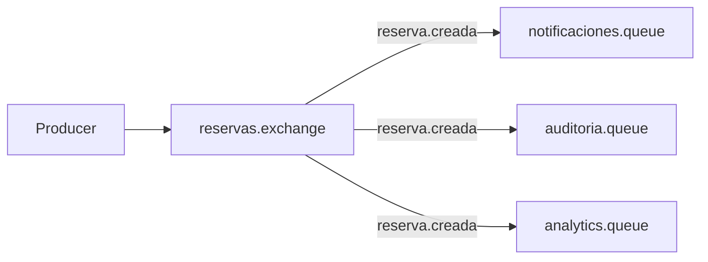
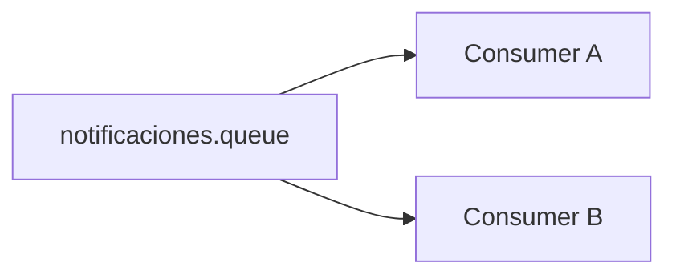

# Contenido extendido · Exchange, Binding y Routing Key

Este material profundiza [2.1.3 · Exchange, Binding y Routing Key](../03-exchange-binding-routing-key.md).

## 1. Por qué existe un exchange

Si cada producer conociera directamente todas las queues receptoras, el producer quedaría acoplado a la topología completa.

RabbitMQ introduce exchanges para centralizar decisiones de routing.

```text
Producer
→ Exchange
→ reglas
→ una o más Queues
```

El producer expresa **qué publica**. La topología determina **quién recibe**.

## 2. Elementos del routing

### Exchange

Punto de entrada lógico de mensajes.

### Routing key

Etiqueta enviada con la publicación.

### Binding

Relaciona exchange y queue bajo una regla.

### Queue

Destino donde el mensaje espera procesamiento.

## 3. Direct exchange

Regla:

```text
routing key == binding key
```

Ejemplo:

```text
exchange: reservas.exchange

bindings:
reserva.creada   → notificaciones.queue
reserva.creada   → auditoria.queue
reserva.cancelada → auditoria.queue
```

Publicar:

```text
routing key = reserva.creada
```

Resultado:

```text
notificaciones.queue
auditoria.queue
```

## 4. Topic exchange

No es el foco central de Semana 08, pero conviene conocer la idea.

Permite patrones.

Ejemplo:

```text
reserva.creada
reserva.cancelada
pago.confirmado
```

Binding:

```text
reserva.*
```

podría coincidir con distintos eventos de reserva.

Se profundiza cuando sea necesario trabajar routing más flexible.

## 5. Fanout exchange

Ignora routing keys y distribuye a todas las queues asociadas.

Modelo:

```text
evento
→ fanout
→ queue A
→ queue B
→ queue C
```

Es útil para comprender publish/subscribe, aunque Semana 08 prioriza DirectExchange por ser explícito.

## 6. Default exchange

RabbitMQ incluye un exchange especial que facilita enviar directamente a una queue usando su nombre como routing key.

Eso explica por qué ejemplos mínimos pueden parecer:

```text
producer → queue
```

Sin embargo, conceptualmente sigue siendo útil pensar en exchanges desde temprano para no perder el modelo de routing.

## 7. Nombres semánticos

Una topología legible ayuda a razonar.

### Exchange

```text
reservas.exchange
usuarios.exchange
pagos.exchange
```

### Routing key

```text
reserva.creada
reserva.cancelada
usuario.registrado
pago.confirmado
```

### Queue

Una queue debería expresar quién procesa o para qué existe.

```text
reservas.notificaciones.queue
reservas.auditoria.queue
pagos.conciliacion.queue
```

## 8. Error frecuente: nombre técnico sin significado

Evitar:

```text
exchange1
queue2
keyA
```

Funcionan técnicamente, pero ocultan intención.

## 9. Una routing key no identifica un consumer

```text
reserva.creada
```

describe el mensaje.

No debería significar:

```text
manda esto a NotificacionServiceImpl
```

Ese desacoplamiento permite que mañana aparezca un nuevo consumidor sin modificar al producer.

## 10. Múltiples responsabilidades

Caso:

```text
reserva.creada
```

Interesados:

- notificaciones;
- auditoría;
- analytics.

Topología:



Cada capacidad tiene su propia queue.

Eso permite que una procese lentamente sin bloquear necesariamente a las otras.

## 11. Misma queue, múltiples consumers

Caso diferente:



Aquí los consumers compiten por trabajo de **la misma responsabilidad**.

No deben confundirse estos dos patrones:

```text
varias queues
= varias copias / responsabilidades

varios consumers misma queue
= reparto de carga
```

## 12. ¿Qué pasa si no hay binding?

Si el exchange recibe un mensaje y ninguna regla lo dirige a una queue, el mensaje puede no llegar a ningún consumer.

Semana 08 solo requiere reconocer este escenario.

Más adelante aparecen mecanismos para tratar publicaciones no enrutable o errores de entrega.

## 13. Ejercicio de diseño

Diseña una topología para:

- `usuario.registrado`;
- enviar bienvenida;
- registrar auditoría;
- alimentar estadísticas.

Responde:

1. ¿qué exchange usarías?;
2. ¿qué routing key?;
3. ¿cuántas queues?;
4. ¿por qué no una sola queue?;
5. ¿qué ocurre si analytics queda detenido?;
6. ¿debería el producer conocer los tres consumers?

## 14. Idea de cierre

Una topología bien diseñada permite leer la arquitectura:

```text
qué ocurrió
→ quién está interesado
→ dónde espera el trabajo
→ quién lo procesa
```

Exchange, routing key, binding y queue no son cuatro nombres para lo mismo; cada uno resuelve una responsabilidad distinta.
