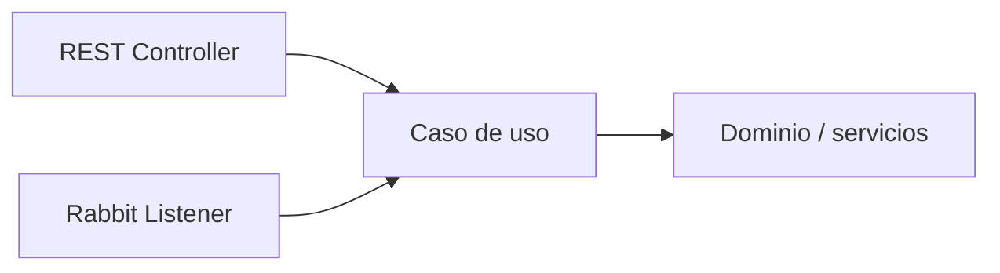

# Separación de responsabilidades · REST, mensajería y negocio

## Objetivo

Evitar que la incorporación de RabbitMQ mezcle infraestructura, transporte y reglas de negocio en una sola clase.

La mensajería agrega un nuevo adaptador, no una nueva ubicación para toda la aplicación.

## Estructura mínima sugerida

```text
config/
  RabbitMQConfig

messaging/
  ReservaEventPublisher
  NotificacionConsumer

application/
  ReservaService
  NotificacionService

web/
  ReservaController
```

No es la única estructura posible. Lo importante es que cada responsabilidad tenga un límite comprensible.

## Responsabilidades

### `RabbitMQConfig`

Contiene elementos de infraestructura:

- queues;
- exchanges;
- bindings;
- nombres o constantes asociadas a la topología.

No debería implementar reglas de negocio.

### Publisher

`ReservaEventPublisher` traduce una necesidad de publicación hacia RabbitMQ.

Ejemplo:

```java
@Component
public class ReservaEventPublisher {

    private final RabbitTemplate rabbitTemplate;

    public ReservaEventPublisher(RabbitTemplate rabbitTemplate) {
        this.rabbitTemplate = rabbitTemplate;
    }

    public void publish(ReservaCreadaEvent event) {
        rabbitTemplate.convertAndSend(
            RabbitMQConfig.EXCHANGE,
            RabbitMQConfig.RESERVA_CREADA,
            event
        );
    }
}
```

### Consumer / Listener

El listener recibe el mensaje y adapta esa entrada a una operación de la aplicación.

```java
@Component
public class NotificacionConsumer {

    private final NotificacionService notificacionService;

    public NotificacionConsumer(NotificacionService notificacionService) {
        this.notificacionService = notificacionService;
    }

    @RabbitListener(queues = RabbitMQConfig.NOTIFICACIONES_QUEUE)
    public void consume(ReservaCreadaEvent event) {
        notificacionService.notificarReservaCreada(event);
    }
}
```

La clase es deliberadamente pequeña.

### Caso de uso / servicio de aplicación

Aquí se coordina el comportamiento que pertenece a la capacidad.

```java
@Service
public class NotificacionService {

    public void notificarReservaCreada(ReservaCreadaEvent event) {
        // lógica de aplicación
    }
}
```

## REST y RabbitMQ como adaptadores

Una misma capacidad puede recibir solicitudes desde mecanismos distintos.



Esto evita que la lógica quede atrapada en `@RestController` o `@RabbitListener`.

## Anti-patrón: listener como aplicación completa

```text
@RabbitListener
→ valida reglas
→ consulta repositorios
→ calcula resultados
→ envía correos
→ actualiza varias entidades
→ decide routing
→ 80 líneas más
```

Ese listener deja de ser un adaptador y se convierte en una clase difícil de probar, reutilizar y mantener.

## Anti-patrón: controller publica detalles de infraestructura

Otro problema frecuente:

```text
Controller
→ arma routing key
→ conoce exchange
→ usa RabbitTemplate
→ define payload de infraestructura
```

El controller debería expresar una intención de aplicación. Un publisher dedicado puede encapsular los detalles de RabbitMQ.

## Payload y modelo de dominio

No conviene enviar automáticamente una entidad JPA completa como mensaje.

Un mensaje debería representar explícitamente lo que necesita comunicar.

Ejemplo:

```java
public record ReservaCreadaEvent(
    Long reservaId,
    Long usuarioId,
    String email,
    LocalDateTime fechaCreacion
) {}
```

Esto reduce acoplamiento entre el contrato del mensaje y la estructura interna de persistencia.

## Pregunta útil para revisar diseño

Para cada clase, pregunta:

> ¿Esta clase seguiría teniendo sentido si mañana cambiara RabbitMQ por otra tecnología?

- el caso de uso: probablemente sí;
- el dominio: sí;
- el listener: no necesariamente;
- `RabbitMQConfig`: no.

Esa diferencia ayuda a reconocer qué pertenece a infraestructura.

## Testabilidad

Separar responsabilidades permite probar:

- lógica de aplicación sin iniciar RabbitMQ;
- publisher de forma aislada;
- listener como adaptación;
- integración RabbitMQ mediante pruebas específicas.

No todo test debe requerir infraestructura completa.

## Regla práctica de Semana 08

El listener debería poder explicarse así:

```text
recibe mensaje
→ valida/adapta lo mínimo
→ invoca caso de uso
```

Si el listener contiene gran parte del negocio, hay una señal de alerta.

## Checkpoint

Revisa tu implementación:

- ¿`RabbitMQConfig` contiene solo infraestructura?;
- ¿el controller conoce RabbitMQ directamente sin necesidad?;
- ¿el listener contiene lógica extensa?;
- ¿el payload representa un contrato claro?;
- ¿el caso de uso puede ejecutarse sin conocer RabbitMQ?;
- ¿la lógica está duplicada entre REST y mensajería?

## Profundización

Para revisar capas, contratos de mensajes, testabilidad y decisiones de arquitectura:

→ [Contenido extendido · Separación de responsabilidades](./04-separacion-responsabilidades/)
