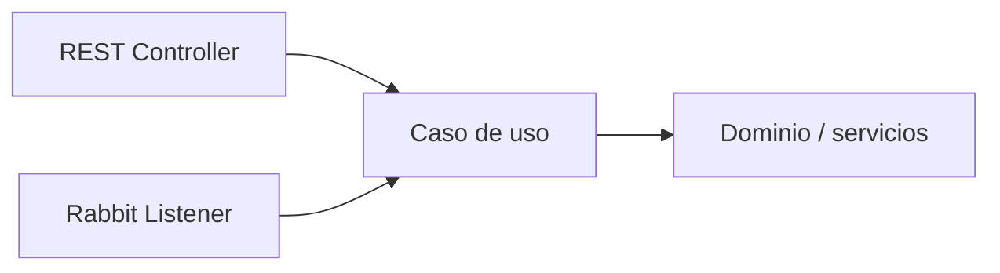

# Separación de responsabilidades · REST, mensajería y negocio

## Estructura mínima

```text
config/
  RabbitMQConfig
messaging/
  ReservaEventPublisher
  NotificacionConsumer
application/
  ReservaService
web/
  ReservaController
```

## Regla

- `RabbitMQConfig`: infraestructura.
- `ReservaEventPublisher`: traducción de una intención a mensaje.
- `NotificacionConsumer`: adaptador de entrada desde RabbitMQ.
- `ReservaService`: caso de uso / aplicación.
- `ReservaController`: adaptador HTTP.

## Anti-patrón

```text
@RabbitListener
→ 80 líneas de reglas de negocio
→ acceso directo a todo
```

El listener no debería convertirse en “la aplicación”.

## Modelo deseado



Así la capacidad mantiene autonomía respecto del mecanismo que la activa.
