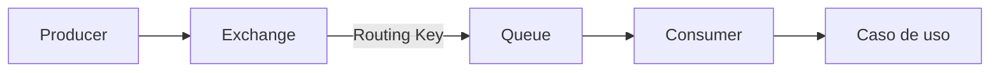

# Evidencia y criterio de salida · Semana 08

## Propósito

La evidencia de Semana 08 no busca solo demostrar que “RabbitMQ funciona”.

Debe demostrar tres niveles:

1. **infraestructura:** la topología existe;
2. **ejecución:** los mensajes recorren el flujo;
3. **comprensión:** el estudiante puede explicar por qué está diseñado de esa forma.

## Evidencia mínima

### Infraestructura

- RabbitMQ ejecutándose;
- Management UI accesible;
- queue visible;
- exchange visible;
- bindings visibles;
- consumer conectado cuando corresponde.

### Ejecución

- producer funcionando;
- al menos dos mensajes publicados;
- consumer recibiendo;
- routing keys coherentes;
- salida o log que permita relacionar publicación y consumo.

### Diseño

- nombres comprensibles;
- separación entre infraestructura y lógica;
- listener pequeño;
- payload reconocible;
- caso de uso independiente del mecanismo de transporte.

## Evidencia útil vs captura decorativa

Una captura aporta cuando permite responder una pregunta.

Por ejemplo:

> “Aquí se observa `reservas.notificaciones.queue` con un consumer conectado y cero mensajes pendientes después del procesamiento.”

Eso demuestra más comprensión que una imagen sin explicación.

## Recorrido que el estudiante debería explicar

```text
1. ocurre una acción en la aplicación
2. producer crea/publica un mensaje
3. mensaje llega al exchange
4. routing key se compara con bindings
5. mensaje llega a una queue
6. consumer recibe el mensaje
7. listener invoca un caso de uso
8. aplicación ejecuta el procesamiento
```

## Preguntas de salida

### Conceptos

1. ¿Qué problema resuelve la asincronía?
2. ¿Qué significa desacoplamiento temporal?
3. ¿Qué almacena una queue?
4. ¿Qué responsabilidad tiene el broker?

### Routing

5. ¿Qué hace un exchange?
6. ¿Qué función cumple un binding?
7. ¿Qué diferencia existe entre routing key y nombre de queue?
8. ¿Qué ocurre si no existe un binding compatible?

### Ejecución

9. ¿Qué ocurriría si el consumer se detiene temporalmente?
10. ¿Qué puedes observar en Management UI mientras existen mensajes pendientes?
11. ¿Qué cambia si agregamos un segundo consumer sobre la misma queue?

### Arquitectura

12. ¿Por qué un listener no debería contener toda la lógica de negocio?
13. ¿Por qué conviene encapsular `RabbitTemplate` en un publisher?
14. ¿Qué diferencia existe entre el payload del mensaje y una entidad JPA?
15. ¿Qué parte de la aplicación debería sobrevivir si RabbitMQ se reemplaza?

## Criterio de salida técnico

La implementación mínima debe permitir:

```text
publicar
→ enrutar
→ almacenar temporalmente
→ consumir
→ ejecutar una capacidad
```

El flujo debe poder repetirse de manera reproducible.

## Criterio de salida conceptual

El estudiante debería ser capaz de dibujar, sin copiar código, algo equivalente a:



y explicar la responsabilidad de cada componente.

## Señales de comprensión insuficiente

Aunque la aplicación funcione, todavía falta consolidar si:

- se confunde queue con exchange;
- se afirma que el producer “llama al consumer”;
- no se puede explicar la routing key;
- toda la lógica está dentro del listener;
- solo funciona copiando exactamente nombres o código sin comprender relaciones;
- una captura de Management UI no puede relacionarse con la configuración.

## Puente hacia Semana 09

Una vez comprendido el flujo básico aparecen nuevas preguntas:

- ¿qué ocurre si el consumer procesa y falla?;
- ¿cuándo se considera entregado un mensaje?;
- ¿qué debe sobrevivir a un reinicio?;
- ¿cómo se manejan mensajes que no pueden procesarse?;
- ¿cómo se distribuyen eventos a múltiples interesados?

Estas preguntas abren acknowledgements, durabilidad, publish/subscribe y dead-lettering.

## Profundización

Para usar esta evidencia como checklist de diagnóstico y autoevaluación:

→ [Contenido extendido · Evidencia y salida](./05-evidencia-y-salida/)
