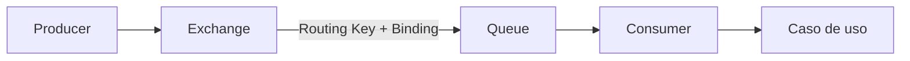

# Semana 08 · Mensajería asíncrona y RabbitMQ

**Periodo:** 28 de septiembre al 3 de octubre de 2026  
**Experiencia de aprendizaje:** Desarrollando colas de mensajes  
**RA/IL:** RA2 · IL2.1

## Propósito de la semana

Durante esta semana se introduce un cambio importante en la forma de diseñar la comunicación entre capacidades: no toda interacción necesita esperar una respuesta inmediata.

Hasta ahora gran parte de los ejemplos se han trabajado mediante comunicación síncrona:

```text
Cliente → API → Servicio → respuesta
```

Semana 08 incorpora mensajería asíncrona con RabbitMQ para comprender cómo una aplicación puede **publicar una intención o evento, continuar su ejecución y delegar el procesamiento a otro componente**.

La meta no es aprender RabbitMQ como una colección de comandos. La meta es comprender el problema arquitectónico que resuelve y construir una topología mínima que el estudiante pueda explicar, observar y modificar.

## Contenidos institucionales

- **2.1.1** Introducción a mensajería asíncrona y RabbitMQ.
- **2.1.2** Crear cola, productor y consumidor básicos.
- **2.1.3** Exchanges, bindings y routing keys aplicados al caso.

## Resultados esperados

Al finalizar la semana, el estudiante debería poder:

- diferenciar comunicación síncrona y asíncrona;
- identificar escenarios donde una cola aporta valor y escenarios donde agrega complejidad innecesaria;
- reconocer los roles de producer, broker, exchange, queue y consumer;
- levantar RabbitMQ localmente mediante Docker;
- publicar y consumir mensajes con Spring AMQP;
- explicar la relación entre exchange, binding y routing key;
- observar la topología y el flujo desde RabbitMQ Management;
- separar infraestructura de mensajería y lógica de aplicación.

## Ruta de aprendizaje

Cada tema tiene dos niveles:

1. **MD base:** lectura principal para clase y repaso.
2. **Contenido extendido:** profundización conceptual y técnica dentro de una carpeta con el mismo nombre.

| Paso | Lectura base | Profundización |
|---|---|---|
| 1 | [Asincronía, colas y RabbitMQ](./01-asincronia-y-colas.md) | [Contenido extendido](./01-asincronia-y-colas/) |
| 2 | [Hello World · Queue, Producer y Consumer](./02-hello-world-rabbitmq.md) | [Contenido extendido](./02-hello-world-rabbitmq/) |
| 3 | [Exchange, Binding y Routing Key](./03-exchange-binding-routing-key.md) | [Contenido extendido](./03-exchange-binding-routing-key/) |
| 4 | [Separación de responsabilidades](./04-separacion-responsabilidades.md) | [Contenido extendido](./04-separacion-responsabilidades/) |
| 5 | [Evidencia y criterio de salida](./05-evidencia-y-salida.md) | [Contenido extendido](./05-evidencia-y-salida/) |
| 6 | [Trabajo formativo](./trabajo-formativo.md) | [Guía extendida](./trabajo-formativo/) |
| 7 | [Actividad evaluada · RabbitMQ](./actividad-evaluada-rabbitmq.md) | Diseño + implementación · 10% EV2 |

## Mapa conceptual de la semana



Una idea importante acompaña toda la semana:

> RabbitMQ transporta mensajes; la lógica de negocio sigue perteneciendo a la aplicación.

## Capas de práctica

### Ejemplos

Ejemplos pequeños y aislados para observar un concepto a la vez.

→ [Examples · Semana 08](../../examples/semana-08/)

### Ejercicios breves

Problemas acotados para comprobar comprensión y modificar topologías.

→ [Ejercicios · Semana 08](../../ejercicios/semana-08/)

### Laboratorio guiado

Construcción paso a paso de un flujo RabbitMQ + Spring AMQP.

→ [RabbitMQ + Spring AMQP](../../labs/rabbitmq-spring-amqp/)

### Transferencia

Aplicación del patrón al caso semestral.

→ [RegistrApp · Semana 08](../../proyecto-formativo/semana-08/)

## Dos clases · 4 bloques cada una

### Clase 1 · Del problema al primer mensaje

```text
problema de acoplamiento temporal
→ síncrono vs asíncrono
→ Producer / Broker / Queue / Consumer
→ RabbitMQ mediante Docker
→ Management UI
→ Hello World
→ observar mensaje publicado y consumido
```

El énfasis está en comprender **por qué** existe la cola antes de agregar routing avanzado.

### Clase 2 · Routing y diseño de responsabilidades

```text
Exchange
→ Binding
→ Routing Key
→ DirectExchange
→ múltiples queues
→ separación infraestructura / aplicación
→ ejercicios
→ laboratorio
→ transferencia formativa
```

El énfasis cambia desde “hacer funcionar RabbitMQ” a **entender la topología y tomar decisiones coherentes de diseño**.

## Actividad evaluada · 10% EV2

Durante esta semana comienza una actividad evaluada de diseño e implementación de comunicación distribuida.

- **Parte 1 · Diseño:** viernes 2 de octubre de 2026.
- **Parte 2 · Implementación:** lunes 5 de octubre de 2026.
- **Requisito mínimo:** 1 comunicación síncrona y 2 comunicaciones asíncronas mediante RabbitMQ.
- **Entrega:** informe, sin presentación.
- **Ponderación:** 10% de la EV2.

→ [Ver enunciado completo de la actividad](./actividad-evaluada-rabbitmq.md)  
→ [Explorar ejemplos por dominio](./actividad-evaluada-rabbitmq-ejemplos/)

## Trabajo autónomo AVA

Se recomienda utilizar el trabajo autónomo para:

- completar la guía Hello World;
- instalar y validar Docker Desktop;
- explorar RabbitMQ Management;
- repasar producer y consumer con Spring AMQP;
- revisar el contenido extendido de los temas donde existan dudas;
- documentar con capturas y explicaciones el recorrido de un mensaje.

## Fuera de alcance esta semana

Todavía no se profundiza en:

- acknowledgements manuales;
- persistencia y durabilidad avanzada;
- dead-letter exchanges y dead-letter queues;
- estrategias de retry;
- idempotencia;
- alta disponibilidad o clustering;
- observabilidad distribuida avanzada.

Estos conceptos requieren haber comprendido primero el flujo base de mensajes y aparecen progresivamente en las semanas siguientes.

## Criterio de salida

El estudiante cumple el objetivo de Semana 08 cuando puede:

1. publicar un mensaje;
2. consumirlo desde otra responsabilidad;
3. observar queue, exchange y binding en Management UI;
4. explicar el recorrido completo del mensaje;
5. justificar por qué el flujo puede ser asíncrono;
6. distinguir infraestructura de mensajería de lógica de negocio.

No basta con mostrar que “funciona”: debe poder explicar **qué componente hace qué y por qué existe**.
