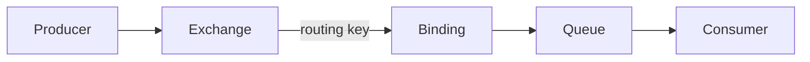
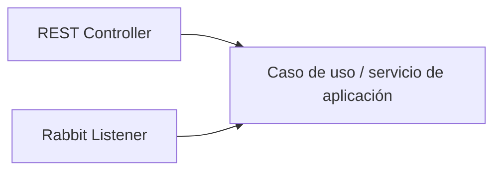

# Semana 08 · Mensajería asíncrona y RabbitMQ

**Periodo:** 28 de septiembre al 3 de octubre de 2026  
**Experiencia de aprendizaje 2**

## Contenidos oficiales

- **2.1.1** Introducción a mensajería asíncrona y RabbitMQ.
- **2.1.2** Crear cola, productor y consumidor básicos (Hello World).
- **2.1.3** Exchanges, bindings y routing keys aplicados al caso.

## Resultado de la semana

Al finalizar, el estudiante debe poder:

- distinguir una necesidad síncrona de una asíncrona;
- explicar qué problema resuelve una cola de mensajes;
- levantar RabbitMQ con Docker;
- publicar y consumir mensajes con Spring AMQP;
- declarar un `DirectExchange`, bindings y routing keys;
- verificar el recorrido en RabbitMQ Management UI;
- separar configuración de mensajería de lógica de negocio.

## Modelo mental



> La cola no existe porque “queremos usar RabbitMQ”. Se incorpora cuando una capacidad puede procesar trabajo sin obligar al solicitante a esperar su ejecución inmediata.

## Contexto arquitectónico

La mensajería asíncrona aparece naturalmente en sistemas distribuidos y microservicios, pero también puede utilizarse dentro de un monolito modular si las capacidades están correctamente separadas.

Una misma capacidad puede ser activada desde diferentes adaptadores:



REST y RabbitMQ son mecanismos de entrada; la lógica de negocio no debe duplicarse entre ellos.

---

## Clase 1 · Fundamentos + Hello World · 4 bloques de 40 min

### Bloque 1 · Problema antes que herramienta

- síncrono vs. asíncrono;
- dependencia temporal;
- desacoplamiento;
- buffering;
- procesamiento en segundo plano;
- cuándo una llamada síncrona sigue siendo la opción correcta.

### Bloque 2 · Producer, Broker, Queue y Consumer

```text
Producer -> RabbitMQ -> Queue -> Consumer
```

Se estudia el ciclo básico antes de introducir routing.

### Bloque 3 · RabbitMQ con Docker

- Docker Compose;
- puerto `5672` para AMQP;
- puerto `15672` para Management UI;
- exchanges, queues, connections y consumers.

### Bloque 4 · Hello World con Spring AMQP

- `spring-boot-starter-amqp`;
- `RabbitTemplate`;
- `@RabbitListener`;
- publicación y consumo;
- verificación por consola y Management UI.

**Evidencia de cierre:** broker operativo, queue visible, mensaje publicado y consumido, explicación del desacoplamiento logrado.

---

## Clase 2 · Routing + aplicación · 4 bloques de 40 min

### Bloque 1 · Exchange, Binding y Routing Key

Un `DirectExchange` enruta por coincidencia exacta de routing key.

### Bloque 2 · Ejemplo guiado

→ [Ejemplo Semana 08](../../examples/semana-08/)

### Bloque 3 · Ejercicio y laboratorio

→ [Ejercicio de routing](./ejercicio.md)  
→ [Laboratorio RabbitMQ + Spring AMQP](../../labs/rabbitmq-spring-amqp/)

### Bloque 4 · Trabajo formativo

→ [Trabajo formativo](./trabajo-formativo.md)  
→ [Transferencia a RegistrApp](../../proyecto-formativo/semana-08/)

## Trabajo autónomo AVA

Revisar:

- guía **Crear cola, productor y consumidor básicos (Hello World)**;
- video **2.1.4 · Instalar Docker Desktop**;
- video **2.1.5 · Uso de Docker Desktop**;
- video **2.1.6 · Productores-Consumidores con Spring AMQP**.

## Fuera de alcance por ahora

Esta semana no necesita introducir todavía DLQ, retries avanzados, publisher confirms, idempotencia distribuida ni observabilidad compleja. Primero debe quedar sólido el recorrido básico del mensaje.
