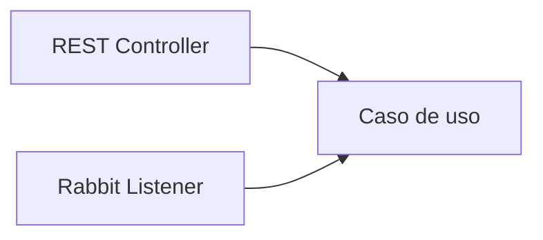

# Trabajo formativo · Capacidad autónoma activada por REST y mensajería

## Propósito

Transferir el patrón aprendido a una capacidad del caso semestral sin convertir RabbitMQ en lógica de negocio.

## Parte 1 · Justificación

Seleccionar una capacidad que tenga sentido ejecutar de forma asíncrona: notificación, auditoría, procesamiento posterior, generación de documento u otra capacidad secundaria.

Explicar:

- qué dispara la capacidad;
- por qué el solicitante no necesita esperar todo el procesamiento;
- qué beneficio aporta desacoplarla.

## Parte 2 · Diseño

Definir:

- producer;
- exchange;
- routing key;
- queue;
- consumer;
- payload mínimo.

## Parte 3 · Implementación

Implementar un flujo mínimo con Spring AMQP.

## Parte 4 · Autonomía

La lógica debe poder ser activada desde distintos adaptadores sin duplicarse:

El listener traduce el mensaje a una llamada al caso de uso.

## Parte 5 · Evidencia

- Management UI;
- mensaje publicado;
- mensaje consumido;
- código separado por responsabilidades;
- explicación breve.

## Criterios formativos

- comprensión síncrono/asíncrono;
- topología correcta;
- coherencia de nombres;
- separación infraestructura/negocio;
- capacidad de explicar el recorrido;
- reproducibilidad.
