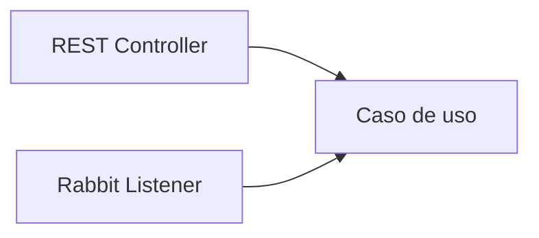

# Trabajo formativo · Capacidad autónoma activada por REST y mensajería

## Propósito

Transferir el patrón aprendido durante Semana 08 a una capacidad del caso semestral.

El objetivo no es “poner RabbitMQ en alguna parte”, sino seleccionar una operación donde el procesamiento asíncrono tenga sentido y diseñarla sin convertir la infraestructura de mensajería en lógica de negocio.

## Contexto

Una operación principal suele generar efectos secundarios.

Ejemplo:

```text
crear reserva
├── confirmar resultado al usuario
├── enviar notificación
├── registrar auditoría
└── actualizar estadísticas
```

No todos estos pasos necesitan bloquear la respuesta principal.

El trabajo consiste en seleccionar uno de ellos y desacoplarlo mediante mensajería.

## Parte 1 · Justificación

Selecciona una capacidad apropiada, por ejemplo:

- notificación;
- auditoría;
- procesamiento posterior;
- generación de documento;
- actualización estadística;
- integración secundaria.

Explica:

1. qué evento o acción dispara la capacidad;
2. qué parte del flujo sigue siendo síncrona;
3. qué parte se moverá a mensajería;
4. por qué el solicitante no necesita esperar ese procesamiento;
5. qué beneficio concreto aporta desacoplarlo.

No basta indicar “porque RabbitMQ es asíncrono”.

## Parte 2 · Diseño de topología

Define explícitamente:

- producer;
- exchange;
- routing key;
- queue;
- consumer;
- payload mínimo.

Completa un esquema equivalente a:

```text
Producer:
Exchange:
Routing key:
Queue:
Consumer:
Payload:
```

Luego dibuja el recorrido:


## Parte 3 · Contrato del mensaje

Define qué información necesita realmente el consumer.

Evita utilizar una entidad completa solo porque ya existe.

Ejemplo:

```json
{
  "reservaId": 120,
  "usuarioId": 44,
  "email": "usuario@ejemplo.cl",
  "fechaCreacion": "2026-09-29T12:30:00"
}
```

El payload debería ser:

- suficiente;
- pequeño;
- entendible;
- coherente con el evento;
- independiente de detalles innecesarios de persistencia.

## Parte 4 · Implementación

Implementa un flujo mínimo con Spring AMQP.

Debe incluir:

- configuración;
- publisher;
- publicación;
- queue;
- consumer;
- delegación hacia un caso de uso o servicio de aplicación.

## Parte 5 · Autonomía de la capacidad

La lógica no debe quedar atrapada en el listener.



El listener adapta el mensaje y delega.

La capacidad debería poder ejecutarse desde otro adaptador sin copiar sus reglas.

## Parte 6 · Prueba controlada

Realiza al menos estas pruebas:

### Flujo normal

```text
producer activo
→ consumer activo
→ mensaje procesado
```

### Consumer temporalmente detenido

```text
producer publica
→ mensaje queda pendiente
→ consumer vuelve
→ mensaje es procesado
```

Observa el comportamiento en Management UI.

## Parte 7 · Evidencia

Incluye evidencia suficiente para reconstruir el flujo:

- topología en Management UI;
- mensaje publicado;
- mensaje consumido;
- log o salida;
- código separado por responsabilidades;
- explicación breve del recorrido;
- justificación de la asincronía.

## Criterios formativos

Se observará principalmente:

- comprensión de síncrono/asíncrono;
- pertinencia de la capacidad elegida;
- topología correcta;
- coherencia de nombres;
- contrato de mensaje razonable;
- separación infraestructura/negocio;
- capacidad de explicar el recorrido;
- reproducibilidad.

## Preguntas para la revisión

Antes de entregar, responde:

1. ¿Por qué esta capacidad puede ejecutarse después?
2. ¿Quién publica el mensaje?
3. ¿Qué significado tiene la routing key?
4. ¿Por qué la queue tiene ese nombre?
5. ¿Qué ocurre si el consumer no está disponible unos minutos?
6. ¿Dónde está la lógica real de la capacidad?
7. ¿Qué componente cambiaría si mañana RabbitMQ fuese reemplazado?

## Alcance

No es necesario incorporar todavía:

- retries complejos;
- DLQ;
- acknowledgements manuales;
- clustering;
- idempotencia avanzada.

Primero debe quedar sólido el recorrido básico.

## Guía extendida

Para ver una pauta más detallada de análisis, diseño, implementación y evidencia:

→ [Trabajo formativo · Guía extendida](./trabajo-formativo/)
